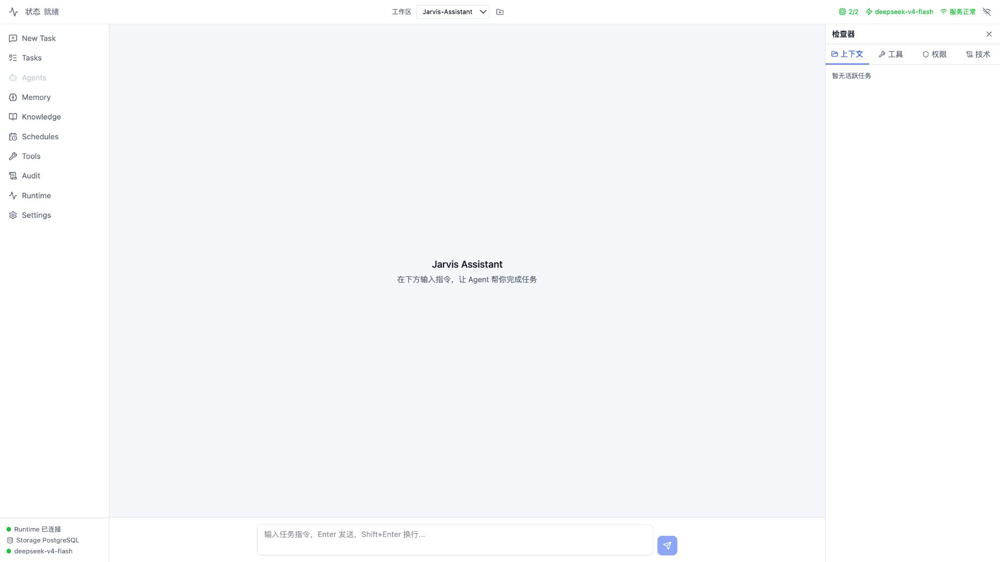

# Jarvis Assistant

Jarvis Assistant 是一个本地优先的个人 AI Agent 控制台。它以 Web 界面作为当前产品入口，用独立的运行时、工具网关、权限系统、持久化和审计链路执行可观察、可暂停、可恢复的 Agent 任务。

> 当前版本：`1.0.0`（公开开发预览）



> 截图展示 `v1.0.0` 当前 Web 主界面；后续版本将持续优化前端的信息架构与交互体验。

> [!CAUTION]
> **开发状态声明：** 本项目仍在快速迭代，当前版本主要面向学习、研究、自托管试用和协作开发，不建议未经独立安全评估就直接用于生产关键环境。Apache-2.0 允许包括商业使用在内的授权用途，但这不代表项目已获得商业认证或达到特定生产标准；项目目前不承诺稳定性、向后兼容性、安全认证、服务等级协议（SLA）或商业支持，采用者应自行完成风险评估、合规审查、测试和运维保障。

## 核心能力

- Vue 3 Web Agent 控制台：任务、时间线、权限、工具调用、产物和运行状态集中展示。
- Python Agent Worker：基于 LangChain / LangGraph 执行模型循环与工具调用。
- Go Gateway：提供类型化 API、运行调度、Worker 心跳和 Runtime Event 扇出。
- Redis Runtime Bus：承载任务、命令、事件和心跳，不作为业务真源。
- PostgreSQL + pgvector：持久化任务、运行、权限、审计、记忆及 RAG 数据。
- ToolGateway + PermissionManager：本地写入和敏感动作统一经过权限、审计与效果边界。
- RAG 文档链路：PDF 上传、解析、分块、向量化、检索、页码引用及多文档回答。
- 恢复能力：支持刷新、暂停、恢复、取消、服务重启、Worker 崩溃和 Redis 丢失场景。

## 系统结构

```text
Vue Web
  -> Go Gateway / Runtime Orchestrator
  -> Redis Runtime Bus
  -> Python Agent Worker / RAG Worker
  -> ToolGateway / PermissionManager
  -> PostgreSQL + pgvector / Artifact Storage
```

Go 不执行 Agent loop，Python Worker 不绕过 ToolGateway，Redis 不保存业务最终真相。详细边界见[系统架构](docs/02-system-architecture.md)。

## 环境要求

- macOS 或 Linux
- Docker Desktop / Docker Engine
- Conda
- uv（CI 固定使用 0.12.5）
- Node.js 22+
- Go 1.25+
- DeepSeek API key
- OpenAI API key（用于默认 RAG Embedding）

本地 MLX-VLM 与 BGE Reranker 是可选能力；未安装时可以使用明确配置的降级路径。

## 快速开始

1. 安装项目依赖：

```bash
scripts/dev.sh setup
```

2. 创建本地配置：

```bash
cp apps/agent-worker/.env.example apps/agent-worker/.env
```

编辑 `.env`，至少填写模型名称、模型密钥和 RAG Embedding 密钥。真实密钥只能放在本地 `.env` 或系统密钥环境中，不能提交到 Git。

3. 运行首次启动检查：

```bash
scripts/dev.sh doctor
```

4. 启动完整开发运行时：

```bash
scripts/dev.sh start
```

启动完成后：

- Web：<http://127.0.0.1:5173>
- Gateway API：<http://127.0.0.1:8080/api>
- Python Control Plane：<http://127.0.0.1:8100/internal>

按 `Ctrl+C` 会停止应用进程，但保留 PostgreSQL 与 Redis 容器。完整配置和故障排查见[运行手册](docs/16-dev-runtime-runbook.md)。

## 验证

确定性代码门禁：

```bash
scripts/release-gate.sh ci
```

也可以分别运行：

```bash
npm test --prefix apps/web
npm run build --prefix apps/web
npm run typecheck --prefix packages/shared

cd apps/gateway && go test ./...

python apps/agent-worker/eval/runners/fetch_corpus.py \
  --case nist-ai-rmf-1-0 \
  --case nasa-systems-engineering-handbook-rev2 \
  --case world-bank-data-driven-development-2018
cd apps/agent-worker && pytest -v
```

三个 P0 PDF 不进入 Git；下载器从版本化 manifest 读取官方来源，并在写入本地 cache 前校验固定 SHA-256。普通运行不需要下载评测语料，只有完整测试和真实使用评测需要。

版本 `1.0.0` 对应候选 revision 的完整 P0 真实使用评测为 `36/36 passed`。本地评测产生的日志、数据库、Artifact 和结果目录均位于 `.local/`，不会进入仓库。

## 安全模型

- 工具风险等级为 L0–L5；中高风险动作必须经过用户确认。
- 高风险动作不能永久自动批准。
- AgentRunner 只能通过 ToolGateway 执行本地或外部能力。
- 权限决定、工具调用和失败结果写入持久化审计。
- 工作区路径、符号链接和允许根目录在工具执行前校验。
- `.env`、密钥文件、本地数据库、日志和运行产物默认被 Git 忽略。

安全设计见[权限与安全](docs/08-permission-security-design.md)，安全问题处理方式见[SECURITY.md](SECURITY.md)。

## 目录

```text
apps/web/           Vue 3 Web 控制台
apps/gateway/       Go Gateway / Runtime Orchestrator
apps/agent-worker/  Python Agent Worker、RAG Worker 与 Control Plane
packages/shared/    TypeScript 共享契约
scripts/            启动、诊断、发布与数据生命周期工具
eval/               真实使用评测契约
docs/               架构、接口、安全与运行文档
```

## 文档入口

- [项目概览](docs/01-project-overview.md)
- [系统架构](docs/02-system-architecture.md)
- [Agent Runtime](docs/05-agent-runtime-design.md)
- [权限与安全](docs/08-permission-security-design.md)
- [开发指南](docs/09-development-guide.md)
- [接口契约](docs/13-interface-contract.md)
- [数据模型](docs/14-data-schema.md)
- [运行手册](docs/16-dev-runtime-runbook.md)
- [完整文档索引](docs/README.md)

## 当前边界

- 当前优先形态是本地 Web Agent 控制台，不是云端聊天服务。
- 默认使用 single-agent；复杂 multi-agent 编排尚不是首版主路径。
- 桌面封装、语音唤醒、插件市场和完整 App 自动化不属于 `1.0.0`。

## 参与贡献

- 功能缺陷和建议请通过 GitHub Issues 提交。
- 安全问题请按照 [SECURITY.md](SECURITY.md) 私下报告，不要创建公开 Issue。
- 提交代码前请阅读 [CONTRIBUTING.md](CONTRIBUTING.md) 和 [CODE_OF_CONDUCT.md](CODE_OF_CONDUCT.md)。
- 使用支持范围见 [SUPPORT.md](SUPPORT.md)。

## 许可

本项目使用 [Apache License 2.0](LICENSE) 授权，可在遵守许可证条款的前提下使用、修改和分发，包括商业使用。

许可证授权不构成对生产适用性、商业可用性、安全性或持续维护的保证。模型服务、外部 API、下载的评测语料及其他第三方组件仍受各自条款和许可证约束，不因本项目的 Apache-2.0 授权而改变。
