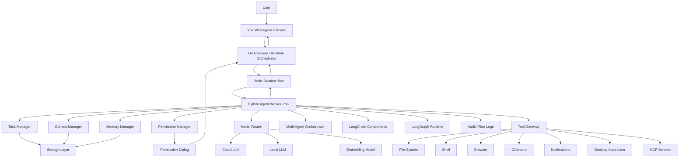
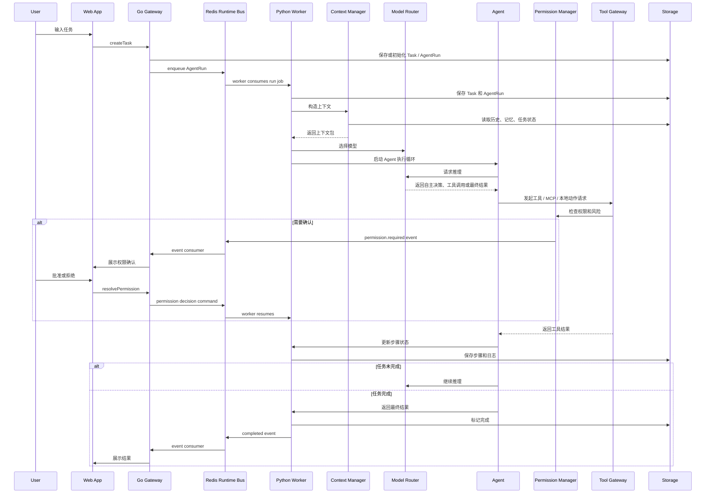
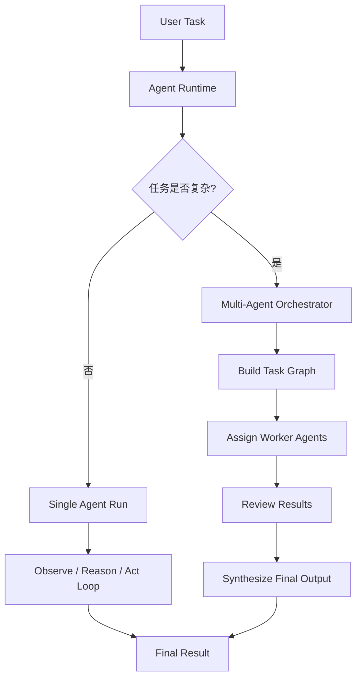

# 系统架构

## 总体架构

系统由 Vue Web App、Go Gateway / Runtime Orchestrator、Redis Runtime Bus、Python Agent Worker Pool、独立 Python RAG Worker、Model Layer、Tool Gateway、Storage、Permission 和 Observability 组成。桌面端是后续封装阶段，可通过 Electron preload / IPC adapter 或其他桌面 shell 复用稳定后的 Web UI 与 Runtime 能力。

架构整体遵循 Agent Harness Engineering / Loop Engineering。Harness 不是一个孤立模块，也不是 LangChain / LangGraph 本身，而是由 Go Runtime Orchestrator、Redis Runtime Bus、Python Agent Worker Runtime、Context Manager、Memory Manager、Model Router、Tool Gateway、Permission Manager、Storage、EventBus 和 Observability 共同构成的运行环境。

```text
Personal AI Agent
├── Vue Web Agent Console
│   ├── Chat / Command Center
│   ├── Task Dashboard
│   ├── Agent Run Timeline
│   ├── Permission Dialog
│   ├── Dev Console
│   └── Settings
│
├── Go Gateway / Runtime Orchestrator
│   ├── Web API / BFF Controllers
│   ├── DTO Validation
│   ├── ApiResult / AppError Normalization
│   ├── Runtime Event Fan-out
│   ├── Worker Manager / Scheduler
│   ├── Redis Producer / Consumer
│   ├── Cancel / Timeout / Retry / Backpressure
│   ├── Dev Scenario API
│   └── Desktop Adapter Later
│
├── Redis Runtime Bus
│   ├── Run Queue
│   ├── Worker Command Stream
│   ├── Runtime Event Stream
│   ├── Worker Heartbeat / Status
│   └── Pending Permission / Cancellation Signal
│
├── Python Agent Worker Pool
│   ├── Agent Run Loop
│   ├── Task Manager
│   ├── Planner
│   ├── Skill Layer
│   ├── Context Manager
│   ├── Memory Manager
│   ├── Model Router
│   ├── Tool Gateway
│   ├── Permission Manager
│   ├── Multi-Agent Orchestrator
│   ├── LangChain Components
│   └── LangGraph Runtime
│
├── Python RAG Worker
│   ├── PostgreSQL Job Claim / Lease / Retry
│   ├── PyMuPDF + PaddleOCR-VL / MLX-VLM
│   ├── Multimodal Chunking
│   ├── OpenAI Embedding
│   └── pgvector Indexing
│
├── Model Layer
│   ├── Cloud LLM Provider
│   ├── Local LLM Provider
│   ├── Embedding Provider
│   └── Model Router
│
├── Local System Bridge
│   ├── File System
│   ├── Shell
│   ├── Browser
│   ├── Clipboard
│   ├── Notification
│   └── Desktop Native APIs Later
│
├── Storage Layer
│   ├── Storage Interface
│   ├── Relational Store Adapter
│   ├── Task Store
│   ├── Conversation Store
│   ├── Tool Call Logs
│   ├── Memory Store
│   ├── Audit Store
│   └── Settings Store
│
└── Security / Observability
    ├── Permission Rules
    ├── Audit Logs
    ├── Run History
    ├── Error Logs
    └── Token / Cost Tracking
```

Skill Layer 位于 Python Worker 内部，与 `agent/tools` 同级，只为 LLM 提供可选、受信任、有界的领域
方法论上下文。LLM 负责动态组合 Tool；Skill 不定义产品工作流、任务状态、阶段工具白名单、权限或
持久化真相。Skill 本身不是执行通道；启用的确定性脚本由启动装配映射为
`skill.<skill-id>.<script-name>` system Tool，并且与 native、MCP 工具一样必须经过
`ToolGateway -> PermissionManager -> ToolExecutor`。AgentRunner、SkillLayer 和 ContextManager
都不能直接启动脚本或子进程。

> **当前架构（2026-07-14）**：Python Control Plane（FastAPI Internal API）与 Python Worker 共享 Application Service / Repository，PostgreSQL 是唯一持久化真相，Transactional Outbox 负责把已提交事件最终发布到 Redis。Python Application 是 Conversation、Message、Task、AgentRun、RuntimeEvent、ToolCall、Permission、AuditLog 和 Outbox 的唯一业务 Owner。Go Gateway 不访问数据库，只维护实时投影并向 Web 扇出事件。

## Harness 组成

Agent Harness 负责把 LLM 的自主推理和行动能力变成可执行、可审计、可恢复的任务系统。Agent 可以自主规划和发起动作；Harness 负责决定动作是否允许、是否需要用户确认、如何执行、如何记录以及失败后如何恢复。

```text
Agent Harness
├── Loop: observe / reason / act / observe / verify / finish
├── Context: 动态构造每次模型调用所需上下文
├── Memory: 保存和检索用户、项目和任务记忆
├── Tools: 通过 Tool Gateway 调用本地能力或协议能力
├── MCP: 作为 Tool Gateway 的一类标准协议接入方式
├── Permission: 对本地操作进行风险判断和用户确认
├── State: 保存 Task、AgentRun、ExecutionStep 和 ToolCall
├── Events: 向 UI 发布运行过程
└── Observability: 审计、错误、成本和运行轨迹
```

LangChain / LangGraph 在 Harness 中的位置：

```text
LangChain = 模型、prompt、tool wrapper、retriever、parser 等能力组件
LangGraph = Agent loop、状态图、human-in-the-loop、多 Agent 编排和恢复机制
Project Harness = 权限、工具边界、存储、审计、事件、接口契约和用户接管
```

LangGraph node 可以调用 LangChain；LangChain tool 必须通过项目 ToolGateway；LangGraph state 必须同步成项目的 Task / AgentRun / ExecutionStep / RuntimeEvent。

## 工程分层架构

项目实现按工程层级组织。该分层用于指导目录结构、模块边界、接口契约和代码审查。

```text
Frontend UI Layer
-> Frontend State Layer
-> Client API / Transport Layer
-> Go Gateway / Runtime Orchestrator Layer
-> Redis Runtime Bus Layer
-> Python Agent Worker Runtime Layer
-> Capability Adapter Layer
-> Storage Access Layer
-> Persistence Layer
```

各层职责：

```text
Frontend UI: Vue 页面和组件，负责展示与交互。
Frontend State: UI 状态、Runtime event 消费、前端 API client。
Client API / Transport: Web API client、event stream client；后续桌面端可新增 preload / IPC adapter。
Go Gateway / Runtime Orchestrator: DTO 校验、ApiResult/AppError 统一、任务入队、worker 调度、取消、超时、重试、背压、事件扇出和 Dev Console API。
Redis Runtime Bus: run queue、worker command、runtime event stream、worker heartbeat 和短期协调信号。
Python Agent Worker Runtime: Harness loop、LangGraph 编排、LangChain 能力、上下文、模型、工具、权限、事件和错误恢复。
Capability Adapter: 按领域声明 `CapabilityModule`，把模型 provider、native tools、MCP adapter、
本地系统桥接归一化为受控能力；所有 tool binding 最终安装到唯一 `ToolRegistry`。
Storage Access: Store interfaces，屏蔽具体数据库 backend。
Persistence: 关系型数据库、artifact 文件、Keychain、可选向量库或远程同步。
```

核心约束：

- UI 不直接访问 raw transport、数据库、本地文件、Shell 或 MCP server。
- Web 阶段通过 API client 调用 Go Gateway；桌面阶段再增加 preload / IPC adapter。
- Go Gateway / Runtime Orchestrator 不跑 LangGraph Agent loop，不直接执行工具或调用 LLM，不直接访问 PostgreSQL 或执行 SQL，不把 Redis 当成 Task / Run / Step 最终真相。
- Redis Runtime Bus 不承载业务决策和最终持久化，只承载运行时通信和短期协调。
- Python Agent Worker 不依赖具体数据库 client，只依赖 Application Service 和 Repository 接口。
- Python Control Plane (FastAPI) 只处理短事务 Internal API；不执行 AgentRun 长任务。
- AgentRunner 不直接调用 MCP server、本地系统能力或 PostgreSQL adapter，必须经过 ToolGateway 或 Application Service。
- Python Agent Worker Runtime 不直接依赖具体数据库，必须经过 Application Service → Repository → PostgreSQL adapter。
- Persistence Layer 不承载业务决策。
- Repository 不允许自行 commit；事务边界由 Application Service 通过 UnitOfWork 管理。

## 架构流程图



## 模块职责

### Vue Web Agent Console

负责当前阶段的用户交互。它展示任务、执行过程、工具调用、权限确认和设置。它不直接执行高风险本地操作。

### Go Gateway / Runtime Orchestrator

负责前端契约治理和多进程 Agent 运行调度。它校验请求 DTO、统一返回 `ApiResult` / `AppError`、将 AgentRun 入队到 Redis、管理 worker 心跳和并发、处理取消/超时/重试/背压、扇出 Runtime event stream、提供 Dev Console API，并处理 trace id、日志和基础会话边界。

它不跑 Agent loop，不直接执行工具，不直接调用 LLM，不替代 Python PermissionManager 的核心决策，不把 Redis 的短期状态当成业务最终真相。

Go Gateway 采用按层次 owner 聚合、同一 package 内按领域拆文件的结构：

```text
apps/gateway/
├── cmd/gateway/          # 薄进程入口
└── internal/
    ├── app/              # 依赖装配、路由和生命周期
    ├── api/              # HTTP handlers / middleware
    ├── contracts/        # API 与 Runtime 共享契约
    ├── orchestrator/     # RuntimeBus、pump、worker 状态和健康
    ├── redis/            # Redis Streams 协议与 adapter
    ├── controlplane/     # Python Control Plane 类型化 client
    ├── observability/    # 日志与 trace
    └── testkit/          # 测试 fixture
```

`api` 只能通过窄接口消费 Control Plane 和 Orchestrator；`orchestrator` 不直接访问
PostgreSQL；`redis` 不承载 Task/Run 业务真相。Memory、Context、Model、ToolGateway
等 Agent 语义仍由 Python Worker 持有，不因 Go 目录重构向 Gateway 漂移。

每个 HTTP Handler 只能声明并消费当前功能所需的最小 Control Plane 接口，通过构造函数
一次性注入；禁止 Handler 持有完整具体 Client 后再通过 setter 二次装配。具体 Client
创建属于 `internal/app/dependencies.go`，路由和 Handler 组合属于
`internal/app/routes.go`，服务/pump 生命周期属于 `internal/app/app.go`。

### Desktop App Later

桌面端是后续封装阶段，负责复用稳定后的 Web UI 和 Runtime 能力，并补充桌面 shell、preload / IPC adapter、菜单栏、通知、快捷键和更深的 macOS 能力。

### Redis Runtime Bus

负责 Go Orchestrator 与 Python worker pool 之间的跨进程运行时通信。它承载 run queue、worker command、runtime event stream、worker heartbeat/status、pending permission 和 cancellation signal。

Redis 不是业务数据库。Task / AgentRun / ExecutionStep / ToolCall / Permission / AuditLog 的最终状态仍由 Storage Layer 持久化。
Gateway、Control Plane、Agent Worker 与 RAG Worker 必须由同一组 `JARVIS_REDIS_ADDR`、
`JARVIS_REDIS_PASSWORD`、`JARVIS_REDIS_DB` 选择同一个 Runtime Bus；任何进程忽略 logical DB 或认证配置都会
形成静默分区，必须在启动和真实 smoke 中失败可见。

### Python Agent Worker Pool

负责系统核心智能行为和业务真相写入。它消费 Redis run queue / command stream，构造上下文、调用模型、执行 LangGraph Agent 循环、调度工具、处理失败，持久化 Task / AgentRun / ExecutionStep / ToolCall / Permission / AuditLog，并将标准 RuntimeEvent 写回 Redis event stream。

### LangChain / LangGraph

LangChain 负责模型、prompt、tool wrapper、retriever、embedding、document loader 和 output parser 等能力组件。LangGraph 负责 Agent loop、状态图、human-in-the-loop、pause / resume / retry、多 Agent task graph 和长任务恢复。

二者都不能绕过 ToolGateway、PermissionManager、Storage、AuditLog 和 RuntimeEvent 契约。

### Model Layer

负责屏蔽不同模型供应商差异。Python Agent Worker Runtime 不直接绑定某个模型，而是通过统一 ModelProvider / LangChain model wrapper 调用云端或本地模型。

### Tool Gateway

负责统一管理工具和协议能力调用。Agent 不应该直接访问文件系统、Shell、桌面原生 API 或 MCP server，而是通过 Tool Gateway 进入权限和审计流程。

### Storage Layer

负责持久化任务、对话、运行步骤、工具调用、权限、审计、配置和记忆。Python Agent Worker Runtime 只能依赖 Storage Interface，不应该直接依赖具体数据库实现。

当前 MVP 使用 PostgreSQL 作为唯一关系型持久化后端。业务逻辑仍依赖 Store Interface / Repository，不在 Runtime 中直接绑定数据库 client；未来替换或扩展存储必须通过 adapter 与 migration 完成。

Python Worker 的物理目录采用“功能聚合、基础设施下沉”：

```text
jarvis_worker/
├── agent/          # core/context/memory/rag/models/skills/tool_gateway/permissions/tools/artifacts
├── runtime/        # Worker 执行与 run/task/conversation/workspace/permission 流程
├── runtime_bus/    # Redis Runtime Bus adapter
├── database/       # 连接、ORM、事务、UnitOfWork、Outbox/Inbox
├── control_plane/  # 可选开发与调试接口
├── shared/         # config/contracts/domain/errors/observability
├── bootstrap/      # 依赖组装
└── migrations/
```

Storage Access Layer 是架构边界，不要求存在一个笼统的 `storage/` 物理目录。功能
Repository 跟随所属功能放置，例如 Memory 的端口和 PostgreSQL adapter 均位于
`agent/memory/`；公共连接与事务仍由 `database/` 提供。Runtime 和 Agent 只能通过
Repository/UnitOfWork 边界持久化，不能因为目录聚合而直接访问数据库 client。

Workspace Registry 也属于 PostgreSQL 业务真源。用户通过 Web 主动触发平台目录选择器注册工作区；Go 只代理 DTO，Python `WorkspaceApplicationService` 负责路径策略、注册、撤销和 Task 绑定。Agent 无权调用目录选择器、注册、切换或扩大 Workspace。`JARVIS_WORKSPACE_ROOT` / `JARVIS_ALLOWED_WORKSPACE_PATHS` 仅在 Control Plane 启动时作为 configured Workspace seed，不再是 Web 下拉列表的业务真源。

Personal Knowledge Base 是独立的能力边界：Obsidian Vault 中的 Markdown 是内容真源，PostgreSQL
保存 Vault 与 Jarvis 创建文档的元数据。Web 显式写入走 Application Service；Agent 写入必须通过
L2 `knowledge.create_document`。定期任务由 PostgreSQL 保存计划与执行实例，Python Control Plane
只负责到期扫描，实际执行仍创建普通 Task/Run，经 Outbox、Redis 和 Worker 进入同一 Agent Harness。
该系统不包含向量化。RAG 是独立检索系统；`agent/rag` 是领域 owner，根目录只保留共享领域契约、
标识符、Repository 和 PostgreSQL adapter，处理阶段分别进入 `ingestion/`、`chunking/`、
`preprocessing/`、`embedding/`、`indexing/`、`retrieval/` 与 `ocr/`。当前采用本地优先的混合预处理：
PyMuPDF 提取原生文字、坐标、表格和图片，页面路由只把扫描页或包含视觉元素的复杂页交给完整
PaddleOCR-VL Pipeline；布局阶段仍由 PaddleOCR 客户端执行，元素识别通过 localhost MLX-VLM
运行 PaddleOCR-VL-1.6，固定单并发。两路结果统一为格式无关的 `PreprocessedDocument`，再按文本、
表格、图片、图表、公式和代码路由分片。百度智能云 OCR adapter 仅是默认关闭的可选 fallback，
若启用仍必须经过外发权限链。`RagIngestionService` 已校验受控 PDF Artifact 的 Task/ToolCall 血缘、
Workspace、大小和 SHA-256，使用 lease/心跳执行预处理，把 Chunk、Element、Asset 和 relation 原子写入
PostgreSQL，并在成功后释放解析 lease、停在 `embedding` 交接状态。该状态不等于 ready；只有后续
真实 Embedding/VectorIndex 成功后才能完成作业并把文档标为 ready。RAG ingestion 与 embedding
现由独立的 Python RAG Worker 单并发公平轮转执行；它只领取 PostgreSQL RAG Job，不消费 Agent Run
Redis queue，也不执行 Agent loop。这样视觉模型、PDF 解析与向量化不会和 Agent Worker 争抢执行
生命周期。RAG Worker 与 Agent Worker 都向同一 Redis heartbeat stream 报到，因此 Gateway/Web
展示的是两个真实进程；RAG Worker 不拥有模型状态，也不把 RAG Job id 冒充 Agent `active_run_id`。
生产 RAG Worker 仍由 Conda 主环境运行，仅按显式配置追加项目隔离 PaddleOCR 客户端依赖目录，
MLX-VLM 继续作为 localhost 单并发服务由统一脚本治理。在线检索现由
`RagRetrievalService -> RagRetrievalPipeline` 拥有，稳定阶段为
`QueryRewriter -> CandidateRetriever -> Reranker -> ContextAssembler`。默认装配恒等改写、
OpenAI Query Embedding + pgvector 与 PostgreSQL 有界关键词双路召回、RRF、确定性策略重排及相邻
Chunk/多模态 Element 预算组装。默认重排组合为 HardFilter、Feature、可选 Cross-Encoder、
quota-aware MMR 与最终 PolicySelector；本地 BGE 模型由独立 localhost sidecar 承载，Agent Worker
只依赖 Provider 契约。未装配 Provider 时保持确定性 Feature/MMR/Policy 降级路径。后续专用 BM25 或
Query Rewrite 只替换对应端口。每个阶段输出都由 Pipeline 重新校验
Workspace、候选集合和数量边界。Agent 只能通过 L0 `rag.search` Tool 调用该 Service；受控 PDF
入库则通过 L2 `rag.ingest_artifact` 调用 command service，Workspace 必须由持久化 Task 回查。
两个 Tool 参数均不接受
`workspace_id`。用户显式 PDF 上传则走 `Web -> Gateway multipart validation -> Control Plane
RagUploadApplicationService -> Artifact Store + completed upload Task/Run + AuditLog -> RAG command service`；
它以 runtime user-upload lineage 校验来源，而不伪造 Agent ToolCall。RAG 证据进入模型前经过有界投影，
finish 引用再由 Runtime 使用可信 Chunk 元数据校验与渲染。关键词查询仍在 Repository 内执行
Workspace、ready 状态和 document scope 过滤，不能先全库读取再由 Python 过滤。

默认 ContextAssembler v2 先按候选数量为每条主证据预留公平 token 预算，再轮转补充相邻 Chunk 和
多模态 Element；长内容围绕 query 命中窗口截取，并去除相邻 Chunk 的确定性重叠。组装器只消费
Reranker 已确认的候选集合，不扩大 Workspace 或 document scope。RAG 文档生命周期由同一 command
service 拥有：ready 文档可停用并保留索引，disabled 文档可恢复检索，运行中作业可取消，failed/ready
文档可从原 Artifact 重新入队；所有写操作携带 expected version 并写 AuditLog。管理读模型同时用当前
ingestion/parser/chunker/embedding 目标版本计算 `current/stale/building/unavailable`，前端不自行猜测。
永久删除通过独立 Lifecycle Service 创建 L4 单次 PermissionRequest；批准后数据库级联删除 RAG 文档、
作业、Chunk、Element、Asset、Link 与向量，再以持久化 cleanup checkpoint 补偿清理派生文件。原始
Artifact 明确保留用于来源追溯；拒绝、批准和清理结果均写 AuditLog。

### Security / Observability

负责权限判断、用户确认、审计日志、错误记录、成本统计和运行轨迹。

## 项目运行流程



## Single-agent 与 Multi-agent 分流


