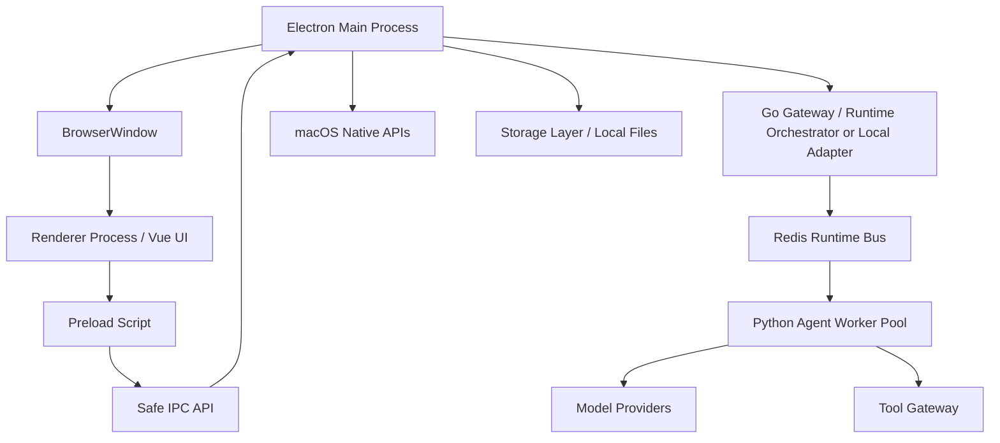

# macOS App 设计

## 阶段定位

桌面端不是当前 MVP 第一闭环目标。当前开发主线优先做 Web 端 Agent 控制台；等 Web 端交互、Agent Runtime、权限、安全、存储和工具系统稳定完整后，再将稳定 UI 和 Runtime 能力封装成 macOS 桌面 App。

本文件描述后续桌面端阶段的设计，不约束当前 Web-first 开发必须先实现 Electron。

## App 定位

桌面端是用户与 Agent Runtime 交互的控制台。它负责输入、展示、确认、观察和设置，不负责把所有 Agent 逻辑塞进 UI。

它应该是一个真正运行在 MacBook 上的 App，而不是网页。

## App 核心能力

桌面端阶段必须具备：

- 主窗口。
- Chat / Command Center。
- 任务列表。
- Agent 执行时间线。
- 权限确认弹窗。
- 设置页。
- 本地通知。
- 文件选择器。
- 本地持久化配置。

后续增强：

- 菜单栏常驻。
- 全局快捷键唤起。
- 后台任务运行。
- 开机自启动。
- 剪贴板读取和写入。
- 截图能力。
- 浏览器控制。
- 语音输入和输出。

## Electron 进程结构



## 安全原则

Renderer 不能直接访问 Node、本地文件或 Shell。

Renderer 只能通过 preload 暴露的安全 API 访问能力：

```text
window.agent.createTask()
window.agent.subscribeRunEvents()
window.permission.resolveRequest()
window.settings.updateModelConfig()
window.files.pickWorkspace()
```

所有本地危险操作必须经过：

```text
Renderer -> Preload -> IPC -> Main Process -> Permission Manager -> Tool Gateway
```

## 页面结构

```text
Main Window
├── Sidebar
│   ├── New Task
│   ├── Tasks
│   ├── Agents
│   ├── Memory
│   ├── Tools
│   └── Settings
│
├── Main Panel
│   ├── Chat View
│   ├── Task Detail View
│   ├── Agent Run Timeline
│   └── Artifact Preview
│
└── Right Inspector
    ├── Context Used
    ├── Tool Calls
    ├── Permissions
    └── Logs
```

## 主要 UI 模块

### Chat / Command Center

负责输入任务和展示 Agent 输出。

需要支持：

- 文本输入。
- 流式输出。
- 文件拖入或选择。
- 当前工作区选择。
- 当前任务状态展示。

### Task Dashboard

展示任务状态：

```text
pending
running
waiting_for_user
blocked
failed
completed
cancelled
```

### Agent Run Timeline

展示 Agent 执行轨迹：

- 规划步骤。
- 模型调用。
- 工具调用。
- 工具结果。
- 错误和重试。
- 权限请求。
- Reviewer 结果。

### Permission Dialog

当 Runtime 需要用户确认时弹出。

选项：

```text
Allow once
Allow for this task
Always allow for this tool and scope
Deny
```

### Settings

管理：

- API key。
- 本地模型地址。
- 默认模型策略。
- 工作区目录。
- 工具权限。
- 日志级别。
- token / cost 限制。

## App 启动流程

```text
1. macOS 启动 App
2. Electron Main Process 初始化
3. 加载本地存储和配置
4. 创建主窗口
5. 初始化 Runtime
6. 注册 IPC handler
7. 注册通知、菜单和快捷键
8. Renderer 加载 UI
9. UI 请求当前任务、设置和运行状态
10. 用户开始创建任务
```
