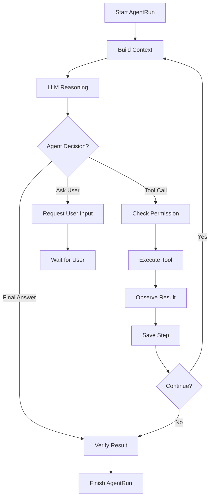

# Agent Runtime 设计

## Runtime 定位

Agent Runtime 是项目核心，当前由 Go Runtime Orchestrator、Redis Runtime Bus 和 Python Agent Worker Pool 共同承载。它负责让 Agent 在个人电脑上稳定运行，并通过 Go Gateway 向 Vue Web 前端暴露稳定 API 和 RuntimeEvent。

它不是单个 Agent，也不是某个 prompt，也不是 LangChain / LangGraph 本身，而是 Agent Harness 的主要实现层。它管理任务、上下文、记忆、模型、工具、权限、状态、事件和日志，让 LLM 推理能力在受控 loop 中执行任务。

Runtime 不把 LLM 降级成只会给建议的组件。AgentRunner 应允许模型在 loop 中自主规划、选择工具、生成参数并发起动作；Runtime 负责把这些动作放入 ToolGateway、PermissionManager、Storage 和 EventBus 的边界内执行。

Harness 仍由 Go Orchestrator、Redis Runtime Bus、AgentRunner、TaskManager、ContextManager、MemoryManager、ModelRouter、ToolGateway、PermissionManager、EventBus、RunStore、AuditStore 和 ErrorHandler 共同组成。Python Worker 内新增的 `RunSupervisor` 是单次 AgentRun 的运行控制 owner，只收敛预算、取消、停止边界与运行不变量；它不替代跨进程 Orchestrator，也不拥有模型决策、工具 effect 或业务持久化。

### RunSupervisor 与运行控制不变量

单次 Worker 执行必须经过 `RunSupervisor`：

```text
RunBudget + CancellationController
-> AgentRunner / LangGraph phases
-> exactly one terminal or suspension boundary
-> RuntimeInvariant validation
```

- `RunBudget` 统一校验有界工具迭代预算；`max_iterations` 只是现有构造参数的兼容名称。
- `CancellationController` 将 Redis/内存取消探针转为单调信号：一次观察到取消后，本次执行不得再次启动模型或工具动作。
- 一次 `AgentRunner.run` 或 checkpoint resume 必须以一个终态结束，或在没有终态时以未决挂起边界结束。
- 终止事件为 `agent.run.completed / failed / cancelled`；挂起边界为 `agent.run.paused / permission.required`。
- 同步等待权限时，`permission.required` 可以是中间可观察事件；只有它位于返回序列末尾时才表示本次执行挂起。
- 终态之后不得再产生 RuntimeEvent；违反时 Worker 必须失败关闭，不能把非法事件序列交给持久化层或前端推导状态。
- Harness 第一批没有修改 checkpoint；Loop/Harness v1 随后将 Run/Permission checkpoint 升级为 v5。v5 冻结 `CompletionContract`、`LoopProgressSnapshot`、`StopDecision` 与 `RunControlState`；v4 只读兼容并在内存补建控制状态，下一安全边界只写 v5。v1-v3 继续拒绝恢复。

### Loop Engineering v1

Agent loop 不再只依赖 prompt、`max_iterations` 和分散 guard。Python Worker 的 `LoopController` 是以下
结构化状态的唯一 owner：

```text
validated Intent + enabled Tool manifests
-> CompletionContract

trusted ToolResult observations
-> LoopProgressSnapshot

CompletionContract + Progress + Runtime policy
-> StopDecision(continue | complete | clarify | fail)
```

- `CompletionContract` 冻结必需工具、RAG 证据、Workspace evidence/action、条件式 effect 前置条件和澄清
  要求；模型不能改写。`completion-contract-v2` 当前只开放一个保守替代终点：当用户明确要求“创建文件，
  如果目标已存在则告知且不要覆盖”时，`target_absent` 是 create effect 的前置条件。只有 L0
  `search_files/get_file_info/read_file/read_files/list_files` 对同一规范化相对路径的成功 ToolResult，或
  `create_file` 对同一路径返回的可信 `PATH_ALREADY_EXISTS`，才能证明前置条件不成立并短路写入。模糊名称、
  模型正文和工具摘要都不能满足该替代终点；短路后由 Host 输出“已存在、未覆盖”，不得请求无意义权限或
  接受模型声称创建成功。
- 成功的 Workspace 写入 ToolResult 同时构成该 effect 目标的可信元数据证据；其 path、size/hash 等结果
  可以满足 `workspace.evidence=metadata`，但不能替代正文读取证据。这样即使 schema 合法的 Intent 把明确
  创建目标误标为 `read + metadata`，权限恢复后的已完成副作用也不会被迫再次调用 list/get_file_info，
  更不会把合理 `finish` 锁入 `tool_required`；正文任务仍必须由 read/search ToolResult 满足。
- `LoopProgressSnapshot` 只从本 Run 的可信 observation 推导，按工具名与规范化模型参数生成有界 action
  fingerprint；相同成功动作重复执行不算新进展，新的成功参数组合才重置 no-progress streak。
- 通用动作门禁只拦截“紧邻上一条成功 observation、工具与规范化参数完全相同”的重复动作：第一次写入
  `STRATEGY_CHANGE_REQUIRED` 并要求改变查询、范围或证据源；模型在没有新增 observation 时再次提出
  相同动作，以 `LOOP_NO_PROGRESS` 在 ToolGateway 前失败关闭。源码导航等领域控制器继续优先拥有更细的
  no-progress 语义，通用门禁不覆盖其诊断 reason code。
- 证据来源切换同样由 `LoopController` 判定，而不是由 Agent Loop 按工具名写分支。证据检索工具在可信
  ToolManifest 的 `metadata.loop` 声明 `operation/evidence_domain/substitutable_evidence_domains`；紧邻的
  失败检索之后，只允许同一证据域或 manifest 明确批准的等价域继续。把外部来源失败改写为本地索引检索等
  未获准跨域替代时，返回 `SEMANTIC_SOURCE_SUBSTITUTION`，动作校验层只负责反馈、预算和 ToolGateway 前
  阻断；第一次要求策略修正，没有新增 observation 时再次跨域替代则失败关闭。工具编号、案例编号和具体
  provider 名均不进入 Loop policy。该证据域门禁对所有 Loop 生效；源码导航只接管“重复成功动作”的领域
  no-progress 判断，不会绕过来源等价性。
- `StopDecision` 记录继续、完成、澄清或失败及固定 reason code。`ActionValidationPhase` 仍执行权限、安全、
  EffectGuard 和最终回答校验，但完成要求不再临时重复拼装。
- 结构化 Intent 重试穷尽时，Runtime 优先恢复明确的 Workspace 只读/副作用安全边界；其余非空目标进入
  `unknown/no-capability` 澄清契约。`LoopController` 将它识别为 `clarify`，动作校验层无论收到 finish
  还是 call_tool 都在 ToolGateway 前改写为确定性澄清，不允许模型借降级状态获得工具能力。
  只读边界接受显式“工作区”或安全相对路径/目录范围；`..`、绝对路径、通配符、副作用动词和未限定对象
  不得借 fallback 获得文件能力。用户明确要求按正文查询词定位命中时，fallback 可把 L0
  `workspace.search_text` 纳入该次只读能力；这不允许搜索预览替代普通全文阅读。
- ContextManager 只向模型投影有界 Loop 摘要；终态收口模式隐藏工具名，保持不能再次规划工具的既有契约。
- v4 恢复时 CompletionContract 会根据当前已校验 Intent 与启用 manifest 补建；原 observation 重建 progress。
  补建后必须在下一持久化安全边界写 v5，不原地覆盖历史 checkpoint。既有 checkpoint v5 中的
  `completion-contract-v1` 只读兼容，Runtime 从不可变 user goal 补齐条件式 effect 字段后，在下一安全边界
  写为 v2；未知子版本或附加字段继续 fail closed。

`RunControlState` 同时冻结本 Run 的开始时间、wall-clock deadline、工具预算、模型调用预算和已用模型次数。
每次 Intent LLM、普通动作模型、动作校验和工具 effect 前都重新检查同一持久化 deadline；权限批准后若已
过期，必须在 ToolGateway 前以 `RUN_DEADLINE_EXCEEDED` 失败关闭。模型调用预算在请求模型前原子递增到
checkpoint state，耗尽后以 `MODEL_CALL_BUDGET_EXHAUSTED` 停止，不依赖 LangGraph recursion limit。

RAG 生产 Pipeline 的 QueryRewriter 已从 identity 升级为确定性的 `bounded-query-plan-v1`：原始问题始终
作为第一条不可变查询，只从明确分句中最多追加三条独立、非重复子查询。Query planning 不调用第二个 LLM，
不改变 Runtime 锁定的 Workspace/document scope，也不会形成嵌套 agent loop。`rag.search` 同时输出
`rag-evidence-assessment-v1`，当前策略版本为 `rag-evidence-sufficiency-v2`。它除无结果和指定文档覆盖外，
还核对查询中的数字/标识符硬约束，以及同语种查询与证据是否至少存在一个词项锚点。Dense、Reranker
分数只用于排序，不构成“证据相关”的证明。门禁未通过时，Harness 直接生成当前有效语言的固定无证据
答复，设置 `insufficient_evidence=true`、清空 citations，并记录 reason code；不能把格式纠错失败暴露给用户，
也不能引用无关结果后声称完成。Validator 只接受最新一次成功 `rag.search` 的当前策略 assessment；缺失、
畸形或旧策略版本均 fail closed，禁止旧 checkpoint 或更早检索为最新检索背书。

研究、知识库写入和 RAG 组合任务使用普通 Agent loop：

```text
ModelProvider (LLM decide)
-> AgentRunner
-> ToolGateway
-> PermissionManager
-> Native / MCP ToolExecutor
-> ToolResult observation
-> ModelProvider (LLM decide again)
```

LLM 拥有来源相关性、下一步工具和总结内容的语义决策；Runtime 不按 Skill 名称硬编码研究阶段，也不
自动替模型插入“准备、归档、校验”等业务步骤。来源 provider 必须把是否可下载作为可信结构化事实
返回；当用户要求下载所有可下载的相关资料时，模型先判断相关性，再对每个
`download.available=true` 的来源调用下载工具。是否可下载不能由模型根据 URL 或内容猜测。

个人知识库和 RAG 是独立链路。`knowledge.create_document` 保存人可读 Markdown；
`rag.ingest_artifact` 只接受可信 Artifact 并创建异步作业。两项 L2 权限互不继承，任一链路失败不
回滚另一条已经成功的产物。Runtime 只从本 Run 的成功 ToolResult 连接 source、Artifact、RAG job 和
KnowledgeDocument provenance；既有 RAG 证据写入知识文档时还连接检索 ToolCall、RAG Document 与
模型实际可见的 Context Chunk。它不从正文猜引用，也不把入队成功误报为索引 ready。
用户要求“真正可检索/向量化完成后再告知”时，LLM 还需选择 L0
`rag.await_ingestion(job_id)`；它只读轮询业务真源，只有作业 `completed` 且文档 `ready` 才返回
`ready=true`，不替代或推进独立 RAG Worker。

仓库不再内置 `knowledge-curator`。通用 SkillLayer 仅保留领域方法论上下文能力；Skill 不拥有平台
能力、任务状态机、工具可见性、证据真相或知识/RAG 生命周期。

LangChain / LangGraph 是 Runtime 内部可使用的框架组件：

- LangChain 负责模型、prompt、tool wrapper、retriever、embedding、document loader、output parser 等能力组件。
- LangGraph 负责 Agent loop、状态图、human-in-the-loop、pause / resume / retry、多 Agent task graph 和长任务恢复。
- 项目自己的 ToolGateway、PermissionManager、Storage、AuditLog、RuntimeEvent 和 AppError 仍是产品真源。

## 核心模块

```text
Agent Runtime
├── GoRuntimeOrchestrator
├── RedisRuntimeBus
├── AgentWorker
├── AgentRunner
├── TaskManager
├── Planner
├── SkillLayer
├── ContextManager
├── MemoryManager
├── ModelRouter
├── ToolGateway
├── PermissionManager
├── LangChainAdapters
├── LangGraphRuntime
├── EventBus
├── RunStore
├── AuditStore
└── ErrorHandler
```

## 多进程运行模型

当前多 Agent 和长任务执行不走 FastAPI 长请求热路径，而是使用 Go + Redis + Python worker pool。

```text
Vue Web
-> Go Gateway / Runtime Orchestrator
-> Redis run queue / worker command stream
-> Python Agent Worker
-> Redis runtime event stream
-> Go event fan-out
-> Vue Web
```

Go Runtime Orchestrator 负责：

- 接收 Web API 请求并校验 DTO。
- 创建或初始化 AgentRun 的入口状态。
- 将 AgentRun 入队。
- 管理 worker 心跳、状态、并发和能力标签。
- 处理 pause / resume / cancel / retry / timeout。
- 做 backpressure、dead letter、event fan-out。

Redis Runtime Bus 负责：

- run queue。
- worker command stream。
- runtime event stream。
- worker heartbeat / status。
- pending permission / cancellation signal。

Python Agent Worker 负责：

- 消费 run job 和 command。
- 执行 LangGraph loop。
- 调用 LangChain 能力组件。
- 调用 ToolGateway / PermissionManager。
- 写入 Storage / AuditLog。
- 发布 RuntimeEvent。

FastAPI 只可作为 Python 侧可选 dev/debug/control plane，不得承载长时间运行的 AgentRun 请求生命周期。

## LangChain 分工

LangChain 负责“能力组件”，不负责系统边界。

适合使用 LangChain 的位置：

- `ModelProvider`：封装云端模型、本地模型、fallback 模型。
- `PromptBuilder`：将 ContextPackage 格式化成模型消息。
- `ToolDescriptor` / tool wrapper：把 ToolGateway 中允许暴露的工具转成模型可见工具描述。
- `Retriever` / `Embedding`：用于 Memory、项目知识库和 RAG。
- `DocumentLoader`：用于后续文档解析和知识导入。
- `OutputParser`：把模型输出解析成计划、工具请求、最终结果或结构化错误。

RAG ingestion 使用框架无关状态机：`queued -> parsing -> chunking -> embedding -> completed`，
运行中可以进入 `failed/cancelled`，失败作业按最大尝试次数、重试时间和 lease 恢复。
每个作业还持久化一个有界 `RagJobProgress` 快照，记录当前执行器、PDF 页数、原生提取完成状态、
视觉页完成量、视觉路由原因计数、chunk 总数和 Embedding 完成量。进度只能由持有 lease 的阶段 Service 更新；前端不得
根据耗时推算百分比，Redis heartbeat 也不能替代该业务真源。
用户显式“重新执行”复用同一个 Document、来源 Artifact 与幂等 Job：清除旧 lease、尝试计数、错误、
终态时间和进度，并从 `queued -> parsing` 重新开始。旧 Worker 后续提交必须因 lease/status 不匹配而
失败，不能覆盖新一轮结果；已有向量只在 Document 为 `ready` 时参与召回。
`EmbeddingProvider`、`VectorIndex` 是 `agent/rag` 端口；LangChain adapter 后续只能实现这些端口，
不能拥有作业状态、Workspace 边界、持久化事务或权限决策。

`RagIngestionService` 当前负责到 `embedding` 交接点：先验证 PDF Artifact、Task、ToolCall、Workspace、
大小和 SHA-256，再领取作业；长时间本地 OCR 期间周期续租，lease 丢失后旧 Worker 不得继续写入。
解析完成后以单事务替换该文档的 Chunk/Element/Asset/Link 投影，记录 parser/chunker 版本和审计，
随后清空 `claimed_by/lease_until`。文档继续保持 `indexing`；`embedding` 只是下一阶段的持久化待办，
不得作为完成或可检索状态展示。

Web 用户上传在 enqueue 前允许一个严格的 `approved staging` 来源状态：Task 必须仍为
`waiting_for_user`、Run 必须为 `waiting_permission`，同时确定性 PermissionRequest 必须为 L2
`approved + allow_once`，并逐项绑定相同 Task、Run、Workspace、Artifact、净化文件名、字节数和 SHA-256。
该中间态只解决“先入队、后消费权限并完成 Task/Run”的顺序，不是通用 Artifact 放行规则。入队成功后
上传服务才把 Permission 标记 consumed 并将 Task/Run 转为 completed；若进程在两步之间失败，同一文件
可复用原批准和确定性 Artifact/Job 幂等恢复。缺失批准、摘要变化、跨 Workspace 或任一身份不一致都以
`RAG_SOURCE_INTEGRITY_ERROR` 失败关闭。

Agent 通过 L2 `rag.ingest_artifact(artifact_id)` 只创建或复用摄取作业；它不能在 Agent Worker 内执行
解析或向量化。独立 RAG Worker 领取作业并完成后，文档才从 `indexing` 进入 `ready`。PDF 下载工具
返回的 `artifact_ids` 来自 Runtime 注入的确定性 Artifact id，使下一次 Tool 调用不依赖模型猜测 id。
L0 `rag.await_ingestion(job_id)` 使用可信 `task_id` 回查 Workspace，最长等待 15 分钟并按真实
PostgreSQL 作业/文档状态返回；超时为可恢复 observation，作业失败或取消为不可恢复工具错误。
等待工具自身不写作业状态。

RAG 内部按流水线职责分包：`ingestion` 读取受控来源并解析，`chunking` 只产生稳定 Chunk draft，
`embedding` 只拥有向量化 Provider，`indexing` 只拥有索引写入，`retrieval` 负责检索/重排/上下文
组装，`ocr` 实现可替换 OCR Provider。正常标题和段落边界不使用固定 overlap；仅当单个语义块
超过硬上限、不得不切开时使用有界 overlap。

在线 `retrieval` 内部进一步固定四个可替换端口：
`RagQueryRewriter -> RagCandidateRetriever -> RagReranker -> RagContextAssembler`。默认 Reranker
组合为 `HardFilter -> FeatureReranker -> 可选 CrossEncoder -> QuotaAwareMMR -> PolicySelector`：
RRF 最多保留 50 条，Feature 默认压到 30 条，本地 Cross-Encoder 默认压到 16 条，MMR 默认选择
10 条，Policy 最终按 top-k 收口。语义层按 0.75/0.25 融合模型排名与上游排名；Provider 失败时保留
Feature 顺序并记录 degraded step，不得静默声称语义重排已应用。MMR v1 使用有界词项 Jaccard
估算候选间冗余并执行文档软配额；后续可在不改变阶段契约的前提下换成已存向量相似度。流水线在耗时改写/
向量化、短事务召回、可选重排和短事务证据扩展之间显式分段，并在每个插件边界重新校验
Workspace、候选来源、去重和 top-k 上限。混合检索和 Reranker 不得绕过 Repository 或把
Workspace 过滤推迟到 Python 结果后处理。
默认 `HybridRrfCandidateRetriever` 组合 pgvector cosine 与 PostgreSQL 有界关键词召回。关键词准备
支持规范化英文标识符和受限中文四字窗口，最多 16 个词项；Repository 同时约束 Workspace、ready
文档和可选 document ids。两路先按各自 `min_score` 过滤，再使用 RRF 排名融合，不直接比较异构原始
分数；候选内部单独保留 semantic/keyword rank、RRF、Feature、Cross-Encoder、融合及 MMR 分数，
`candidate.score` 只表示当前阶段排序分数，Context/Tool 公共契约保持不变。生产数据飞轮只读取这些
trace，不拥有生产排序分数。

P4 的 selected multi-document scope 是用户约束而不是普通过滤提示。`rag.search` 将有效 `top_k`
提升到至少等于已选文档数（总上限 20）；`PolicySelector v2` 在候选可用时先按 Runtime 提供的文档顺序
为每份文档保留一条证据，再执行内容去重、单文档配额与全局 top-k。ToolResult 返回覆盖计数和未覆盖
文档 ID；覆盖不完整时 Agent 不得宣称完成全面比较。当前策略版本为 `rag-hybrid-retrieval-v6`。

默认 `EvidenceContextAssembler` 使用 `fair-neighbor-multimodal-budget-v2`：第一轮给每条主证据保留
公平预算，第二轮按候选轮转加入前后邻居，第三轮再加入表格、公式、图片 OCR/描述。单条内容超出预算
时围绕 query 或关键词命中位置截取；相邻 Chunk 已存在的 overlap 在输出前去除，并按最终文本重新计算
token。Assembler 不执行召回或重排，也不能接纳未经过 Reranker 的 Chunk。Query Rewrite 本轮仍保持
恒等实现，后续只通过既有 `RagQueryRewriter` 端口替换。

索引可用性与索引新鲜度是两个独立维度：ready/disabled 文档仍可保留旧索引，但当 ingestion policy、
parser、chunker、Embedding provider/model/dimensions 任一项偏离当前目标时标记为 `stale`。显式“升级
索引”从原 Artifact 创建或复用当前 policy 的确定性 Job；重建期间 Document 为 indexing，检索不会
读到半成品。永久删除必须先终止运行中 Job，并经过 L4 `rag.delete_document` 单次授权。

`preprocessing` 位于解析与分片之间，输出格式无关的 `PreprocessedDocument/DocumentNode`。默认
路径是 PyMuPDF native-first；OCR 判断必须使用未受 table proxy 去重影响的原始文字层。
`PageRoutingPolicy` 只把原生文字不可用、存在非背景/非重复语义图片，或原生表格结果不完整的页面交给本地
`PaddleOcrVlProvider`。全页背景、跨页重复装饰、全篇统一图片层和已产生稳定 Markdown/rows 的原生表格
不得仅因“检测到元素”触发 VLM。每个视觉页输出 `ocr_required/complex_image/complex_table` 原因。
`native-first-region-routing-v3` 进一步把语义图片和不完整表格映射为带页面坐标的 `VisualRegion`：区域数与
总覆盖率在有界阈值内时只渲染对应裁剪；原生文字不可用、区域过多或区域覆盖过大时才回退整页视觉解析。
Provider 必须调用完整 PaddleOCR-VL Pipeline，并把 VLM 阶段委派给
localhost MLX-VLM；它不能绕过布局阶段直接请求 MLX。页面请求串行处理，模型常驻且只初始化一次。
预处理器在 PyMuPDF 开始、原生解析完成以及每个 PaddleOCR-VL 页面完成后报告结构化进度；未进入
视觉路由的页面不得被计入视觉总页数。
视觉结果使用文档 SHA-256、页码、区域坐标、渲染 DPI、路由策略版本及 Provider 名称/版本生成缓存键。
该本地缓存只是可重建的计算加速层，不是业务真源；损坏或版本不匹配按 miss 处理。服务中断后重新执行同一
文档时，已完成的整页或区域解析会被复用，未完成部分继续调用 Provider；Job 状态和用户可见进度仍以
PostgreSQL 为真源，不能从缓存目录反推业务状态。
融合策略在扫描页以 VL 文本为准但保留原生图片证据，在数字页保留原生文字，仅补充更丰富的
表格、公式和图表节点。

多模态 ingestion 不把图片或表格塞入文本 Chunk：`RagElement` 保存类型、页码、PDF point bbox、
图注/OCR/结构化数据和派生描述，`RagAsset` 只保存受控二进制引用，显式 relation 表达
contains/references/explains/caption_of/nearby。OCR 先于视觉语义且按需触发；视觉模型输出必须保留
provider、model version、confidence 和原始页面定位。

多模态分片由 `MultimodalChunkRouter` 按节点类型分发：正文保留标题层级，表格切分时重复表头，
代码/公式/图表/图片描述形成独立模态 Chunk；原始二进制不进入文本 Chunk，Chunk draft 保存
`node_ids/element_node_ids`，后续映射到显式 Chunk-Element relation。

PDF 原生文字层或视觉结构数据可能包含 `U+0000`，而 PostgreSQL UTF-8 text/JSONB 不接受该字符。
Parser、Chunker 与最终 persistence projection 必须在各自信任边界移除 NUL；其他字符保持不变。
Chunk `content_hash`、确定性 ID 与 token count 必须基于清理后的最终正文计算；`RagElement.ocr_text` 与
嵌套 `structured_data` 同样清理，不能等数据库异常后把作业笼统标记失败。

禁止让 LangChain 直接拥有：

- 权限最终决策。
- 本地文件、Shell、MCP 的真实执行入口。
- AuditLog。
- Storage schema。
- 用户可见 RuntimeEvent。
- `AppError` / DTO 契约。

LangChain tool 的真实执行路径必须是：

```text
LangGraph node / AgentRunner
-> ToolGateway
-> PermissionManager
-> ToolExecutor / LangChain tool wrapper
-> ToolResult
-> Storage + AuditLog + EventBus
```

## LangGraph 分工

LangGraph 负责“运行编排”。

### Intent Layer 与自动 RAG 决策

生产意图的唯一 owner 位于 Python Worker `agent/intents`。当前生产容器装配
`LlmIntentExtractor`，并把 `extract_intent` 作为 LangGraph 的正式节点；旧
`RuleBasedIntentExtractor` 只保留给离线测试或显式降级，不再决定生产任务语义。Intent LLM 只生成
候选 JSON，不得回答用户、执行 Tool、访问数据库或输出下载决策。候选必须通过严格字段、类型、枚举、
组合关系和文档范围校验，才以版本化 `intent-llm-v7` 写入 `AgentState` 与 PostgreSQL checkpoint。
v6 在 Workspace 元数据读取中新增 `listing_entry_types=file|dir|symlink|other[]`，表达用户最终回答允许
出现的根目录条目类型；它不改变 ToolGateway 的原始 `workspace.list_files` 结果，也不成为工具参数。
对于“列出/有哪些/告诉我”同一分句中明确点名的文件、目录/文件夹或符号链接，Parser 还会把候选类型与
原始目标做高置信度一致性校验；否定的创建/删除约束和下一分句的补充条件不能被提升为列举类型。
v7 增加一个 host-owned 的窄歧义裁决：用户明确删除唯一具名目录及其全部内容时，“全部”只限定该目录，
必须进入 `destructive + clear` 并继续经过 `workspace.delete_path` 与 L4 单次确认；删除目录中的重复、旧、
可能无用等候选仍为 `clarification_required`。旧 `intent-llm-v5` checkpoint 可以按空投影只读恢复，v6
按完整 Workspace shape 恢复；恢复后统一升级到当前策略，不猜测或补造新的类型约束。

结构化候选通过 schema 不等于语义一定可信。当 LLM 把原始目标可确定性识别的单一 Workspace 副作用
判为 `unknown`，或把明确路径/动作判为 `clarification_required` 时，Intent owner 必须使用同一
host-owned 安全 effect classifier 做交叉校验。只有 classifier 能唯一证明受支持的创建、移动或删除
语义及安全相对路径范围时，才用其 `workspace` 投影纠正候选，并可把 `unknown` 收敛为 `task`；RAG 与
Knowledge 字段仍保留结构化候选的结果。该裁决不生成 ToolRequest/参数、不批准权限，也不能把“只解释
如何操作”等已明确的 `none + clear` 建议升级为真实副作用。

会话跟进任务还有一组 host-owned 证据边界。只对上一轮回答做压缩、改写、翻译或格式化，
且未要求刷新证据或产生外部副作用时，Intent 必须为 `conversation + retrieval.skip`；动作模型若仍请求
工具，Runtime 在 ToolGateway 前以 `HISTORY_TRANSFORM_TOOL_FORBIDDEN` 拒绝并进入一次 finish-only 重写。“改写后保存/
发送/写入”不属于纯转换，仍由 effect 和权限链路处理。对上一轮引用是否支持结论的核对则相反：
当 `rag.search` 可用时必须进入 `document_question + retrieval.required`，不得使用旧回答直接改写出新判定。
“第 N 个引用”只允许从最近可信 assistant 回答的 Runtime citation 投影恢复对应文档身份，支持中文和
阿拉伯数字序号；恢复出的 ID 还必须存在于当前冻结文档目录。没有可验证引用身份时使用 `unresolved`，
不能扩大成 `all`。同理，新会话中“这份/那份/刚才那份手册、论文或文档”面对多个目录候选且没有历史
文档身份时必须先澄清，不得猜选唯一标题近似项或退化为 Workspace 工具探索。所有 host 仲裁结果在写入
checkpoint 前必须重新通过完整 Intent state 契约校验。

Intent 节点遵循 Harness 的模型生命周期：发布独立 `model.call.*` Step，结构化失败先由 Provider 执行
有界纠错；耗尽后 Runtime 最多再拒绝并重试一次。最终仍为 `MODEL_OUTPUT_INVALID` 时，Runtime 只允许
`agent/intents` owner 生成最小安全语义候选。明确的当前 Workspace 只读/取证请求可以恢复为确定性的
`read + required|metadata`；创建文件/目录、移动和删除请求只有在文本能唯一识别一种副作用、固定 Tool
Registry 存在对应能力且相对路径范围足够明确时，才恢复为 `write|destructive + clear`。移动到“刚建的
目录”还必须由最近用户消息明确请求创建同一相对路径，并由随后助手消息唯一确认该路径；单独的助手声明
不能消除歧义。成功回执允许“已创建目录”“已在当前 workspace 下创建目录”等受控表述，但解析出的唯一
相对路径必须与紧邻用户创建请求中的路径一致；失败、否定、无用户依据或多路径回执都不能消除歧义。明确
副作用仍由后续动作模型生成参数，并完整经过 ToolGateway、PermissionManager、Storage、
EventBus 和 AuditLog；Intent 兜底不得生成 ToolRequest、路径参数或授权决定。

跨目录批量、未限定目标的全部/重复文件等范围、缺少移动目标或未解析代词会恢复为
`write|destructive + clarification_required`，只触发确定性澄清，不创建 PermissionRequest 或执行工具。
绝对路径、`..`、glob、URL、混合副作用、明确禁用工具/排除 Workspace、缺少对应能力或无法证明语义时继续
以 `INTENT_EXTRACTION_FAILED` 或 `INTENT_CAPABILITY_UNAVAILABLE` fail closed。该兜底不固定文件路径、
搜索词、业务答案或工具参数；RAG、Prompt 和 UI 不得各自维护另一套关键词判断。

明确的单一 Workspace 副作用还必须在授权前通过动作一致性门禁。Runtime 从用户原始目标和已注册
manifest 建立必需工具契约；当动作模型把明确的文件创建误选为目录创建、移动或删除等另一种副作用时，
发布可恢复的 `model.call.failed(REQUIRED_TOOL_ACTION_MISMATCH)`，注入不含路径和正文的可信纠正反馈，
并要求重新规划。只读探查不属于冲突动作，多副作用任务的顺序仍交给 planner；连续不匹配耗尽预算时在
PermissionManager、ToolGateway 和文件系统之前失败关闭。因此权限卡只展示已经同时满足用户目标语义和
工具 schema 的副作用，不会要求用户为错误动作授权。

Workspace 的含糊副作用请求以澄清安全边界优先：当候选已经是
`write|destructive + clarification_required`，但模型又把澄清后可能需要的 `metadata|required` 读取阶段
混入同一候选时，Intent owner 必须确定性丢弃该读取要求并持久化为
`skip + write|destructive + clarification_required`。这不是执行降级；EffectGuard 仍只允许 L0 探查，
任何写入、删除或权限请求都会被改为统一澄清回复。范围明确后的新任务再独立分类所需读取证据与副作用。

检索决策固定为：

```text
skip      -> 当前任务不访问 RAG
retrieve  -> 普通知识问题；即使用户没有提到知识库，也先尝试当前 Workspace 检索
required  -> 明确依赖已上传文档、报告、论文或知识库；无成功检索证据不得完成
```

`retrieval.query` 只在 `retrieve/required` 时是必须非空的检索问题；`skip` 没有检索动作，允许并推荐使用
空字符串。严格解析器与 checkpoint 恢复必须保持同一条件校验，不能因为无意义的空检索词阻断纯知识库
写入或仅 RAG 入库 effect。

检索范围固定为 `none/all/selected/unresolved`。Runtime 先按 Task 的 Workspace 从 Storage 读取最多
50 份 `ready` 文档，为模型生成 `doc_1...doc_N` 匿名键；Prompt 不含数据库 UUID。每项另携带最多
600 字符的 `identity_excerpt`，来源是该文档首个已持久化 Chunk，只用于核对论文名和主题，并继续按
不可信数据处理。模型选择 `selected` 后，解析器把匿名键映射回可信 UUID；用户问题中能唯一命中的
书名号标题、强身份英文名或 arXiv 编号必须包含在选择结果中，否则候选 fail closed；普通查询英文词
不得被当作文档身份。强身份命中多份同名文档时，Runtime 将不可信 `selected` 候选确定性降级为
`unresolved`，不依赖模型重试。AgentRunner 在调用 `rag.search` 前覆盖模型提交的 `document_ids`。
用户指向特定文档但无法唯一解析时，Agent 只能要求用户按标题、来源、版本或上传时间区分，不能索要
UUID/内部参数、猜测相近文档或退化为全库检索。

`effects.knowledge_write` 与 `effects.rag_ingestion` 分别描述个人知识库写入和 RAG 入库，均为
`skip/optional/required`，两条链路互不隐式触发。下载不属于 Intent 输出；是否可以下载只能由来源
Provider/ToolResult 的真实 `download.available` 决定。

`workspace` 是独立的结构语义，不复用 Prompt 关键词：`evidence=skip|metadata|required`、
`action=none|read|write|destructive`、`ambiguity=clear|clarification_required`，以及只适用于
`metadata + read + clear` 的 `listing_entry_types=[]|[file|dir|symlink|other...]`。代码审查、读取或基于
当前项目回答必须分类为 `read + required`，finish 前至少要有当前 Run 成功的
`workspace.read_file` 正文证据；只列文件/目录名称、判断存在性或读取类型、大小等基础信息时分类为
`read + metadata`，finish 前必须有成功的 `workspace.list_files` 或 `workspace.get_file_info`。目录/元数据
证据不能充当内容证据，正文读取也不能替代目录枚举语义；复用会话历史不能充当本次 Run 的真实证据。
用户明确把列举结果限制为某些条目类型时，Runtime 保留完整 ToolResult/Observation 作为审计和恢复真相，
只在模型上下文边界过滤 `list_files.entries`；系统策略同时声明允许类型。内置
`WorkspaceListingProjectionValidator` 在 finish 前对照原始 Observation，若回答提及被排除条目，则发布
`FINAL_ANSWER_VALIDATION_FAILED` 并进入一次 finish-only 重写，不重复调用工具。未设置类型投影时，列出
全部条目、区分类型和后续规划保持原行为。

已批准的长期 Memory 也不能仅靠 Prompt 被动遵守。基础 AgentRunner 内置
`ResponseLanguagePreferenceValidator`：它只消费 Runtime 从
`preference/response.language` 解析出的 `zh|en` 类型策略，不读取或执行任意 Memory 指令。存在有效策略时，
模型输出在流式发布前保持缓冲；自然语言回答与有效语言不符会进入同一个有界 finish-only 重写环。
Workspace scope 高于 global scope，当前用户的明确语言指令只覆盖本轮；提问语言本身、引用示例、代码、
结构化 JSON、路径和技术名词不改变默认偏好。该校验不规划工具、不改变 ToolRequest，也不扩大权限。
凭据持久化拒绝、Intent/Workspace 歧义澄清和目标已存在短路属于 Host-owned final output，按同一个有效
语言枚举选择固定模板后再接受校验；模型不能借语言重写改变安全结论或重新提出工具动作。

明确写入和删除分别要求
成功的 Workspace 写工具或 `workspace.delete_path` ToolResult。若写入/删除的目标路径、候选范围或
保留方式存在会改变副作用的歧义，Runtime 只允许 L0 探查，并把任何非 L0 动作或提前 finish 收敛为
确定性澄清；不得创建 PermissionRequest、猜测路径或声称已完成。

`retrieve/required` 只表达运行策略。实际调用仍必须保持
`AgentRunner -> ToolGateway -> PermissionManager -> rag.search -> ToolResult`。Intent 决策会作为可信系统策略
进入 ContextManager；如果模型仍提前 finish，effect guard 使用
`REQUIRED_TOOL_EVIDENCE_MISSING / REQUIRED_TOOL_NOT_EXECUTED` 有界重试或失败。首次检索完成前不发布
`model.delta`；Workspace 读取证据尚未满足时使用同一缓冲规则，避免任何会被 EffectGuard 拒绝的草稿
先出现在 Web。明确禁止访问 RAG、纯改写和闲聊进入 `skip`；当前
运行没有注册 `rag.search` 时同样安全降级为 `skip`，不能构造不存在的工具调用。

适合使用 LangGraph 的位置：

- Single-agent AgentRun loop。
- Multi-agent TaskGraph。
- permission wait / human-in-the-loop。
- pause / resume / retry / blocked。
- long-running task recovery。
- node-level streaming 和事件映射。

LangGraph 图可以表达为：

```text
build_context
-> call_model
-> decide_next_action
-> check_permission
-> execute_tool
-> observe_result
-> verify
-> finish
```

### 当前单 Agent 实现（2026-07-20）

`AgentRunner.run()` 已通过 LangGraph `StateGraph` 运行。当前图采用安全的七阶段编排：
`initialize_run` 发布运行起点；`extract_intent` 调用 LLM 并校验结构化意图；`call_model` 只调用模型并把未受信任的 `AgentAction` 留在
Worker 进程内；`validate_action` 完成字段校验和 effect guard，且只在通过后构造可信
`ToolRequest`；`execute_tool` 是唯一会调用 ToolGateway/PermissionManager 的节点；
`observe_result` 将 `ToolResult` 投影为 RuntimeEvent 和下一轮 observation；最后进入继续、
因 `permission.required` 暂停、终态或 `max_iterations` 失败节点。这样将循环控制迁入图，同时保留已经验证过的 ModelProvider
校验、权限 checkpoint、ToolCall/AuditLog/RuntimeEvent 语义。

图的模块 owner 已拆分：`agent/core/graph_state.py` 定义仅进程内使用的 `AgentGraphState` 与
`AgentGraphUpdate`，`agent/core/graph_nodes.py` 定义七个阶段节点、终态路由和 `max_iterations` 节点，
`agent/core/graph.py` 是唯一的 `StateGraph` 装配入口。P6-3 第一切片中，`observe_result` 已直接绑定
`agent/core/phases/observation.py`，共享的图游标、checkpoint 与事件原语位于
`agent/core/phases/runtime.py`；第二切片中，`call_model` 已直接绑定
`agent/core/phases/model_call.py`，该 service 只消费项目 `ModelProvider`，不暴露 LangChain 类型或
工具执行能力。第三切片中，`validate_action` 已直接绑定
`agent/core/phases/action_validation.py`，该 service 可调用 ToolGateway `assess`，但结构上禁止
`execute` 和 Permission owner 直连。第四切片中，`execute_tool` 已直接绑定
`agent/core/phases/tool_execution.py`，它是唯一允许经 ToolGateway `execute` 发生 effect 的图阶段，
但不能导入具体 executor。第五切片中，`extract_intent` 已直接绑定
`agent/core/phases/intent_extraction.py`；Intent phase 不调用后续 phase，retry/call_model/end 仍由
LangGraph 路由。最终切片中，`initialize_run` 与最大迭代终态已直接绑定
`agent/core/phases/lifecycle.py`；该 phase 不拥有图路由。图节点
不直接调用数据库或 Redis；模型与工具只经其对应的受控节点发生。

LangGraph 内部状态只在 Worker 内存中存在；它不使用 LangGraph checkpointer 作为恢复
真源。普通运行的安全恢复点由 PostgreSQL `agent_runs.checkpoint_json` 保存，权限暂停由
`permission_requests.checkpoint_json` 保存；Task/Run/Step、ToolCall、AuditLog 和
RuntimeEvent 共同负责恢复与审计。内部 Run checkpoint 放在 envelope 的进程内
`internal` 字段，序列化与公共 DTO 从源头忽略该字段。

约束：

- LangGraph state 必须映射到项目的 Task、AgentRun、ExecutionStep、ToolCall、PermissionRequest。
- LangGraph node started / finished / failed 必须映射成 RuntimeEvent。
- permission interrupt 必须映射成 `waiting_for_permission` 和 `permission.required`。
- Permission checkpoint 必须由集中 builder/validator 构造与校验；Worker 在 claim 恢复权和任何工具
  effect 前，必须把内部 request/task/run/step/tool-call/tool-name 与 PostgreSQL PermissionRequest
  逐项对账。缺失、同版本损坏或身份不一致一律 fail closed，不得进入 ToolGateway。
- 权限恢复 lease 过期时，获批工具视为 effect unknown，必须不可恢复失败并同步关闭开放 Step/ToolCall；
  deny 中断可以确认工具未执行，但同样需要确定性失败收口。只有工具终态及下一轮 `call_model`
  checkpoint 已持久化后，continuation 中断才允许保留模型恢复资格，且不得重新执行工具。
- PermissionRequest 已过期或 Run 已终态后到达的匹配 Redis command 必须按 PostgreSQL 真源幂等 ack，
  不恢复 Runner、不重复发布终态；command 与持久化 task/run/request 身份不一致时不得 ack。
- 每个 PermissionRequest 在创建事务内冻结非空 `expires_at`。默认 TTL 为 15 分钟，可通过
  `JARVIS_PERMISSION_REQUEST_TTL_SECONDS` 在 30 秒到 24 小时内调整；非法值回退默认值。Control Plane
  reconciliation 每 30 秒使用 `(status, expires_at)` 有界 `SKIP LOCKED` 扫描，且用户点击时仍在行锁内
  复核截止时间，不能依赖扫表及时性或浏览器倒计时授权。
- pending 请求到期后必须在同一事务投影为 PermissionRequest expired、ToolCall permission_status expired、
  开放 ToolCall/Step failed、等待中的 Run/Task failed，并追加 `permission.expired`、唯一
  `agent.run.failed(PERMISSION_REQUEST_EXPIRED)`、Outbox 和 AuditLog。前端只用 `expires_at` 停用按钮和解释，
  不拥有过期状态；迟到批准永远不能进入 ToolGateway。
- `ToolCall.permission_status=expired` 表示关联 PermissionRequest 未获批准便失效。Runtime 只允许
  `pending → expired`，不得覆盖用户 `denied` 或已经 `approved` 的事实；Run 取消/失败/完成对 pending
  PermissionRequest 的批量过期必须在同一事务同步 ToolCall 和 AuditLog。
- 恢复、重试、失败不能只存在 LangGraph checkpoint 中；必须同步到项目 Storage。
- Model 与 Tool Step ID 必须使用 checkpoint 中同一个 Run 全局单调 `step_seq`；不得使用只统计工具
  observation 的 `AgentState.iteration` 生成持久化身份。
- `RuntimeApplicationService` 是 Step 顺序与计数的唯一投影 owner。同一 Run 的事件先锁定 Run 行；
  仅首次看到新的 `step_id` 时分配 `order_index=run.step_count`，并在同一事务递增 `step_count`、更新
  `current_step_id`。started/completed/failed、权限恢复与重复 event 不得重复计数。
- 既有 Step 必须与 Event 的 Run、Task、StepType 及可用 call identity 一致；冲突必须 fail closed，不能
  让 Tool lifecycle 覆写 Model Step。
- Run/Permission checkpoint 已升级到 v5，在 v4 的 Run 全局 Step 身份、`extract_intent` 恢复节点和
  冻结匿名文档目录上，新增 Runtime-owned Completion/Progress/Stop 状态。v4 允许只读恢复，Worker 从已校验
  Intent 与可信 observation 补建 Loop 状态并在下一安全边界写成 v5；v1-v3 checkpoint 不再恢复。Worker 在调用
  模型或执行工具前将原 Run 以不可恢复错误收口，要求用户重新发起干净任务。新 Step 分配还会复查
  既有计数、顺序与 current step，避免混版本 Run 继续写坏。

### Worker 崩溃恢复（当前实现）

- `agent.run.started` 先保存 `extract_intent` 恢复点；Intent 完成后保存含冻结文档目录的
  `call_model` 恢复点。Intent 的 `model.call.started/failed/completed` 与普通动作模型使用不同 Step，均可审计。
- `model.call.completed(tool_call)` 保存 `execute_tool` 恢复点；checkpoint 使用 Run version 条件原子写入，只有持久化成功后才进入工具节点，避免与取消等并发状态写入互相覆盖。
- `tool.call.started` 在 effect 前同步保存 `tool_in_flight`；若此后 Worker 消失，工具结果视为未知，禁止自动重放并以 `RUN_RECOVERY_UNSAFE` 失败收口。
- 权限恢复的 `allow_once` 也必须在调用 ToolGateway 前同步持久化
  `permission.resolved + tool_in_flight`。不能等工具返回后再批量写事件；否则 Worker 在批准与结果之间
  崩溃时会从旧的 permission checkpoint 重放 effect。
- ToolGateway 在一次性批准校验完成、capability executor 尚未进入前提供 Runtime-owned
  `ToolEffectBoundary` 生命周期端口。生产默认不装配实现；隔离故障验收只有同时显式启用测试总开关和
  绝对屏障目录时才装配文件屏障。屏障只写 Task/Run/Step/Tool/Permission 身份，不写 arguments、reason
  或正文，使 REC-07 能在真实 `tool_in_flight` 窗口精确强杀 Worker，而不是依赖模型、sleep 或猜日志。
- `tool.call.finished` 保存包含可信 observation 的下一轮 `call_model` 恢复点。
- `tool.call.failed` 若携带 `recoverable=true`，同样保存包含错误 observation 的 `call_model`
  恢复点并回到 LLM；LLM 可以调整 query、选择替代工具或如实结束。循环仍受 `max_iterations`
  约束。`recoverable=false` 才直接进入 `agent.run.failed`。
- 相同工具与规范化参数已经失败、且此后没有成功 ToolResult 改变环境时，Runtime 以最近一次真实
  ToolError 收口，不得再次进入 PermissionManager 或 ToolGateway。EffectGuard 同时区分未调用、调用失败
  与调用成功；失败调用不能被改写为 `REQUIRED_TOOL_NOT_EXECUTED`。
- Intent policy 是 checkpoint 内部状态契约的一部分。含旧 policy 候选的恢复点必须 fail closed 并要求
  重开任务，不能用 v5 Runtime 猜测或补写 Workspace 语义。
- `max_iterations` 是工具调用预算。最后一个 ToolResult 后仍允许一次只可用于 `finish` 的模型收口；
  ContextManager 在每轮注入可信的已用/剩余预算，预算为零时明确禁止再次 `call_tool`，要求模型只基于
  已有成功 ToolResult 交付已确认事实、推断和未覆盖范围。若仍请求工具，才以 `MAX_ITERATIONS` 失败。
  生产 Worker 默认预算为 14，可通过 `JARVIS_AGENT_MAX_ITERATIONS` 在 1–20 范围内调整；提高预算不会
  绕过 ToolGateway、PermissionManager 或每次 effect 的独立权限检查。
- 最终回答的结构、引用、类型化响应偏好或 coverage 语义矛盾拥有独立的一次重写预算，不与
  `max_iterations` 相减。首次拒绝
  保存 `call_model` checkpoint、强制 finish-only 并注入独立 `answer_guard_feedback`；重写轮不能调用工具。
  第二次仍不合格时失败关闭。EffectGuard 判定证据覆盖不足且工具预算仍可用时，下一次模型动作进入
  `tool_required`：Provider parser 与 ModelCall 防御层都只接受 `call_tool`，直到产生新的 ToolResult 后才
  恢复普通规划。反馈要求模型通过不同来源、不同 query 或不同 path 范围推进覆盖；仅更换搜索工具但复用
  同一 query/path，或重复读取同一文件，不算新的覆盖。普通结构化 JSON 纠错反馈本身不触发该模式，避免
  把模型格式错误误判成证据缺口。以下源码 coverage 的额外计数与终态语义只属于显式装配
  `WorkspaceSourceChainCoverageValidator` 的未来 Codex/Developer Agent 扩展；基础 Personal Agent 生产
  容器不注册该 Validator，也不进入源码导航、源码补证或源码终态门禁。扩展中源码 coverage 本身尚未闭合
  不是答案措辞问题：若工具预算仍可用，Runtime
  使用独立、连续最多两次的 `source_chain_evidence_rejections` 进入 `tool_required` 动作模式并注入
  `effect_guard_feedback`。该模式的 Provider parser 与 ModelCall 防御层都只接受 `call_tool`，不能依赖模型
  自愿遵守提示词；模型仍自主选择已启用工具、路径、query、参数和缺口顺序，Runtime 不预设答案路径。
  Provider 内部或 Runtime 的既有结构化纠错预算允许修正一次非法 `finish`，但不会增加工具调用计数；任一
  真实 ToolResult 清零源码证据拒绝计数并恢复 `normal` 模式。工具预算已经耗尽时直接以
  `SOURCE_CHAIN_EVIDENCE_INCOMPLETE` 失败一次，不再浪费答案重写。
  `answer_guard_rejections/answer_guard_feedback` 属于 AgentState/checkpoint 的唯一 owner，恢复时执行类型与长度
  上界校验。失败事件只持久化固定 validator/reason、计数、布尔值与 coverage 摘要，不保存答案、Prompt、
  动态路径或源码正文。
- `tool_required` 协议纠错全部耗尽时，只存在一个窄的 Harness 恢复例外：CompletionContract 唯一缺口是
  `requires_rag_evidence`、Intent 已将范围验证为 `selected|all`、当前 Run 尚无成功 `rag.search` 且 Registry
  确认该工具启用时，Provider adapter 可以从 Intent 的已校验 query 恢复一次 `rag.search` AgentAction。
  该动作不生成答案、不猜文档 ID、不适用于 `unresolved`、Workspace、Knowledge 或多 effect 任务，且仍
  完整经过 ActionValidation、ToolGateway、PermissionManager、AuditLog、Observation 和 Loop。除此之外
  仍由模型自主选择工具与参数，禁止增加通用“代替模型调用工具”的分支。
- 基础 AgentRunner 内置 `FinalMessageIntegrityValidator` 和
  `CitationVerdictConsistencyValidator`。前者拒绝明显停在连词、未闭合定界符或 Markdown fence
  中的截断回答；只在 RAG 检索和引用复核链路强制缓冲，不改变普通聊天和普通工具链的流式协议。
  后者在引用复核任务中要求一个明确且单一的“支持/不支持”判定，同时出现两种极性时拒绝重写。
  这两个 Validator 只校验回答完整性和判定一致性，不替代 `RagCitationValidator` 对可信 Chunk 身份的校验。
- 基础 AgentRunner 还内置 `ExplicitAnswerConstraintValidator`。它只从当前原始目标提取通用约束：明确的
  “不超过 N 字/字符”上限、要求区分来源事实与分析判断、以及对长文档“所有/全部命中”的穷尽性请求。
  超长回答或缺失事实/判断标签进入同一个有界 finish-only 重写；有界 RAG 结果不得声称全文无遗漏，必须
  披露结论限于本次召回且仍可能漏召回。Validator 不裁剪文本、不编写结论、不固定章节或测试答案。
- `finish_only` 和 `tool_required` 是 Runtime 动作协议，不是网络容错。Provider 对首次
  `MODEL_OUTPUT_INVALID` 保留一次独立的协议纠错机会，即使 `JARVIS_MODEL_MAX_RETRIES=0` 也生效；
  该机会不重试 timeout/transport/HTTP 故障，不增加工具调用计数，也不可扩展为无界模型循环。
- 当前 Run 一旦出现成功 `rag.search`，PromptBuilder 必须从本 Run 全部可信 observation 生成有界的动态
  引用清单，并明确 `citations` 不得缺失或为空；清单最多包含 12 个 Runtime 已验证的 Chunk UUID，可附
  可信页码用于模型选择。它不是答案模板、预设检索路径或固定测试金标，模型仍根据正文结论自主选择其中
  的证据，未被本 Run 检索到的 Chunk 永远不能进入最终引用。
- LangGraph `recursion_limit` 由同一个 `max_iterations` 和 Runtime 拥有的有界重试类别确定性推导：除
  初始化、Intent、最终收口和失败路径的固定余量、每次真实 ToolCall 的节点余量外，还要为 EffectGuard
  与 FinalAnswerValidator 的答案重写、源码证据补齐和导航退回三类有界回边预留
  `validate_action -> call_model` 节点。Guard retry 不递增工具迭代数，但必须计入图遍历预算；它不能再让
  框架上限先于 Runtime 工具预算或既有有界 guard 终止合法任务。新建 Run 与从 checkpoint 恢复使用同一
  上限；新增可恢复回边时必须同步登记其 owner、次数上限和图节点成本，禁止用无界余量掩盖循环。
- Worker 每 20 秒续租，lease 为 60 秒；Control Plane reconciliation 只处理 lease 已过期的 `running` Run。
- 可恢复 Run 经 `running → paused → running` 与 `run.resume.requested` 重新调度；恢复预算最多 3 次，超限以 `RUN_RECOVERY_EXHAUSTED` 收口。
- checkpoint 恢复对已撤销的 `skill_workflow_stage` 使用显式 tombstone 兼容；只丢弃这一已知旧字段，
  其他未知 AgentState 字段仍 fail closed。reconciliation 失败收口时必须同时把非终态
  ExecutionStep 与 ToolCall 标记为 failed，不能留下 `running/pending` 投影。
- terminal event 清空 Run checkpoint。旧的 `_run_loop` 已删除，LangGraph 是唯一执行语义。

### P6 框架收口审计（2026-08-02）

当前实现不是“尚未接入 LangGraph”：`run()` 和 `resume_from_checkpoint()` 都同步调用编译后的
`StateGraph.invoke()`。P6-3 已按节点开始拆分：`ObservationPhase` 成为 ToolResult 投影的唯一 owner，
`ModelCallPhase` 成为上下文预算、Skill、安全 streaming 和模型重试的 owner；两者都没有
ToolGateway/PermissionManager/executor 能力；`ActionValidationPhase` 成为动作/effect/最终答案校验与
可信 ToolRequest 构造 owner，并保持 assess-only。`AgentGraphUpdate` 收紧节点返回契约。
`ToolExecutionPhase` 成为权限事件和 ToolGateway effect owner，并保持 effect 前 checkpoint 与
allow/deny/expire/defer 语义；`IntentExtractionPhase` 拥有可信 Intent 语义但不拥有图路由；
`RunLifecyclePhase` 拥有初始化、取消/暂停检查与最大迭代终态。`AgentRunner` 已缩减至 639 行，负责
依赖装配、图执行和兼容入口，不再拥有各阶段的完整实现。价值审计确认 7 组条件边与 7 个 route 函数
仍由 LangGraph 独占，phase 之间不直接调用；异步与 interrupt 边界留给 P6-4 对账。

P6-1 时尚未完成 LangChain 接入：生产 `OpenAiCompatibleModelProvider` 通过同步 `httpx` 直接调用 chat
completions。P6-2 已以现有 `ModelProvider` 为稳定端口增加 `LangChainModelProvider`；框架 message 与
structured output 转换回项目 `ModelMessage` / `AgentAction` 并继续经过原有校验。默认 adapter 已切为
`langchain`，原 direct Provider 只作为显式回退，不能在单次调用失败后自动重放。

P6-2 的供应商装配保持身份边界：DeepSeek 使用 `ChatDeepSeek` 并保留 JSON Output 与 thinking 配置；
自定义兼容端点使用 `ChatOpenAI` 窄适配并保留既有 `max_tokens` 请求字段。两条路径都拒绝原生
tool call、非纯文本、超长输出和非 `stop` finish reason；安全流式提取仍只发布通过 action 类型确认的
`finish.final_message`。

P6-4 完成后，LangGraph native interrupt/checkpointer 明确保持关闭。生产权限等待必须允许原 Worker
退出并由任意空闲 Worker 接手；项目使用 PostgreSQL PermissionRequest checkpoint 与 Run checkpoint v5
完成这一点。图编译不注入 checkpointer，节点不调用 interrupt，避免形成第二恢复真源。LangGraph
继续拥有流程拓扑，PostgreSQL 继续拥有持久化恢复事实。

P6 期间下列 owner 不变：

- LangGraph 只拥有进程内图控制、typed state transition 和路由。
- phase service 拥有对应阶段业务语义，但工具 effect 只能经 ToolGateway。
- PostgreSQL checkpoint v5、Task/Run/Step、Permission、ToolCall、AuditLog 和 RuntimeEvent 继续是恢复与
  审计真源。
- LangGraph 原生 checkpointer、prebuilt agent 和 `ToolNode` 不得成为平行执行或恢复路径。
- 每个节点迁移必须证明事件序列、Step 身份、权限暂停、崩溃恢复和终态语义等价。

详细迁移顺序与门禁见 `docs/26-p6-agent-runtime-framework-consolidation.md`。

### 用户暂停 / 恢复（当前实现，2026-07-23）

生产链路以 PostgreSQL 状态和 checkpoint 为真源：

```text
Web pause
-> Gateway
-> Python RunApplicationService: running -> pause_requested + AuditLog + Outbox
-> Redis run.pause command
-> owner Worker 设置线程安全 pause token（active run 同时短轮询 PostgreSQL 的
   pause_requested 权威状态，兜底 Outbox/Redis 投递末端竞态）
-> AgentRunner 下一个 effect-safe boundary
-> agent.run.paused + resumable checkpoint
-> RuntimeApplicationService: pause_requested -> paused

Web resume
-> Gateway
-> Python RunApplicationService: paused -> resume_requested + AuditLog + Outbox RunJob
-> Worker claim: resume_requested -> running
-> agent.run.resumed
-> AgentRunner.resume_from_checkpoint()
```

- 暂停边界允许 `call_model`、模型已经返回但尚未消费动作的 `validate_action`，以及尚未
  执行 effect 的 `execute_tool`。`validate_action` checkpoint 持久化可信 `AgentAction`，
  因此恢复不会重复模型调用或已流式展示的输出。`tool_in_flight`
  不可暂停/恢复；Worker 中断时继续 fail closed，禁止猜测工具是否执行成功。
- 模型请求或工具 effect 已开始时不强杀线程；暂停等待当前不可中断动作结束，再在下一个
  安全边界生效。若模型调用返回错误前 pause/cancel 已到达，控制命令拥有下一持久边界：cancel 优先，
  pause 以调用前 `call_model` checkpoint 收口并在恢复时重试；Provider 错误不得覆盖已接受的控制命令。
- `pause_requested` 是持久化控制意图的唯一真源。active Worker 正常从 Redis worker-command
  接收 `run.pause`，并以不超过约 100ms 的限频只读查询观察同一 Run 的 `pause_requested`；后者只用于
  避免 Outbox/consumer 延迟错过模型完成前的最后安全边界，不替代命令投递、ACK 或审计。
  若任务先自然完成且没有待处理控制命令，`pause_requested -> completed` 合法。
- `agent.run.paused` 的 event id 从 pause command id 派生，`agent.run.resumed` 从本次
  resume RunJob id 派生；多次暂停/恢复不会复用事件 id，消息重投仍保持幂等。
- Worker lease 续租覆盖 `pause_requested`。若 Worker 在请求后退出，Reconciliation 对
  resumable checkpoint 确认 paused；若只剩 `tool_in_flight`，则显式失败收口。
- cancel 与 pause/resume 并发时 cancel 优先。UI 不依据按钮点击猜测状态，只消费
  durable RuntimeEvent，并在 paused 状态继续保持 SSE 订阅。
- 权限恢复取得真实 ToolResult 后，普通执行路径与 LangGraph ObservationPhase 统一消费
  `effect_guard_feedback`、源码导航拒绝计数和源码证据拒绝计数；旧 checkpoint 中的补证状态不得让
  已满足的单次副作用再次进入 `tool_required` 协议。

### Run Queue pending / retry / DLQ（当前实现）

Run Queue 的 Redis Pending Entries List（PEL）由 Worker Pool 消费 adapter 治理，
但 Task / AgentRun 的状态与恢复判断始终以 PostgreSQL 为真源：

- 每个 Worker 默认使用 `JARVIS_WORKER_ID` 作为 consumer name，避免多个 Worker 意外共享同一 consumer 身份。
- Worker 每个到期扫描周期优先有界处理至多一条 PEL，再读取新消息，通过 `XPENDING` + `XCLAIM` 接管 stale RunJob；首次接管阈值为 65 秒，晚于 60 秒 Run lease，且持续新流量不会让 stale 消息永久饥饿。
- 重投采用 65 / 130 / 260 秒指数退避，单条消息最多交付 3 次；扫描周期、stale 阈值和最大交付次数均可配置且有上下限。
- stale 原消息若在 PostgreSQL Inbox 中已处理，或对应 Run 已由 reconciliation 恢复，只做幂等 ACK，不重复执行 Agent loop。
- Reconciliation 同时有界扫描超过 60 秒仍为 `queued` 的 Run。若最近一次 queue job 已经
  `delivered`、同样超过宽限期，且对应 Redis Outbox dedupe key 确实不存在，说明 Redis 可能在消费前
  整体丢失；它以新的 event/job id 创建
  `run.queue.reconciled` Outbox 并刷新 Run version。重投按 60/120/240 秒有界退避，最多 3 次；之后仍未
  claim 则以 `RUN_QUEUE_RECONCILIATION_EXHAUSTED` 写入失败事件和审计并安全收口。若最近 job 仍为
  `pending/dispatching`、尚在宽限期或已经 `dead`，则不重复投递、不绕过 Outbox 重试预算。Worker 仍以
  PostgreSQL 的 `queued -> running` claim 和 Inbox 保证业务幂等。
  Redis 核对不可用时保守视为事件仍存在，不得仅凭超时把正常积压误判为丢失。
- PostgreSQL 暂时不可用、Run claim 冲突等可恢复错误保留在 PEL，等待下一次退避接管；不会立即 ACK 或制造第二份业务状态。
- outer envelope 非法、schema/type 不匹配或 payload 无法解码时不可重试，直接进入 `jarvis:stream:run-dead-letter`。
- 达到交付上限的合法 RunJob 先在 PostgreSQL 以 `RUN_QUEUE_RETRY_EXHAUSTED` 写入失败 RuntimeEvent 与 AuditLog，再通过 Lua 原子执行 DLQ `XADD` + 原消息 `XACK`；任一步失败都保留 pending，避免消息静默丢失。
- DLQ 使用原 stream/message id 去重 7 天并近似保留最近 10,000 条，只保存原 payload 的 SHA-256/字节数而不复制 user_goal/workspace_path，仅用于诊断与人工处置，不作为业务真源。
- 人工处置不得直接重放 DLQ payload。当前仅允许 Run Queue `RUN_QUEUE_RETRY_EXHAUSTED`：Gateway 用精确 DLQ message id 取得白名单证据，Python RunApplicationService 重新读取 PostgreSQL Task/Run/Workspace 并核对旧 Run 尚为对应 failed 终态；通过持久化 L3 `PermissionRequest` 单次批准后创建全新 queued Run 与 `run.retry.requested` Outbox。旧 Run 和 DLQ 记录保持不变。
- Worker Command、RuntimeEvent、malformed、权威关联缺失、Task 已产生新 active Run 或 Workspace 已撤销时 fail closed；不能把诊断记录转换成可执行输入。
- Worker heartbeat 的 `runtime_bus` 字段上报进程级累计 `reclaimed`、`retry_deferred`、`dead_lettered`、`malformed` 指标，Gateway Worker Status 只做可观察投影。

### 定期任务（当前实现，2026-07-26）

```text
ScheduledTask 到期 / 用户手动触发
-> 持久化 ScheduledTaskExecution
-> 以 scheduled_execution_id 幂等创建普通 Task + AgentRun
-> Outbox RunJob
-> Redis Runtime Bus
-> Python Worker / AgentRunner / ToolGateway
```

- PostgreSQL 是计划、下一次执行时间和执行实例的真源；扫描器每 30 秒有界领取到期计划。
- 每次执行使用 `pending -> dispatching -> dispatched | failed`，带 60 秒 lease 和最多 3 次派发尝试。
- `tasks.scheduled_execution_id` 唯一，派发进程在 Task 提交后崩溃也不会创建第二个任务。
- 当前重复规则限定 daily/weekly，并保存 IANA timezone；暂停、恢复使用 version 乐观锁。
- 定期任务不直接调用模型或文件系统，不建立第二套 Runtime；窗口关闭不会丢失计划或运行状态。
- 后台创建的 Run 首个 RuntimeEvent 到达 Gateway 时，EventPump 通过 Control Plane 重新核对
  PostgreSQL Task/Run 关联后建立实时投影；未经业务真源验证的未知 Run 仍保留 pending 并最终 fail closed。

### Worker command / RuntimeEvent 可靠性（当前实现）

- Worker command 的新消息与 pending 分离消费；active/idle Worker 均按 5 / 10 / 20 / 40 / 80 秒退避，以 `XPENDING` + `XCLAIM` 有界接管，避免非 owner Worker 首次读到命令后永久困在其 PEL。
- command 的 outer schema、type、routing fields 与 payload 采用严格一致性校验；非法或未知 command 不再静默 ACK，也不会永久 pending，而是通过 Lua 原子进入 `jarvis:stream:worker-command-dead-letter` 并 ACK。
- 合法 command 不因固定投递次数直接 DLQ：取消与权限恢复必须再次读取 PostgreSQL Run / Permission / lease 状态后决定 ACK、继续等待或安全失败，避免 Redis delivery count 覆盖业务真相。
- `mcp.discovery.refresh` 是不关联 Task/Run 的全局管理命令：Gateway 只发布 command id、trace id
  和时间；空闲 Worker 从 Storage 加载配置并执行 MCP discovery，成功持久化后 ACK。Control Plane
  仅保留配置 CRUD/查询，不连接 MCP server。
- Gateway EventPump 每秒优先扫描 runtime-event PEL，按 5 / 10 / 20 秒退避接管；ACK 结果不确定时，`InMemoryRuntimeBus` 以 RuntimeEvent id 幂等投影。
- RuntimeEvent 按单条 delivery 解码；单条 poison event 不再阻断同批正常事件。非法 outer/payload 直接进入脱敏 `jarvis:stream:runtime-event-dead-letter`。
- EventPump 遇到尚未 Seed 的 Run 时先保留 pending，为 Control Plane 返回与 Gateway `SeedAcceptedRun` 的竞态提供恢复窗口；第 3 次仍无法投影时进入 DLQ。权威 RuntimeEvent 已由 Python Application Service 写入 PostgreSQL，刷新链路仍可恢复。
- Gateway 默认以 `hostname + pid` 生成唯一 consumer name，也可用 `JARVIS_GATEWAY_ID` 显式配置；多 Gateway 实例不再共享固定 `gateway-01` consumer 身份。
- command/runtime-event DLQ 均只保存 routing id、payload SHA-256、字节数和有界错误摘要，不保存原 payload，也不作为 Task / Run / Permission / RuntimeEvent 真源。

### 权限中断与恢复（当前实现）

生产 AgentRunner 遇到 L2-L4 工具时不在 Worker 线程中等待：它生成
`permission.required`，把 AgentState、可信 ToolRequest、事件序号和 ToolCall 关联
保存到 `permission_requests.checkpoint_json`，随后释放 Worker。内部 checkpoint 在
RuntimeApplicationService 边界被剥离，不进入 RuntimeEvent、Outbox、SSE 或 Web DTO。

用户决策写入 PostgreSQL 后通过 Redis command 通知 Worker。任意空闲 Worker 必须先
核验 request/task/run/decision/checkpoint，并以乐观锁把 Run 从
`waiting_permission` 占用为 `running`，才可通过 ToolGateway 恢复执行。命令仅在事件
持久化完成后 ACK；崩溃遗留 command 由 XAUTOCLAIM 接管。若执行租约过期，系统以
显式失败收口，不盲目重放可能已经产生本地或外部副作用的工具。

权限决定事务必须同时更新 PermissionRequest 与关联 ToolCall 的
`permission_request_id/permission_status`。批准后的 executor 若返回可恢复错误，则先记录真实
`tool.call.failed`，再把错误作为 observation 交回 LLM；拒绝始终是不可恢复终态。

## Agent 执行循环

Agent loop 是 Runtime 的最小执行单位。简单任务由一个 AgentRun loop 完成；复杂任务由 Multi-Agent Orchestrator 编排多个 AgentRun loop 完成。

Agent 的基本形态是一个循环：

```text
observe -> reason / plan -> act -> observe -> verify -> finish
```

其中 `act` 表示 Agent 可以主动发起工具调用、MCP 调用或本地动作请求。低风险动作可以在权限规则允许时自动执行；涉及本地计算机高影响操作、外部发送、删除、购买、系统设置或敏感数据的动作，需要进入用户确认或禁止流程。

对应运行流程：



## 任务状态

Task 状态：

```text
pending
running
waiting_for_user
blocked
failed
completed
cancelled
```

AgentRun 状态：

```text
created
running
paused
waiting_for_permission
waiting_for_user
failed
completed
cancelled
```

ExecutionStep 类型：

```text
model_call
tool_call
observation
permission_request
user_message
system_event
review
final_output
```

## 核心数据对象

```text
Task
  id
  user_goal
  status
  priority
  created_at
  updated_at

AgentRun
  id
  task_id
  agent_id
  status
  steps
  final_output

ExecutionStep
  id
  run_id
  type
  input
  output
  error
  created_at

ToolCall
  id
  step_id
  tool_name
  arguments
  result
  permission_status
  error

Agent
  id
  name
  role
  instructions
  allowed_tools
  model_policy
  permission_scope
```

## Runtime 数据流

```text
User Input
-> Go Gateway createTask
-> Go Runtime Orchestrator create or initialize Task / AgentRun
-> Redis enqueue AgentRun
-> Python Agent Worker consume run job
-> create AgentRun
-> build ContextPackage
-> call ModelRouter / LangChain model wrapper
-> parse model decision / tool request / final answer
-> optional Permission check
-> optional Tool / MCP call through ToolGateway
-> save ExecutionStep
-> repeat
-> verify
-> final output
-> persist result
-> Redis publish RuntimeEvent
-> Go Gateway fan-out to Web
```

## 失败恢复策略

Runtime 需要处理：

- 模型调用失败。
- 工具调用失败。
- 权限被拒绝。
- 上下文不足。
- 输出格式不合法。
- 任务超时。
- 用户中断。

基本策略：

```text
retry
fallback model
fallback tool
ask user
pause task
mark blocked
mark failed
```

### 失败步骤重试（当前实现，2026-07-23）

- 原 failed AgentRun 是不可变审计事实，重试不会把它改回 queued/running，也不会在原 Run
  上追加新的执行步骤。
- 只允许 `type=model_call`、`status=failed`、错误与 Run 终态一致且
  `recoverable=true` 的 ExecutionStep；源 Run 必须保留 `resume_node=extract_intent|call_model` 的安全
  PostgreSQL checkpoint，并且仍是 failed Task 的 active Run。
- Application Service 在单一事务中锁定源 Run/Task，创建确定性 replacement Run、更新
  `Task.active_run_id`、写 `agent.run.retry_requested`、Outbox 与 AuditLog。重复请求返回同一个
  replacement Run，不会重复入队。
- Outbox 仍投影成标准 `run.job`。Worker 以 replacement Run 身份从复制后的安全 checkpoint
  继续，并发布带 `retry_from_checkpoint=true` 的 `agent.run.started`；它不是原 Run 的 resume。
- 工具失败、`tool_in_flight`、未知执行结果、不可恢复模型错误以及 stale Task/Run 均 fail
  closed，禁止重放可能已经发生的副作用。
- Web 只在 terminal `agent.run.failed.error.recoverable=true`，且最新
  `model.call.failed` 也携带 `step_id/recoverable=true` 时展示重试入口；不能从更早的可恢复失败事件
  推断最终 Run 仍可恢复。失败终态投影必须保留合法的 `extract_intent|call_model` checkpoint；其他恢复点
  即使内部可用于 crash recovery，也不得被失败步骤重试接口提升。

### Artifact v2 与受控文件存储（当前实现，2026-07-24）

- 模型 `finish` 先经过可插拔 `FinalAnswerValidator`，通过后发布确定性 `artifact.created`，再发布
  `agent.run.completed`；Artifact
  与对应 model step 关联，kind 为 `markdown`，显式声明 `purpose=final_response` 和
  `producer.type=runtime`。LLM 可提供 `final_message` 和候选 `citations.chunk_id`，但文档名、页码、
  Artifact 与最终引用 metadata 必须由 Runtime 从可信 ToolResult 恢复；LLM 不拥有 Artifact 身份和
  持久化状态。`final_message` 只允许回答正文，模型不得拥有引用标题、页码或 chunk metadata。模型同时
  输出结构化 `citations` 和尾部引用列表时，`RagCitationValidator` 只在结构化 Chunk 身份已通过本 Run
  ToolResult 校验后丢弃模型自写列表，再由 Runtime 统一渲染一次；若正文只剩引用列表则失败关闭。模型
  没有提交 `citations` 时，可将正文中明确的 `p.4`、`pp.4-5` 或“第 4 页”映射到本 Run 已检索 Chunk
  的可信页码区间作为兼容兜底，但不能映射未检索页，也不能跨 Run 或从预设答案恢复身份。存在待校验
  RAG 证据时不实时发布未经验证的 `model.delta`，最终文本在引用校验通过后随终态一次性交付，避免伪造
  或重复引用短暂显示。
- Runtime 统一渲染的每个引用使用内部
  `/knowledge/rag?document_id=<trusted>&chunk_id=<trusted>` 链接；链接中的两个 UUID 均来自同一可信
  ToolResult，不使用模型文本或文件名构造身份。文档标题只作为已转义标签展示。Web 点击后定位并高亮来源
  文档、展示证据分块身份；该导航不赋予读取、写入或重新检索权限。
- Runtime Application Service 在同一 PostgreSQL 事务内幂等创建 Artifact metadata/content，
  并通过 Run 乐观锁写入 `final_output_artifact_id`。事件持久化完成后才经 Outbox 进入 Redis。
- `workspace.create_file` 成功后由 Capability Adapter 返回可信 deliverable 描述；Runtime
  再次核对 path/size/hash 与 ToolResult data 一致，按 `tool_call_id + path` 分配确定性 id。
  `tool.call.finished`、`deliverable/tool` Artifact、`artifact.created` 与 Outbox 在同一
  PostgreSQL 事务内提交，并把 Artifact id 回填到工具结果；拒绝、失败或描述不一致均不创建。
- Web 将 `final_response` 继续显示在对话和 Timeline，不再放进“交付物”区域；仅
  `deliverable` 聚合为交付物卡。工作区文件卡展示相对路径、大小和 MIME，展开时通过
  Artifact API 按需读取；历史 v1 事件在前端消费边界兼容升级。
- UTF-8 正文超过 `JARVIS_ARTIFACT_INLINE_MAX_BYTES`（默认 8 KiB）时，Application Service
  原子写入 `JARVIS_ARTIFACT_ROOT/scoped/<workspace>/<run>/<prefix>/<artifact>.<suffix>`；
  Workspace bucket 只使用 UUID 或工作区绝对路径的 SHA-256 摘要，文件权限为 `0600`。
  PostgreSQL 保存相对路径、字节数、MIME 与 SHA-256，`artifact.created` 不再携带正文。
- Artifact Store 在同一根目录的跨进程文件锁内执行用量检查和原子替换，默认单对象 50 MiB、
  单 Run 250 MiB、单 Workspace 2 GiB、本地总量 10 GiB，并要求
  `object <= run <= workspace <= total`。目录统计采用流式、不跟随 symlink 的最多 100,000 条目扫描；
  扫描或任一配额超限均返回稳定容量错误。最终回复外置失败时只退回已有输出边界内的内联正文并记录
  `capacity_fallback`，不会让 Run 永久停在非终态；显式上传和论文下载则 fail closed。
- RAG Asset Store 使用独立跨进程锁，默认单对象 16 MiB、本地总量 20 GiB；超限时 ingestion job
  进入带稳定错误码的失败终态并清理未提交投影，不留下 `ready` 空壳。
- RAG ingestion 与 embedding 共用显式 job lease，默认 300 秒，配置只允许 5–1,800 秒；Worker
  崩溃后新进程只能在 lease 过期后接管并增加 attempt，不能并发写同一 Job。短 lease 只用于隔离故障
  演练，生产默认值保持不变。
- parsing/chunking lease 过期且 `attempts == max_attempts` 时，claim repository 必须把耗尽结果返回给
  Application Service，而不是在最终返回 `None` 的空闲事务里静默回滚。Service 在同一 PostgreSQL
  UnitOfWork 将 Job 收口为 `failed/RAG_INGESTION_ATTEMPTS_EXHAUSTED`、将仍为 `indexing` 的 Document
  同步为 `failed` 并写 `rag.ingestion.failed` AuditLog；因此 Worker 崩溃不会留下永久 processing。
- 当前 Worker 在最后一次 attempt 内遇到可恢复 provider/lease 错误时，也必须在同一事务把原错误归一为
  `RAG_INGESTION_ATTEMPTS_EXHAUSTED`，同步失败 Document 并写相同审计；不能等待一个不存在的后继 claim
  才完成终态收口。
- 同一长回复在 `agent.run.completed` 中也只保留 `final_output_artifact_id`，完整消息仍写入
  PostgreSQL Conversation；避免 RuntimeEvent / Outbox 重复承载长正文。
- Web 展开卡片时经 `GET /api/artifacts/{id}` 按需读取。Gateway 不访问文件，Control Plane
  通过 Artifact Service 区分 Artifact Store 文本和 workspace file deliverable。后者必须
  反查 Task 的可信 `workspace_path` 与已完成 `workspace.create_file` ToolCall，严格核对
  `artifact_ids/data/deliverables` 来源链，再以 dir-fd + `O_NOFOLLOW` 读取并校验相对路径、
  普通文件、大小、UTF-8 与 SHA-256；响应不公开 `file_path` 或绝对工作区路径。

### PostgreSQL 业务真源只读对账（当前实现，2026-07-24）

- Python `StorageReconciliationApplicationService` 是对账规则 owner；它只通过 Store interfaces
  读取最近有界的 Run、Task、RuntimeEvent、ExecutionStep、Artifact，并通过受控 Artifact
  file adapter 校验外置文本文件，不写库、不发布事件、不执行修复。
- 当前检查活跃 Task/Run 状态映射、RuntimeEvent 连续序号与终态事件（缺失与重复分开报告）、Run/Event
  的 Step 引用、Run Step 计数、连续且唯一的 Step 顺序、Model/Tool Event 与 StepType 对应、最终
  Artifact 双向引用，以及外置 Artifact 的引用、大小和 SHA-256 完整性。
- 默认扫描最近 50 个 Run，单次最多 100 个，异常摘要最多返回 200 条。响应只包含错误码、
  关联 ID 和安全摘要，不返回 Artifact 正文、文件路径、用户目标或工具参数。
- Go Gateway 只代理结构化结果；Web Runtime Health 将 Redis 运行健康与 PostgreSQL 业务真源
  对账分区展示。`degraded` 只表示发现不一致，不改变 Task/Run 状态，也不触发自动恢复。
- 当前唯一受控修复是 `failed Run + failed_at + 安全 error + 事件序号连续 + 无任何终态事件`
  时补写 `agent.run.failed`。用户必须先检查资格，再创建持久化 L3 单次权限请求；批准时在同一
  事务追加 RuntimeEvent、Transactional Outbox、消费 PermissionRequest 并写 AuditLog。拒绝也
  写审计。Run、Task 和已有事件均不修改，其他对账错误仍只诊断。
- 当前文件适配器支持 markdown/text/json/diff 文本；截图和其他二进制对象仍是后续范围。

## EventBus

Runtime 内部和 UI 之间通过事件同步状态。
Python Agent Worker 产生事件并写入 Redis Runtime Bus，Go Gateway 消费、校验、规范化并扇出事件，Vue Web 消费事件。

事件示例：

```text
task.created
agent.run.started
agent.step.started
model.delta
tool.call.started
tool.call.finished
tool.call.failed
permission.required
permission.resolved
agent.run.completed
agent.run.failed
```

权限恢复后的事件必须区分“决策”和“执行结果”：用户拒绝产生
`permission.resolved(deny) → tool.call.failed(PERMISSION_DENIED) → agent.run.failed`；
用户批准后仅在 executor 成功时产生 `tool.call.finished`，executor 失败则产生携带真实错误码的
`tool.call.failed`；其中不可恢复错误继续进入 `agent.run.failed`，可恢复错误进入下一轮 LLM 决策。
ToolCall 不使用 `status=denied`。

## 2B-2a RedisRuntimeBus 接线骨架（2026-07-06，2026-07-06 修复）

### 状态

`RedisRuntimeBus`（`apps/gateway/internal/orchestrator/redis_runtime_bus.go`）是 Redis-backed RuntimeBus 的接线骨架：组合 `InMemoryRuntimeBus`（临时 state owner）+ `RedisRuntimeTransport`（Redis 通信 adapter）+ 内部 `traceIDs` 映射，同时实现 `RuntimeBus` 和 `RuntimeStateStore` 接口。

### 当前范围

- `PrepareRun`：in-memory **最小初始状态**（仅 `task.created`，run.Status="queued"，不生成任何 worker 完成事件）→ 存储 trace_id → 构造 `RunJobMessage` 并入队到 `jarvis:stream:run-queue`
- `ResolvePermission`：**原子 reserve pending → 构造命令（复用 trace_id）→ publish 到 Redis → 成功则 `CommitPermissionDecisionAckFromReserved` ack，失败则 `RestorePermissionRequest` 恢复 pending**。并发重复确认最多只有一个能 publish。不生成 tool/step/run 完成事件
- `GetEvents`：仍委托 in-memory，不做后台 Redis read/fan-out。Redis-backed 路径只返回最小初始事件
- `GetRun` / `GetTask` / `ListTasks` / `UpdateRunStatus`：全部委托 in-memory
- `traceIDs`：内部 `run_id → trace_id` map，保证 `RunJobMessage.trace_id == PermissionDecisionCommand.trace_id`

### 2026-07-06 修复：三个阻断问题

1. **PrepareRun 最小初始状态**：不再调用 `InMemoryRuntimeBus.PrepareRun`（含 simple_success mock 完成事件），改用新增的 `PrepareMinimalRun`，只生成 `task.created` 事件。`InMemoryRuntimeBus.PrepareRun` mock 行为不变。

2. **ResolvePermission 失败可重试**：改为先 publish 到 Redis，成功后再提交本地权限消费。publish 失败时权限保持 pending，用户可重试。新增 `ReadPermissionRequest`（读不消费）和 `CommitPermissionDecisionAck`（仅 ack，不生成 worker outcome）方法。

3. **trace_id 连续性**：`PrepareRun` 时将 trace_id 存入内部 map，`ResolvePermission` 时从 map 查找复用，确保两者一致。`InMemoryRuntimeBus.ResolvePermission` 不受影响。

### 2026-07-06 二次修复：ResolvePermission ack-only

4. **ResolvePermission 不再生成 mock worker outcome**：Redis publish 成功后只调用 `CommitPermissionDecisionAck`（仅追加 `permission.resolved` ack 事件），不调用 `CommitResolvePermission`（后者会生成 tool/step/run 完成事件）。工具执行结果、step/run 完成事件后续必须由 Python worker 通过 RuntimeEvent 写入。

### 2026-07-06 三次修复：ResolvePermission 并发 reserve/restore

5. **ResolvePermission 原子 reserve 防并发重复 publish**：新增 `ReservePermissionRequest`（写锁内查找+删除+深拷贝）、`RestorePermissionRequest`（publish 失败后恢复 pending）、`CommitPermissionDecisionAckFromReserved`（使用 reserved 数据提交 ack）。两个并发请求只有一个能 reserve 成功，防止重复 permission decision command 发送到 worker。

### 默认路径

`internal/app/app.go` 通过 `orchestrator.NewRuntimeBus(cfg)` 创建 runtime bus，默认 `JARVIS_RUNTIME_BUS=redis` 走真实跨进程链路。`inmemory` 只在自动化测试或显式隔离运行时启用。

### 未完成

- 不做后台 goroutine / event fan-out
- 不创建 Python worker
- 不实现 Storage 持久化
- 不做 Redis event read（GetEvents 仍走 in-memory）

## 2B-2b Gateway 配置开关与真实 Redis 连接（2026-07-06）

### 状态

`apps/gateway/internal/orchestrator/factory.go` 提供 `RuntimeBusConfig` 配置读取和 `NewRuntimeBus` 工厂函数。`internal/app/app.go` 通过环境变量选择 runtime bus 实现，默认使用 Redis。

### 配置

| 环境变量 | 默认值 | 说明 |
|----------|--------|------|
| `JARVIS_RUNTIME_BUS` | `redis` | runtime bus 类型：默认 `redis`；显式测试可用 `inmemory` |
| `JARVIS_REDIS_ADDR` | `127.0.0.1:6379` | Redis 服务地址（仅 redis 模式） |
| `JARVIS_REDIS_PASSWORD` | （空） | Redis 认证密码（可选） |
| `JARVIS_REDIS_DB` | `0` | Redis 数据库编号；Gateway、Control Plane、Agent Worker、RAG Worker 必须一致 |

### 行为

- **默认（无 env）**：`JARVIS_RUNTIME_BUS=redis`，连接本地 Redis；连接失败则启动失败
- **`inmemory` 模式**：仅在显式配置时创建 `InMemoryRuntimeBus`，用于测试或隔离运行
- **`redis` 模式**：创建真实 `go-redis` client → `GoRedisStreamClient`（窄接口）→ `RedisRuntimeTransport` → `RedisRuntimeBus`。启动时 PING 验证 Redis 连通性，失败则 Gateway 启动失败
- **非法值**：`JARVIS_RUNTIME_BUS` 非 `inmemory` / `redis` 时启动失败，输出清晰错误

### 当前范围

- `NewRuntimeBus` 工厂根据配置创建 `(RuntimeBus, RuntimeStateStore, error)`
- redis 模式只写 run queue / worker command，不读 event stream
- redis 模式不启动 Python worker，不做 fan-out
- Redis 仍只是 runtime bus，不是业务真源
- `GetEvents` 仍是临时 in-memory，下一切片 2B-2c 才处理 Redis event reader/fan-out
- `InMemoryRuntimeBus` 仍作为临时 state owner，未来由 Storage-backed StateStore 替代

### 测试

- 17 个 factory/config 单元测试（`factory_test.go`）：覆盖默认值、env 读取、Validate、inmemory/redis 工厂逻辑、非法值错误、fake client 注入
- 全部测试不依赖本机 Redis 服务

## 2B-2c Redis RuntimeEventReader + Go Gateway Event Fan-out（2026-07-06）

### 状态

`EventPump`（`apps/gateway/internal/orchestrator/event_pump.go`）打通了 Redis runtime event stream → Go Gateway → InMemoryRuntimeBus/SSE 的最小事件扇出链路。redis 模式下 Gateway 启动后台 event pump，从 Redis stream 轮询读取 worker 产生的 `RuntimeEventEnvelope`，解码校验后追加到 in-memory 事件列表，使 SSE 能读取到外部注入的事件。

### 行为

- **redis 模式**：
  - 工厂 `NewRuntimeBus` 返回 `PumpCloser` 接口（`RedisRuntimeBus` 组合 `EventPump` 实现）
  - `internal/app/app.go` 调用 `pump.Start()` 启动后台泵（幂等创建 consumer group + 启动 goroutine）
  - 泵循环：优先 `XPENDING + XCLAIM` 接管 stale PEL，否则 `XReadGroup` 读取新消息 → `RuntimeEventReader.ReadDeliveries` 逐条解码 → `InMemoryRuntimeBus.AppendRuntimeEvents` 按 event id 幂等追加 → 每条成功后 `XAck`
  - 读取失败：指数退避（100ms → 5s），记录日志
  - Redis 重启导致 stream/group 丢失时，`NOGROUP` 触发有界 `XGroupCreateMkStream(startID="0")`
    恢复；runtime-event 与 heartbeat pump 均无需重启 Gateway
  - 空读取：50ms 间隔后继续
  - 确定性非法消息进入 DLQ；Run 尚未进入临时投影时保留 pending，按 5 / 10 / 20 秒重试，最多交付 3 次
  - 进程退出：`defer pump.Close()` 取消 context 并等待 goroutine 退出
- **inmemory 模式**：
  - `PumpCloser` 为 nil，不启动 pump，不依赖 Redis
  - 行为与 2B-2b 完全一致

### 新增组件

| 文件 | 组件 | 说明 |
|------|------|------|
| `bus/event_pump.go` | `eventPump` | 事件泵：Start/Close/loop/runOnce |
| `bus/backoff.go` | `EventPumpBackoff` / `ExponentialBackoff` | 可注入退避策略 |
| `bus/bus.go` | `PumpCloser` 接口 | pump 生命周期抽象 |

### 接口扩展

| 位置 | 方法 | 说明 |
|------|------|------|
| `bus/in_memory_bus.go` | `AppendRuntimeEvents(runID, events)` | 深拷贝追加事件到 run |
| `redis/reader.go` | `XGroupCreateMkStream` | 幂等创建 consumer group |
| `bus/redis_runtime_bus.go` | `Start()` / `Close()` | PumpCloser 实现 |
| `bus/factory.go` | `NewRuntimeBus` | 返回 `PumpCloser` 作为第 4 个返回值 |

### 约束

- Go Gateway 只做读取、校验、缓存/扇出，不生产 worker outcome
- RuntimeEvent shape 不变，SSE endpoint path 不变
- consumer group startID=`"0"`，Gateway 重启后可消费已有消息
- go-redis 类型不泄漏到 handler / bus 接口层
- 当前还没有 Python worker 写入事件，pump 在 redis 模式下持续轮询空 stream（50ms 间隔）

### SSE 持续推送（审查修复 2026-07-06）

- `SubscribeEvents`（`internal/api/handlers/run.go`）改为两阶段：
  1. **Phase 1**：发送当前已有事件（初始快照）
  2. **Phase 2**：300ms ticker 轮询 `RuntimeBus.GetEvents`，基于 `event.id` 去重，只推送新增事件
- 不再无条件把 run 标为 `completed`
- 客户端断开（`r.Context().Done()`）时退出
- redis 模式下 EventPump 追加的 worker 事件通过此机制可被 SSE 持续推送到 UI

### Graceful shutdown（审查修复 2026-07-06）

- 使用 `http.Server` + `signal.NotifyContext` 监听 `SIGINT` / `SIGTERM`
- Server 在 goroutine 中运行，主 goroutine 等待信号
- 收到信号后：`server.Shutdown(ctx)`（10s 超时）+ `pump.Close()`
- goroutine 无泄漏

### 测试

- 13 个 `EventPump` 单元测试（`event_pump_test.go`）：使用 `fakeStreamReader` + `fakeBackoff`
- 7 个 `SubscribeEvents` SSE handler 测试（`run_test.go`）：初始快照、新事件推送、去重、404、客户端断开、不标记 completed、多批次事件
- 5 个 `AppendRuntimeEvents` 测试（`in_memory_bus_test.go`）
- 2 个 `RedisRuntimeBus` pump 生命周期测试（`redis_runtime_bus_test.go`）
- 4 个 `fakeStreamReader` + `GoRedisStreamReader` 测试（`reader_test.go`）
- 4 个 `ExponentialBackoff` 测试（`backoff_test.go`）
- 2 个 `factory_test.go` pump 存在性测试
- 全部测试不依赖真实 Redis

### 未完成

- 不创建 Python worker
- 不实现 LangGraph
- 不实现 ToolGateway
- 不做 Storage 持久化
- 不做 Redis 业务真源或跨集群 consumer group 治理；当前只负责启动时幂等创建、Redis 状态丢失后的
  `NOGROUP` 自恢复，以及既有 PEL/DLQ 有界处理
- InMemoryRuntimeBus 仍是临时 state owner，未来由 Storage-backed StateStore 替代
- Python Agent Worker 见切片 3A

---

## 3A Python Agent Worker 最小闭环（2026-07-06）

### 状态

`apps/agent-worker/` 是 Python Agent Worker Runtime，消费 Redis run queue 中的 `RunJobMessage`，执行 deterministic mock runner，产出 `RuntimeEventEnvelope` 写入 Redis runtime event stream。Go Gateway 通过 EventPump 读取并扇出到 SSE/UI，实现从 API 请求到 UI Timeline 的完整闭环。

### 链路

```text
POST /api/tasks
  → Go Gateway PrepareRun → EnqueueRunJob → Redis run queue
  → Python agent-worker consume RunJobMessage
  → MockRunner 生成 5 个 RuntimeEvent
  → 写入 Redis runtime event stream (jarvis:stream:runtime-event)
  → Go EventPump XREADGROUP → AppendRuntimeEvents → InMemoryRuntimeBus
  → SSE SubscribeEvents 轮询 GetEvents → 推送到 Web UI Timeline
```

### 目录结构

```text
apps/agent-worker/
├── pyproject.toml
├── README.md
├── src/jarvis_worker/
│   ├── main.py              # Worker 入口
│   ├── config.py             # 环境变量配置
│   ├── contracts/
│   │   ├── redis_messages.py # RunJobMessage / RuntimeEventEnvelope / stream keys
│   │   └── runtime_events.py # RuntimeEventType 常量
│   ├── redis_bus/
│   │   ├── __init__.py       # Redis client factory + consumer group helper
│   │   ├── consumer.py       # XREADGROUP 消费 run queue
│   │   └── producer.py       # XADD 发布 RuntimeEventEnvelope
│   ├── runtime/
│   │   ├── worker.py         # AgentWorker 主循环
│   │   ├── mock_runner.py    # Deterministic mock runner (5 events)
│   │   └── events.py         # RuntimeEvent / envelope 构造工具
│   └── observability/
│       ├── __init__.py       # 日志配置
│       └── logging.py        # Logger helper
└── tests/
    ├── test_contracts.py     # 契约编解码 + envelope 一致性
    ├── test_event_builder.py # RuntimeEvent 构造 + envelope 包装
    └── test_worker_flow.py   # 端到端消费→生产流程（fakeredis）
```

### 契约对齐

- 所有 stream key / consumer group / schema_version 与 Go 侧 `redis/keys.go` 一致
- RuntimeEventEnvelope XADD fields 格式对齐 `RuntimeEventToStreamFields`：`schema_version + payload（完整 JSON）+ 冗余标量路由字段`
- envelope 校验对齐 `DecodeRuntimeEventEnvelope`：event_id / event_type / task_id / run_id 一致性、核心字段非空
- RunJobMessage 反序列化校验对齐 `DecodeRunJobMessage`：schema_version 精确匹配、必要字段非空

### Mock Runner 事件序列

Mock runner 模拟 simple_success 场景，产生固定 5 个事件：
1. `agent.run.started`
2. `agent.step.started`
3. `model.delta`（streaming 输出）
4. `agent.step.completed`
5. `agent.run.completed`（terminal event）

### 配置

| 环境变量 | 默认值 | 说明 |
|----------|--------|------|
| `JARVIS_REDIS_ADDR` | `127.0.0.1:6379` | Redis 地址 |
| `JARVIS_WORKER_ID` | `worker-01` | Worker 标识 |
| `JARVIS_WORKER_GROUP` | `jarvis:group:worker-pool` | Consumer group |
| `JARVIS_WORKER_CONSUMER` | 同 `JARVIS_WORKER_ID` | Consumer 名称 |
| `JARVIS_RUN_QUEUE_RECLAIM_IDLE_MS` | `65000` | stale RunJob 首次可接管时间，最小 65 秒 |
| `JARVIS_RUN_QUEUE_RECLAIM_INTERVAL_MS` | `5000` | Worker 扫描 PEL 的间隔 |
| `JARVIS_RUN_QUEUE_MAX_DELIVERIES` | `3` | RunJob 最大交付次数，超限进入 DLQ |
| `JARVIS_COMMAND_RECLAIM_IDLE_MS` | `5000` | worker command 首次可接管时间，最低 1 秒 |
| `JARVIS_COMMAND_RECLAIM_INTERVAL_MS` | `1000` | Worker 扫描 command PEL 的间隔 |
| `JARVIS_GATEWAY_ID` | hostname + pid | Gateway Redis consumer name，多实例必须唯一 |

### 本地开发环境

本地 Python / agent-worker 开发默认使用 `jarvis-assistant` conda 环境：

```bash
conda activate jarvis-assistant
cd apps/agent-worker
UV_PROJECT_ENVIRONMENT="$CONDA_PREFIX" uv lock --check
UV_PROJECT_ENVIRONMENT="$CONDA_PREFIX" uv sync --frozen --extra dev --inexact
pytest -v
```

`pyproject.toml` 声明依赖范围，`uv.lock` 锁定开发与 CI 的完整依赖图，conda 只负责本机 Python 运行环境隔离。作为标准 Python 包部署时仍可基于 `pyproject.toml` 执行 `pip install .`，但仓库开发和 CI 必须使用冻结锁文件。

### 约束

- 本切片只做 deterministic mock runner，不做真实 LLM
- 不引入 FastAPI / LangGraph / ToolGateway / PermissionManager
- worker 是长运行 consumer 进程，不是 HTTP API 服务
- 不把 Redis 当业务真源
- 处理失败不 ack，消息保留在 pending 中
- Redis 状态丢失后，run-queue 与 worker-command 消费者在 `XREADGROUP` / `XPENDING` 返回
  `NOGROUP` 时以 `startID="0"` 重建各自 group；非 `NOGROUP` 错误继续上抛，重建后单次读取仍失败也
  不进入无界即时重试

### 测试

- 32 个测试（3 个测试文件），使用 `fakeredis` 模拟 Redis
- 覆盖：契约编解码、envelope 一致性、mock runner 事件顺序、consumer/producer 端到端流程、consumer group 幂等、确定性 event id（重试幂等）、graceful shutdown
- 全部测试不依赖本机 Redis 服务

### 未完成

- 不实现真实 LLM / LangGraph
- 不实现 ToolGateway / PermissionManager
- 不做 Storage 持久化
- 不做 permission.required / pending permission 处理
- 不做 worker heartbeat（已在 3B 实现）
- **历史状态**：3A 当时未实现 pending recovery；该债务已在 2026-07-21 的 Run Queue pending / retry / DLQ 加固中完成，当前行为以本章前部“Run Queue pending / retry / DLQ（当前实现）”为准。

---

## 3B Worker Heartbeat + Gateway Worker Status 最小闭环（2026-07-07）

### 状态

完成 Python agent-worker heartbeat producer、Go Gateway heartbeat reader/pump/status view、HTTP API 和前端最小展示。Gateway 能知道 Python worker 是否在线、当前状态、是否正在处理 run。

### 链路

```text
Python Worker HeartbeatProducer（后台线程，周期性发布）
  → XADD jarvis:stream:worker-heartbeat
  → Go HeartbeatPump（后台 goroutine，XReadGroup 非阻塞轮询）
  → Go WorkerStatusView（in-memory 缓存，按 worker_id 维护最新状态）
  → GET /api/runtime/workers → ApiResult<WorkersOutput>
  → Vue AppHeader（每 5s 轮询，显示 worker 数/在线状态/活跃 run）
```

### 目录结构（新增/修改）

```text
apps/agent-worker/
  src/jarvis_worker/redis_bus/heartbeat.py   — HeartbeatProducer（NEW）
  src/jarvis_worker/config.py                  — + heartbeat_interval_ms（MODIFY）
  src/jarvis_worker/runtime/worker.py          — 集成 heartbeat 状态更新（MODIFY）
  src/jarvis_worker/main.py                    — 创建 HeartbeatProducer（MODIFY）
  src/jarvis_worker/contracts/redis_messages.py — WorkerHeartbeatMessage.to_xadd_fields（MODIFY）
  tests/test_heartbeat.py                      — 29 tests（NEW）

apps/gateway/internal/redis/
  heartbeat_reader.go       — HeartbeatReader（NEW，类似 RuntimeEventReader）
  heartbeat_reader_test.go  — 15 tests（NEW）

apps/gateway/internal/orchestrator/
  worker_status.go          — WorkerStatus + WorkerStatusView（NEW）
  worker_status_test.go     — 14 tests（NEW）
  heartbeat_pump.go         — HeartbeatPump（NEW，类似 EventPump）
  heartbeat_pump_test.go    — 5 tests（NEW）
  redis_runtime_bus.go      — + heartbeatPump + WorkerStatusView + GetWorkerStatuses（MODIFY）
  factory.go                — 创建 HeartbeatReader 注入 RedisRuntimeBus（MODIFY）

apps/gateway/internal/api/handlers/
  worker_handler.go         — GET /api/runtime/workers（NEW）

apps/gateway/internal/app/app.go        — 注册 /api/runtime/workers 路由（MODIFY）

packages/shared/src/types.ts      — + WorkerStatusDTO / WorkersOutput（MODIFY）
apps/web/src/api/client.ts        — + getWorkers()（MODIFY）
apps/web/src/components/layout/AppHeader.vue — + Worker 状态展示（MODIFY）
```

### 设计约束

- **Python agent-worker 负责发布 heartbeat**，HeartbeatProducer 通过独立守护线程周期性发布，可配置间隔（`JARVIS_WORKER_HEARTBEAT_INTERVAL_MS`，默认 3000ms）
- **Redis 只是 runtime bus**，heartbeat 不持久化，不是业务真源
- **Go Gateway 负责读取 heartbeat** 并维护 in-memory WorkerStatusView
- **WorkerStatusView 使用 time.Time 亚秒精度** 计算 stale，避免 RFC3339 秒精度测试不稳
- **stale 判定**：默认阈值 9s（heartbeat interval 3000ms × 3），可配置
- **前端只能通过 Gateway API 获取 worker status**，每 5s 轮询，不能直接访问 Redis
- **InMemory 模式下不启动 Redis heartbeat pump**，WorkerStatusView 为空
- **Gateway 重启后可从 stream 读取已有 heartbeat**（consumer group startID="0"），但不把 Redis 当业务真源
- **非法 heartbeat 不污染 status view**：worker_id 为空 / schema_version 不匹配 / payload 无效 均被丢弃
- **不引入 LangGraph、真实 LLM、ToolGateway、PermissionManager、Storage、SQLite、multi-agent**
- **FastAPI 不进入本轮**

### 状态流转

```text
starting → idle ↔ busy → draining → stopped
                 ↓
               failed → idle
```

- `starting`：启动时发布一次，然后启动后台定时线程
- `idle`：等待任务时周期性发布
- `busy`：处理 job 前发布，`active_run_id = job.run_id`
- `idle`（恢复）：job 完成并 ack 后发布
- `draining`：收到 shutdown signal 后发布
- `stopped`：退出前尽力发布一次
- `failed`：处理 job 出错时发布（不 ack 原消息），然后恢复 idle 继续处理后续 job

### 配置

| 环境变量 | 默认值 | 说明 |
|----------|--------|------|
| `JARVIS_WORKER_HEARTBEAT_INTERVAL_MS` | `3000` | 心跳发布间隔（毫秒），最小 100ms |

### 测试

- Python：29 个 heartbeat 测试（fakeredis），覆盖 XADD fields、状态流转、active_run_id、publish_now、start/stop、draining/stopped、契约一致性
- Go redisruntime：15 个 HeartbeatReader 测试，覆盖 decode/validate/ack/empty/bad schema/missing fields
- Go bus：14 个 WorkerStatusView 测试 + 5 个 HeartbeatPump 测试
- 全部测试不依赖本机 Redis 服务
- 已有测试（Python 32 + Go 144）全部保持通过

### 未完成

- 不实现真实 LLM / LangGraph
- 不实现 ToolGateway / PermissionManager
- 不做 Storage 持久化（WorkerStatusView 仅内存）
- 不做 multi-agent / worker pool 管理
- 不做 XPENDING / XAUTOCLAIM / pending message recovery
- 不做 XPENDING / XAUTOCLAIM / pending message recovery
- 不做 worker command（pause/resume/retry）— cancel 已在 3C 实现
- WorkerStatusView 不持久化；Gateway 重启后从 stream 重新读取 heartbeat 重建状态

---

## 3C Worker Command / Cancel 最小闭环（2026-07-07）

### 状态

完成最小 worker command cancel 闭环：Go Gateway 发布 run.cancel command 到 Redis worker-command stream，Python worker 消费后中断当前 run、发出 agent.run.cancelled terminal event，前端识别 cancelled 状态并恢复输入。本轮只做 cancel，不做 pause/resume/retry。

### 链路

```text
POST /api/runs/:id/cancel
  → Go Gateway CancelRun handler
  → RedisRuntimeBus.CancelRun → PublishRunCancel → Redis StreamWorkerCommand
  → Python WorkerCommandConsumer 消费 run.cancel
  → 匹配当前 active_run_id → 设置 cancel flag
  → MockRunner.run_with_cancel_check 在步骤间检测 cancel
  → 发出 agent.run.cancelled RuntimeEventEnvelope → Redis StreamRuntimeEvent
  → Go EventPump → InMemoryRuntimeBus → SSE SubscribeEvents
  → Vue runStore → Timeline cancelled + composer 恢复可用
```

### 新增/修改文件

```text
# Go
apps/gateway/internal/redis/messages.go       — RunCancelCommand + DecodeRunCancelCommand
apps/gateway/internal/redis/fields.go           — RunCancelToStreamFields
apps/gateway/internal/redis/transport.go        — PublishRunCancel + validateRunCancel
apps/gateway/internal/orchestrator/bus.go                       — RuntimeBus 接口新增 CancelRun
apps/gateway/internal/orchestrator/in_memory_bus.go             — InMemory CancelRun（mock 路径）
apps/gateway/internal/orchestrator/redis_runtime_bus.go         — Redis CancelRun（publish command）
apps/gateway/internal/api/handlers/run.go                  — CancelRun handler 改走 runtime.CancelRun
apps/gateway/internal/api/handlers/run_test.go             — fakeBus 实现 CancelRun

# Python
apps/agent-worker/src/jarvis_worker/contracts/redis_messages.py  — RunCancelCommand
apps/agent-worker/src/jarvis_worker/redis_bus/command_consumer.py — WorkerCommandConsumer
apps/agent-worker/src/jarvis_worker/runtime/mock_runner.py        — run_with_cancel_check
apps/agent-worker/src/jarvis_worker/runtime/worker.py             — cancel flag + poll loop
apps/agent-worker/src/jarvis_worker/main.py                       — 创建 cmd_consumer

# Shared + Frontend
packages/shared/src/types.ts                        — RuntimeEventType 新增 agent.run.cancelled
apps/web/src/stores/runStore.ts                     — cancelled status + terminal event 处理
```

### Worker Command 契约

- Redis Stream：复用现有 `jarvis:stream:worker-command`
- Command type：`run.cancel`（当前唯一支持的 worker command 类型）
- 字段：`command_id` / `trace_id` / `task_id` / `run_id` / `type` / `requested_at` / `reason`（可选）/ `schema_version`
- 所有 command 必须携带 `trace_id`
- Go transport 目前只发布已实现的 command（`run.cancel`、`permission.decision`）
- Python `WorkerCommandConsumer` 按 `type` 标量字段路由：`run.cancel` → decode 并执行；`permission.decision` → no-op + ack（已知但不在 Python worker 执行）；其他未知 type → ack + 警告（不阻塞 stream）；缺 type / malformed payload → 不 ack

### Cancel 语义

- **Go Gateway 不直接生成 agent.run.cancelled**（Redis 模式下），只发布 run.cancel command
- **Python Worker 是 agent.run.cancelled 的唯一生产者**
- **Active run 期间取消**：worker 在 `_process_job_with_cancel_check` 中启动后台 daemon command poll thread，持续消费 worker-command stream。收到匹配的 run.cancel 后设置 `cancel_requested` flag，mock runner 在步骤间通过 `cancel_check` lambda 检测到 flag 后停止后续事件
- cancel 只对当前 active run 生效：匹配当前 active_run_id → 设置 cancel flag 并 ack
- 不匹配当前 active_run_id 或无 active run → 不 ack（避免多 worker 同 consumer group 场景下非 owner worker 吞掉 cancel command；Redis consumer group 语义下不 ack 的消息会进入当前 consumer 的 pending，owner worker 用 XREADGROUP ">" 不会自动读到；完整 multi-worker cancel routing 仍需后续 worker_id 定向或 XPENDING/XAUTOCLAIM reclaim 机制）
- 当前 3C 以 single-worker / 本地 smoke 为目标
- cancel 后 mock runner 不再继续发出后续事件
- cancel terminal event 发出后 job 正常 ack
- heartbeat active_run_id 清空，状态回到 idle

### worker-command stream 多类型路由（审查修复）

worker-command stream 可承载多种 command type。`WorkerCommandConsumer` 先读 XADD fields 中的 `type` 标量字段做路由：
- `run.cancel` → decode 为 RunCancelCommand，由 worker 执行
- `permission.decision` → CMD_UNSUPPORTED sentinel → no-op + ack（已知，不在 Python worker 执行）
- 其他未知 type → CMD_UNSUPPORTED → ack + 警告（不阻塞 stream）
- 缺少 type / malformed payload → CMD_MALFORMED / (None, msg_id) → 不 ack

### Gateway run status 由 terminal event 更新（审查修复）

`InMemoryRuntimeBus.AppendRuntimeEvents` 在追加 RuntimeEvent 时检查 terminal event 类型（completed/failed/cancelled），自动更新对应 run 的 status 和 UpdatedAt。Redis 模式下 worker 产生的 terminal RuntimeEvent 通过 EventPump 追加到 InMemoryRuntimeBus 时触发此更新。

### 配置

| 环境变量 | 默认值 | 说明 |
|----------|--------|------|
| `JARVIS_WORKER_MOCK_STEP_DELAY_MS` | `0` | Python mock runner 步骤间延迟毫秒，用于本地 smoke / manual cancel 验收时制造可点击取消窗口。非生产调度依赖。示例：`JARVIS_WORKER_MOCK_STEP_DELAY_MS=200 python -m jarvis_worker.main` |

复用现有 `JARVIS_RUNTIME_BUS`、`JARVIS_REDIS_ADDR` 等。

### 测试

- Python：78 个测试通过（含 3C cancel 相关：command decode、consumer 路由、active run 期间 cancel、run_forever smoke、mock runner 中断、heartbeat 清理）
- Go：全部测试保持通过，`AppendRuntimeEvents` 自动更新 run status

### InMemory 模式

InMemory 模式下不经过 Redis，`InMemoryRuntimeBus.CancelRun` 直接更新 run 状态为 cancelled 并追加 agent.run.cancelled 事件，保持前端开发可用。

### 前端（审查修复）

- `TimelineStep.vue` 增加 `agent.run.cancelled` 显示：Ban icon + "运行已取消"，amber 色（非 error 红色）
- `CommandView.vue` 增加"取消运行"按钮：仅 active run 运行中显示，点击调用 `cancelRun(activeRunId)`，不提前修改前端状态
- `runStore.ts` 已识别 `agent.run.cancelled` 为 terminal event，composer 自动恢复

### 未完成

- 不实现 pause / resume / retry worker command
- 不实现 Storage 持久化
- 不引入真实 LLM / LangGraph / ToolGateway / PermissionManager
- 不做 multi-agent worker pool
- cancel 后 run 在 Gateway 内存中的状态不立即更新，等 worker 发出 agent.run.cancelled 事件后由事件驱动更新

---

## 5A AgentRunner 最小循环 + MockModelProvider（2026-07-09）

### 状态

新增 `apps/agent-worker/src/jarvis_worker/agent/` 模块，实现 AgentRunner 最小壳子：模型决策 → AgentAction → ToolGateway → observe → finish。当前使用 MockModelProvider（确定性规则），LangGraph-ready 但尚未引入真实 LangGraph / LangChain / LLM。

### 链路

```text
MockRunner (tool scenario)
  → AgentRunner.run(job, default_workspace_root, cancel_check)
  → AgentState 初始化
  → agent.run.started
  → while iteration < max_iterations:
      cancel_check() → agent.run.cancelled
      MockModelProvider.decide_next_action(state) → AgentAction
      if finish → agent.run.completed
      if call_tool:
        tool.call.started
        cancel_check() → agent.run.cancelled
        → ToolGateway.execute(ToolRequest)（经过 PermissionManager）
        if success:
          tool.call.finished
          → state.add_observation(obs)   // 记录成功观测
          → continue loop                 // model 下一轮决定 finish / 继续
        if failure:
          tool.call.failed                // Timeline 展示工具失败
          → agent.run.failed              // terminal failure（不再 add_observation / model finish）
  → agent.run.failed (MAX_ITERATIONS)     // 超过最大迭代次数
  → 返回 RuntimeEventEnvelope 列表
```

### 目录结构

```text
apps/agent-worker/src/jarvis_worker/agent/
├── __init__.py            # 模块入口
├── actions.py             # AgentAction（finish / call_tool）
├── state.py               # AgentState（task_id / run_id / user_goal / workspace_root / observations / iteration）
├── runner.py              # AgentRunner（核心循环：model.decide → ToolGateway → observe → finish）
└── intent_detection.py    # 共享意图检测（read_file keywords + regex）

apps/agent-worker/src/jarvis_worker/models/
├── provider.py            # ModelProvider ABC（decide_next_action） — 从 agent/model_provider.py 迁移
└── mock_provider.py       # MockModelProvider（规则驱动） — 从 agent/mock_model.py 迁移
```

### 当前实现

- **AgentRunner**：接收 ModelProvider + ToolGateway，执行 observe → decide → act → observe 循环。Tool 执行必须经过 ToolGateway。工具失败是 terminal failure：tool.call.failed → agent.run.failed。支持 cancel_check 中断和 max_iterations 防无限循环。
- **MockModelProvider**：user_goal 包含 tool 关键词 → call_tool workspace.list_files（workspace_root 来自 state，即使为空也传入）；其他 → finish。不做 workspace_root 安全判断，fail closed 由 ToolGateway/workspace.list_files 保证。工具执行后根据成功观测结果返回 finish。
- **MockRunner 委托**：tool scenario 不再直接在 MockRunner 里构造 ToolRequest，改为委托 AgentRunner 执行。Phase 6A: `_is_tool_scenario` 同时覆盖 list_files / read_file 意图。simple_success 和 permission scenario 行为不变。
- **LangGraph-ready**：AgentState 结构和 AgentRunner 循环可直接映射为 LangGraph StateGraph node。后续接入时替换 ModelProvider 即可。

### 约束

- 不引入真实 LangGraph 依赖
- 不引入真实 LLM 调用
- 不引入 LangChain provider / prompt / parser
- Tool 执行仍必须经过项目 ToolGateway + PermissionManager
- 工具失败是 terminal failure：tool.call.failed → agent.run.failed（使用 AppError shape）
- workspace_root 缺失时由 ToolGateway/workspace.list_files fail closed，返回 WORKSPACE_ROOT_REQUIRED
- MockModelProvider 不做 workspace_root 安全判断，只生成结构化 AgentAction

### 测试

- 25 个 AgentRunner 测试（test_agent_runner.py）：AgentAction 构造、MockModelProvider 决策、AgentRunner 成功/失败/cancel/超限/验证、MockRunner 委托 Legacy 回退
- 全量 169 个 Python 测试通过

### 未完成

- 不引入真实 LangGraph StateGraph / LangChain BaseChatModel
- 不引入真实 LLM（Cloud API / Ollama）
- 不引入 plan / ask_user / delegate 等复杂 ActionType
- 不做 ToolCallStore / AuditStore 持久化
- 不做多 Agent 编排
- workspace_root 默认值仍需 JARVIS_WORKSPACE_ROOT 环境变量兜底

---

## 5B AgentRunner Action Validation Hardening（2026-07-09）

### 状态

在接入真实 LLM / LangGraph / parser 之前，对 AgentRunner 的 ModelProvider 输出边界进行收紧。AgentRunner 不再把未知 action fallback 为 `agent.run.completed`，而是 terminal 为 `agent.run.failed`。

### 变更内容

#### 1. ModelProvider 返回值类型防御（2026-07-09 补充）

- **问题**：如果 `ModelProvider.decide_next_action(state)` 返回的不是 `AgentAction` 实例（如 `None`、`dict`、`str`），AgentRunner 会在访问 `action.action_type` 时直接抛 `AttributeError`，而不是生成结构化 `agent.run.failed`
- **修复**：在访问 `action.action_type` 之前，先校验 `isinstance(action, AgentAction)`
- 非 `AgentAction` 返回值 → `agent.run.failed`，error code=`INVALID_AGENT_ACTION`，category=`runtime`，recoverable=false
- error message 包含实际返回类型，如 `ModelProvider 返回了非法 action 类型: dict`
- 不访问 `action.action_type`
- 不发出 `tool.call.started`
- 不进入 `state.add_observation`
- 不出现 `agent.run.completed`

#### 2. 未知 action_type 处理

- **旧行为**：未知 action_type → fallback 为 `agent.run.completed`（不安全，可能隐藏模型/parser 错误）
- **新行为**：未知 action_type → `agent.run.failed`，error code=`INVALID_AGENT_ACTION`，category=`runtime`，recoverable=false
- 不发出 `tool.call.started`
- 不进入 `state.add_observation`
- 不再 completed

#### 3. call_tool action 最小必要校验

- `tool_name` 为空或不是字符串 → `agent.run.failed`（`INVALID_AGENT_ACTION`），**不发出 `tool.call.started`**
- `arguments` 不是 dict → `agent.run.failed`（`INVALID_AGENT_ACTION`），**不发出 `tool.call.started`**
- 合法时才允许生成 `tool.call.started` 和 `ToolRequest`
- 这层是 AgentRunner 边界校验，不替代 ToolGateway 的 manifest / permission / argument 校验

#### 4. finish action 最小必要校验

- `final_message` 为空或不是字符串（含仅空白字符）→ `agent.run.failed`（`INVALID_AGENT_ACTION`）
- 合法时才允许 `agent.run.completed`

#### 4.1 明确工具与 Workspace 文件创建任务的 ToolResult 证据校验（2026-07-17，2026-07-30 补强）

Prompt 约束不能作为完成真实性边界。当用户以高置信度命令式表达明确指定已注册工具
（例如“请只调用 `workspace.create_file`”），或以命令式表达要求在 Workspace 创建一个
带明确文件路径的目标（例如“请创建 `tmp/report.txt`”）时，AgentRunner 在接受 `finish`
前必须确认：

- 当前 Run 的 observations 中存在同名工具；
- observation 的 `ok is True`，即来自真实成功 ToolResult；
- 历史 Conversation 中的工具结果不能替代当前 Run 证据。

如果证据缺失：

```text
model.call.failed(
  error_code=REQUIRED_TOOL_EVIDENCE_MISSING,
  recoverable=true
)
-> 将可信 Runtime 校验反馈注入下一轮 system context
-> 模型重新决策
```

反馈和重试次数写入 AgentState，因此 deferred permission checkpoint / resume 不会丢失。
模型持续返回无证据 finish 并耗尽 guard budget 时：

```text
agent.run.failed(
  code=REQUIRED_TOOL_NOT_EXECUTED,
  category=runtime,
  recoverable=false
)
```

不得发布 `agent.run.completed`。说明性问题（例如“如何使用
`workspace.create_file`？”或“请解释如何创建 `tmp/report.txt`”）、否定命令，以及没有明确
目标路径的泛化文本不属于执行指令，不触发 guard。当前自然语言保护有意只补齐可确定映射为
`workspace.create_file` 的高置信度文件创建命令；其他自然语言副作用仍应由后续结构化
plan/effect contract 提供 required effects，不能无限扩张关键词猜测。

自然语言副作用任务已经产生本 Run 的真实成功 ToolResult 时，检索策略不能再把该完成事实反向改写为
`REQUIRED_TOOL_EVIDENCE_MISSING`。当前保护的成功 effect 为知识文档写入、arXiv PDF Artifact 下载和
RAG ingestion 作业创建；用户明确点名工具的执行要求仍保持原 guard，不受该保护影响。该边界只消费
既有 Intent 输出和 ToolResult 事实，不修改当前规则式 IntentExtractor。

#### 5. 新增 `_make_failed_event` 辅助方法

AgentRunner 内部统一的终端失败事件构造器，使用 AppError shape（code/message/category/recoverable）。

### 防御层级

```text
AgentRunner 边界防御（本切片）：
  Layer 0: isinstance(action, AgentAction)      ← 防御非 AgentAction 返回值
  Layer 1: action_type in {finish, call_tool}    ← 防御未知 action_type
  Layer 2: call_tool.tool_name 有效              ← 防御缺字段
  Layer 3: call_tool.arguments 是 dict           ← 防御类型错误
  Layer 4: finish.final_message 有效             ← 防御缺字段
  Layer 5: 明确工具/文件创建任务具有当前 Run 成功证据 ← 防御虚假完成

ToolGateway 边界（已有，不重复）：
  - tool_name 在 ToolRegistry 中
  - PermissionManager.check
  - executor 参数校验

LangChain output parser 边界（待接入）：
  - LLM 原始输出解析为合法 AgentAction
```

### 失败事件序列

```text
# 非法 action（任一校验失败）：
agent.run.started → agent.run.failed (INVALID_AGENT_ACTION)

# 注意：不出现 tool.call.started / tool.call.failed / agent.run.completed
```

### 设计约束

- 不引入真实 LLM / LangGraph / LangChain
- 不改 Go Gateway / Web UI
- 不做目录大重构
- 不改变 ToolGateway 权限边界
- 不改 permission mock 旧链路
- 只做 AgentRunner / AgentAction validation 相关的小闭环

### 测试

- 新增 12 个 action validation 测试（首轮 7 个 + 补充 5 个）：
  - ModelProvider 返回 None / dict / str → agent.run.failed
  - 未知 action_type → agent.run.failed
  - call_tool 缺 tool_name / tool_name 非 str / arguments 非 dict → agent.run.failed
  - finish 缺 final_message / 仅空白 final_message / final_message 非 str → agent.run.failed
  - 合法 finish / call_tool 仍工作
- 原有 25 个 AgentRunner 测试 + ToolGateway 52 个测试全部保持通过
- 全量 181 个 Python 测试通过
- Go / Web 不受影响

---

## 5C workspace.read_file ToolGateway MVP（2026-07-09）

### 状态

新增第二个只读 native tool `workspace.read_file`，让 Agent 可以安全读取 workspace 内单个文本文件。复用了 `workspace.list_files` 的 `_resolve_safe_target` 路径安全基础设施。

### 参数

| 参数 | 类型 | 必填 | 默认值 | 说明 |
|------|------|------|--------|------|
| `workspace_root` | str | 是 | - | workspace 根目录 |
| `path` | str | 是 | - | 相对 workspace_root 的文件路径 |
| `max_bytes` | int | 否 | 65536 | 文件大小上限（最大 262144） |
| `max_chars` | int | 否 | 20000 | 字符数上限（最大 100000），超出截断 |

### 安全策略

- 复用 `_resolve_safe_target`：realpath + commonpath 双重校验
- 拒绝绝对路径
- 拒绝 `../` 穿越
- symlink 指向外部拒绝，指向内部允许
- 目录不可读取 → `PATH_IS_DIRECTORY`
- 文件超过 `max_bytes` → `FILE_TOO_LARGE`
- 二进制/非法 UTF-8 → `UNSUPPORTED_FILE_TYPE`（严格拒绝，不做 `errors="replace"` fallback）
- 字符截断：`truncated=true` + 实际 `chars_read`

### 错误码

| 错误码 | category | recoverable |
|--------|----------|-------------|
| `WORKSPACE_ROOT_REQUIRED` | permission | false |
| `WORKSPACE_ACCESS_DENIED` | permission | false/true |
| `FILE_NOT_FOUND` | tool | true |
| `PATH_IS_DIRECTORY` | validation | true |
| `FILE_TOO_LARGE` | validation | true |
| `UNSUPPORTED_FILE_TYPE` | validation | true |
| `READ_FILE_FAILED` | tool | true |

### MockModelProvider 触发

支持关键词 + 文件名模式触发：
- `读取 AGENTS.md` / `read CLAUDE.md` / `查看 docs/README.md 内容` / `总结 AGENTS.md`
- 没有检测到具体文件名 → 不猜文件，保持原有行为或 finish

### AgentRunner 适配

- `tool.call.finished` payload 增加 `content_summary`：path / size_bytes / chars_read / truncated / 内容前 500 字符预览
- `result.data` 保留完整内容供 UI 使用

### 设计约束

- 不引入真实 LLM / LangGraph / LangChain
- 不新增写文件、shell、MCP 等能力
- 不改变 ToolGateway / PermissionManager 边界

### 测试

- 新增 26 个测试（ToolGateway read_file 17 个 + MockModelProvider read_file 6 个 + AgentRunner read_file 3 个）
- 全量 214 个 Python 测试通过
- Go / Web 不受影响

### 2026-07-09 修复：Web 入口 read_file 路由

**问题**：`MockRunner._is_tool_scenario()` 只识别 list_files 关键词，导致 `读取 AGENTS.md` 等 read_file 请求没有委托 AgentRunner，走的是旧 simple mock 链路。

**修复**：`_is_tool_scenario` 新增 read_file 意图检测，复用 `intent_detection.detect_read_file_path`（与 MockModelProvider 共享同一份关键词和文件名检测逻辑）。

**后续漂移修复**：初始修复时 MockRunner 和 MockModelProvider 各自维护一份关键词列表，已漂移（MockRunner 缺少 `查看 / view / 查看内容 / 打开`）。后续抽取为 `agent/intent_detection.py` 共享模块，两者均调用 `detect_read_file_path`，从根本上消除漂移。

**Web 调用链（修复后）**：
```text
Web 输入 "读取 AGENTS.md" / "查看 AGENTS.md 内容" / "view AGENTS.md" / "打开 AGENTS.md"
→ MockRunner._is_tool_scenario → True（共享 detect_read_file_path）
→ MockRunner → AgentRunner
→ MockModelProvider → detect_read_file_path → path 识别
→ AgentAction.call_tool("workspace.read_file", ...)
→ ToolGateway → execute_workspace_read_file
→ tool.call.started → tool.call.finished (content_summary) → agent.run.completed
```

---

## 5D Phase 6B-0：Agent Action Parser + Prompt Contract（2026-07-10，v3 审查修复 2026-07-10）

### 状态

在接入真实 LLM Provider 之前，补齐"模型输出 → AgentAction"的解析契约、供应商无关的 ModelMessage 角色契约和最小 PromptBuilder。本轮不做真实 LLM 调用、不引入 LangGraph、不改 Go Gateway / Web UI、不做 Storage / AuditLog 持久化。

当前是 single-agent，不实现 Planner/Executor/Reviewer 多角色。模型消息角色为 system/user/assistant/tool。

### 信任边界

```text
LLM 原始文本（JSON，只含模型可控参数，如 path）
  → ActionParser（拒绝 workspace_root 等可信运行时字段）
  → AgentAction（只含模型可控参数）
  → AgentRunner（从 AgentState 注入可信 workspace_root）
  → ToolRequest（含可信 workspace_root）
  → ToolGateway → PermissionManager → ToolExecutor
  → ToolResult
  → bounded observation（含 tool_call_id + model_action）
  → PromptBuilder._build_message_pair() → 原子 (assistant, tool)
  → 下一轮模型决策
```

### 新增模块

#### ModelMessage（models/messages.py）

- 供应商无关的消息结构，不依赖 OpenAI/Anthropic/DeepSeek SDK
- `__post_init__` 运行时校验角色不变量（不只依赖类型注解）
- system/user：不允许 name/tool_call_id
- assistant：name 和 tool_call_id 必须同时存在或同时不存在
- tool：必须提供非空 name 和 tool_call_id
- `ModelMessageValidationError` 表示构造失败

#### PromptBuilder（prompts/builder.py）

- `build_messages()` 是唯一主入口（`build()` 已删除）
- observation 作为不可分割的原子 assistant/tool 消息对
- 缺失 model_action/tool_call_id/tool_name 或不匹配 → `PromptBuildError`
- `_sanitize_json_value()` 递归清洗 AgentAction.arguments
- 所有 `json.dumps()` 使用 `allow_nan=False`
- 所有动态字段有明确上限常量

#### Argument Sanitizer 规则

| 类型 | 处理 |
|------|------|
| None / bool / int | 原样保留 |
| float | NaN/Infinity → PromptBuildError |
| str | 截断到 MAX_ARGUMENT_STRING_LENGTH(500) |
| dict | key 必须是 str，截断到 MAX_ARGUMENT_KEY_LENGTH(100)；条目数 ≤ MAX_ARGUMENT_ITEMS(50) |
| list | 条目数 ≤ MAX_ARGUMENT_ITEMS(50) |
| 深度 | ≤ MAX_ARGUMENT_DEPTH(5) |
| set/bytes/自定义对象 | PromptBuildError |

### 审查修复 v3（2026-07-10）

1. **原子消息对**：`_build_message_pair()` 保证 assistant/tool 同时出现或整条失败
2. **ModelMessage 运行时校验**：`__post_init__` + `ModelMessageValidationError`
3. **递归 JSON-safe sanitizer**：替换浅层 `_safe_truncate_str_values()`，拒绝 NaN/Infinity/set/bytes
4. **不可变性测试精确断言**：`pytest.raises(FrozenInstanceError)` 替代 `except Exception`

### 测试

- ModelMessage 测试：运行时校验 + 角色不变量 + FrozenInstanceError
- action_parser 测试：成功/失败/workspace_root 拒绝
- prompt_builder 测试：原子对验证/递归 sanitizer/字段边界/PromptBuildError
- AgentRunner 信任边界测试：observation 历史/malicious override/fail closed
- 全量 351 个 Python 测试通过

### 未完成（遗留债务）

- Parser 和 PromptBuilder 尚未接入真实 Provider
- ~~工具白名单和工具描述仍是两份静态配置~~：已于 2026-07-17 改为由
  `CapabilityModule -> ToolManifest` 提供唯一工具清单、schema、Prompt guidance/example 真源，
  PromptBuilder 与 ActionParser 均从 manifest 派生。
- 不做 token 计数 / 上下文窗口管理（后续 ContextManager 负责）
- 不做 Provider Adapter
- 不做 plan / ask_user / delegate 等复杂 ActionType

---

## 5E Phase 6B-1：OpenAI-compatible 真实 ModelProvider 基础链路（2026-07-10）

### 状态

新增 OpenAI `/chat/completions` 兼容真实 ModelProvider，使用 httpx 直连，不引入供应商 SDK。该段记录初始实现；当前生产装配已在下方“供应商 Provider 边界”中进一步收敛。

### 新增模块

#### ModelProvider 错误类型（models/errors.py）

结构化错误分类：MODEL_CONFIG_ERROR / MODEL_TIMEOUT / MODEL_HTTP_ERROR / MODEL_RESPONSE_INVALID / MODEL_OUTPUT_INVALID。

#### 消息适配器（models/openai_compatible_adapter.py）

- 内部 ModelMessage → OpenAI-compatible chat messages
- 内部历史仍保持 `assistant AgentAction -> tool ToolResult` 原子对，作为 Runtime 恢复与审计真相
- 生产默认使用 Jarvis 自定义 AgentAction JSON 协议：assistant 保留已校验的 JSON action content，
  ToolResult 转换成带 `[Runtime ToolResult]` 标签的 user data message，不发送供应商原生
  `tool_calls` / `role=tool`
- Runtime ToolResult envelope 必须是严格 JSON object，拒绝重复字段、`NaN/Infinity` 和非 object；
  标签明确它是受控观测而非用户新命令，其 `result.data` 仍按不可信外部数据处理
- `native_tool_history=true` 仅保留给未来真正声明供应商 `tools` 契约的显式调用面；它会生成稳定
  provider-safe alias，但不是当前生产 Agent 决策协议

#### 真实 Provider（models/openai_compatible_provider.py）

- httpx POST /chat/completions → ActionParser → AgentAction
- 有限重试（429/5xx/timeout，最多 2 次）
- 严格校验 HTTP 状态、JSON body、choices、content、finish_reason
- 拒绝空 content、length/content_filter 截断、意外 tool_calls

通用 OpenAI-compatible Provider 不假设 `response_format`、`thinking` 或其他
供应商扩展存在。DeepSeek Provider 根据官方 JSON Output 契约独立发送
`response_format={"type":"json_object"}`；若尚未产生任何安全 `model.delta`，
`MODEL_OUTPUT_INVALID` 最多额外重试一次。重试不再原样重复请求：Provider 根据本地解析器给出的
安全失败分类，把固定纠正指令加入可信 system message，再重新完成原任务。模型原始输出、未知字段值、
Prompt 和用户上下文都不能作为纠正文本回灌。已经展示部分最终文本后绝不重试，避免重复输出。

AgentAction 的本地 Schema 是最终真相，JSON mode 只负责供应商侧的语法约束。进入 Parser 前只执行
确定性的传输规范化：统一换行、裁剪首尾空白、解开一层完整包裹响应的 `json` Markdown fence；Parser
只额外兼容 JSON 字符串内未转义的控制字符、LaTeX 等正文中的非法 JSON 反斜杠 escape，以及模型一次
返回多个相邻 JSON action object 的情况。非法 escape 修复只把无法解释的反斜杠变成字面反斜杠，
不补字段、引号或括号。相邻 action 只消费第一个，其余步骤必须在得到本轮 ToolResult 后由 LLM
重新决策。Parser 不从自然语言中提取 JSON；混有说明文字、损坏的尾部值和数组 batch 均 fail closed。
随后仍拒绝非 object 根节点、重复字段、
`NaN/Infinity`、未知顶层字段、缺失/空/错误类型字段、未知 action、非白名单工具和 Runtime 专属参数；
纠正后仍不合法则以 `MODEL_OUTPUT_INVALID` fail closed。

真实 DeepSeek V4 多轮工具回归确认：当请求没有声明供应商 `tools`，却把 Jarvis 历史伪装成
wire-level `tool_calls + role=tool` 时，模型会在合法 JSON action 后追加 DSML 工具片段，并自造
`rag.wait_for_job` 等不存在的别名。生产适配器因此只传输 Jarvis 自定义 JSON 历史；Prompt 同时明确
禁止第二套工具协议。对于 `rag.await_ingestion` 这类容易被模型同义改名的关键工具，受信任 native/system
manifest 可以设置 `always_include_example`，把精确 tool name 示例固定注入 system prompt；MCP metadata
不能设置该标记或借此进入可信 Prompt。

DeepSeek 完成 Provider 内部有界纠错后若仍返回 `MODEL_OUTPUT_INVALID`，Agent Runtime 还允许一次独立、
可持久化的结构化自纠：发布 `model.call.failed(recoverable=true)`，保存 `call_model` checkpoint，并把固定
协议反馈注入下一轮上下文。该次数由 `AgentState.model_output_rejections` 记录，不增加工具 iteration，
也不会重放已经成功的 ToolCall；再次失败发布
`model.call.failed(recoverable=false)` 并进入不可恢复 terminal `agent.run.failed`，同时清除安全
checkpoint，避免前端对已经耗尽的结构化纠错展示无效重试。

需要引用或其他最终答案校验的调用必须在模型入口关闭 streaming，而不是接收后再丢弃 delta。这样校验前
不会向 UI 发布半成品，同时 Provider 能准确知道没有用户可见输出，并在 `MODEL_OUTPUT_INVALID` 时安全执行
一次有界纠错重试。普通无需缓冲的回答继续使用安全 `final_message` 流式提取。

结构化失败使用不含模型原文的 `output_failure_kind`，当前包括 `invalid_json`、
`duplicate_field`、`invalid_json_constant`、`invalid_root_type`、`unexpected_field`、
`missing_field`、`invalid_field_type`、`empty_field`、`unsupported_action`、
`tool_not_allowed`、`forbidden_argument`，以及 Provider 响应层的 `empty_content`、
`response_too_large`、`missing_finish_reason`、`truncated_output`、
`unexpected_finish_reason`、`unexpected_tool_calls`。最终失败事件同时记录有界 `attempt_count`。

### 配置

| 环境变量 | 默认值 | 说明 |
|----------|--------|------|
| `JARVIS_MODEL_PROVIDER` | `deepseek` | 当前支持 `deepseek`、`custom_openai_compatible` |
| `JARVIS_MODEL_BASE_URL` | 空 | 兼容 API base URL |
| `JARVIS_MODEL_NAME` | 空 | 模型名称 |
| `JARVIS_MODEL_API_KEY_ENV` | 空 | API key 环境变量名（不保存密钥值） |
| `JARVIS_MODEL_TIMEOUT_SECONDS` | `120` | 超时秒数；严格限制为 1–600 |
| `JARVIS_MODEL_MAX_RETRIES` | `1` | 最大重试（0-2） |
| `JARVIS_MODEL_MAX_TOKENS` | `4096` | max_tokens；严格限制为 1–131072 |
| `JARVIS_MODEL_CONTEXT_WINDOW_TOKENS` | `32768` | 模型上下文窗口；必须大于输出预算与 1024 token 安全余量之和 |
| `JARVIS_AGENT_MAX_ITERATIONS` | `14` | 单个 Run 的工具调用预算；严格限制为 1–20 |
| `JARVIS_AGENT_MAX_RUN_SECONDS` | `900` | 单个 Run 的持久化 wall-clock deadline；严格限制为 30–86400 秒 |
| `JARVIS_MODEL_THINKING_MODE` | `""` | `""` \| `"disabled"`（DeepSeek V4 建议 disabled） |

### 测试

- 全量 httpx.MockTransport + fakeredis，零网络访问
- 全量 461 个 Python 测试通过
- 覆盖：ModelProviderError → agent.run.failed、thinking_mode、finish_reason 白名单、
  alias 纯算法/冲突检测、密钥脱敏/from None、启动 fail-closed、
  MockRunner 真实模式路由、assistant content 严格校验

### Phase 6B-2: Model Call Observability（2026-07-10）

新增 model.call.started / model.call.completed / model.call.failed 三种 RuntimeEvent，让前端 Timeline 能看到模型调用开始、完成和失败。

- AgentRunner 在调用 ModelProvider 前后发布 model.call.* 事件
- `model.call.completed` 只在 action 通过基础字段校验后才发布
- 非法 action（字段缺失/类型错误/未知 type）发布 `model.call.failed(error_code=INVALID_AGENT_ACTION)`，随后进入 `agent.run.failed`
- payload 不包含 API key / raw response / prompt / headers
- ModelProvider ABC 新增 provider_name / model_name 属性供 observability 使用
- duration_ms 使用 time.monotonic() 计时

### Phase 6B-3: 安全流式最终回复（2026-07-20）

OpenAI-compatible Provider 使用 SSE `stream: true` 获取模型输出，但 Runtime 不把原始
JSON 或工具参数发送到 Web。Provider 只在检测到 JSON AgentAction 的 `finish.final_message`
后提取并解码有界文本片段，完整响应仍须通过既有 AgentAction parser 校验；AgentRunner 将其包装为 `model.delta`，Worker
通过现有 Redis RuntimeEvent stream 立即扇出。

- `agent.run.started`、`model.call.started` 与每个 `model.delta` 通过 publish callback
  立即发布；Worker 在 Run 返回后跳过这些已发布 event_id，避免重复。
- 单片 delta 限制为 128 字符，单次模型调用最多展示 32,768 字符；不携带 `accumulated`，避免
  在 Redis / SSE 中重复传输不断增长的内容。
- 共享 AgentAction parser 同样拒绝超过 32,768 字符的 `finish.final_message`；因此非
  OpenAI-compatible Provider 也不能绕过最终输出容量边界。`AgentRunner.max_iterations` 只接受
  1–20，默认仍为 3。
- `model.delta` 保持临时事件，不进入 PostgreSQL / Outbox；完成后的 `output` / assistant
  Message 仍是刷新恢复的业务真源。
- 流在已展示文本后失败时不自动重试，避免用户看到重复内容；改由标准
  `model.call.failed -> agent.run.failed` 链路显式收口。

### Phase 6C: LLM 真实工具调用闭环（2026-07-10）

打通第一个真实 Agent 工具调用闭环：
- 模型决策输出契约仍是 JSON AgentAction（call_tool / finish），不接受模型直接返回的 provider-native tool_calls 作为 Agent 决策
- OpenAI-compatible adapter 默认把已发生的 action 保留为 assistant JSON content，并把 ToolResult 表达为
  `[Runtime ToolResult]` user data message；同一请求不混用供应商原生工具协议
- 工具选择、参数校验和执行仍由 Jarvis Runtime（ToolGateway + PermissionManager）控制
- PromptBuilder 约束 LLM 输出 call_tool / finish JSON action
- 列出文件 → workspace.list_files → observation → finish 总结
- workspace_root 由 AgentRunner 从 AgentState 注入，不由模型决定
- ToolGateway 是唯一的工具执行入口

### 未完成

- 不引入 OpenAI/Anthropic 供应商 SDK
- 暂不接受模型返回的 provider-native tool_calls 作为 Agent 决策输出
- 只有未来完整声明供应商 `tools` 的独立调用面才可显式启用 native tool history；当前生产链路禁用
- 不做多工具规划、复杂组合
- 不做 ContextManager / token budget

### Phase 6C 收口：生产 Mock 链路退场（2026-07-11）

- Web 删除 Dev Mock 工具栏和 `triggerMockScenario` client。
- shared contract 删除 `MockScenario` / `TriggerMockScenario*`。
- Gateway 删除 `/api/dev/mock`；`RuntimeBus` 不再暴露 `PrepareDevMock` 产品契约。
- Gateway runtime bus 默认改为 Redis；`inmemory` 只保留为显式测试 adapter。
- Worker 生产配置只允许注册表中的真实 Provider，依赖容器通过 `AgentRunExecutor` 直接调用 `AgentRunner`。
- `MockModelProvider`、`MockRunner`、fake Redis 和 `httpx.MockTransport` 仅作为自动化测试替身保留。
- Header 模型名称由在线 worker heartbeat 提供，不再硬编码供应商或模型名。

### Phase 6D：真实文件读取、工作区策略与工具审计收口（2026-07-16）

真实只读任务链路：

```text
Web 从 SettingsDTO.allowed_workspace_paths 选择工作区
-> Go Gateway 转发 CreateTaskInput.workspace_path
-> Python WorkspacePolicy 规范化并校验允许根目录
-> PostgreSQL Task + RunJob 保存规范化 workspace_path
-> AgentRunner 从 AgentState 注入可信 workspace_root
-> ToolGateway + PermissionManager(L0) + workspace.read_file
-> tool.call.started / finished（同一完整 ToolCallDTO 核心字段）
-> RuntimeApplicationService 写 ToolCall + ExecutionStep + AuditLog + RuntimeEvent
-> 模型基于 observation 生成最终回复
-> SSE / Web Timeline / Tools Inspector
```

关键不变量：

- Web 下拉只是消费者，不能成为工作区授权 owner；直接调用 API 传入越界路径仍必须被 Control Plane 拒绝。
- `Task.workspace_path` 和 RunJob 只保存服务端校验后的规范化路径。
- ToolCall started/finished/failed 使用同一个确定性 `tool_call.id`；真实事件携带一致的 run、step、provider、risk、arguments 和 permission 状态。
- ToolCall 表保存结构化结果和耗时；AuditLog 只保存安全参数摘要、状态、耗时、结果摘要或结构化错误，不保存 API key、prompt 或模型原始响应。
- Web 通过持久化 RuntimeEvent 聚合工具卡，因此刷新后无需从 Redis 或前端本地状态猜测恢复。

---

## Storage 架构重构（2026-07-14 已实施）

> **当前真源**：Python Application + PostgreSQL 主链路已接通，旧 Go SQLite 路径已删除。

### 持久化 Owner 变更

```
旧路径：Go Gateway → SQLite（已删除）
当前：Python Application → PostgreSQL（Python 是唯一持久化 Owner）
```

### AgentRun 状态机

```
合法迁移：
  queued → running              (Worker claim，乐观锁 version)
  queued → cancel_requested     (用户取消)
  running → waiting_permission  (Agent 请求权限)
  running → completed           (Agent 正常完成)
  running → failed              (Agent 执行失败)
  running → cancel_requested    (用户取消)
  waiting_permission → running  (用户批准)
  waiting_permission → failed   (用户拒绝)
  cancel_requested → cancelling (Worker 确认取消命令)
  cancelling → cancelled        (Worker 完成清理)

终态：completed, failed, cancelled
```

实现方式：
```sql
UPDATE agent_runs
SET status = $new_status, version = version + 1, updated_at = now()
WHERE id = $id AND status = $expected_status AND version = $expected_version;
-- affected_rows = 0 → 并发冲突或非法迁移 → AppError
```

取消流程：
```
Go → Python Control Plane（写入 cancel_requested + OutboxEvent）
  → Outbox Publisher → Redis worker-command stream
  → Worker 消费 cancel command
  → AgentRunner 停止
  → Worker 写入 cancelling → cancelled
```

### Permission 状态机

```
pending → approved | denied | expired
approved → consumed
```

### RuntimeEvent 分类

| 分类 | 示例 | 持久化 | 发布方式 |
|------|------|--------|----------|
| 关键事件 | agent.run.*, model.call.*, tool.call.*, permission.* | PostgreSQL runtime_events 表 | Outbox → Redis |
| 临时事件 | model.delta, 心跳, 进度动画 | 不持久化 | 直接 Redis |
| 大型内容 | 文件, 截图, diff | Artifact 文件系统 + metadata | 按需引用 |

### Transactional Outbox 规则

- 关键业务数据和 OutboxEvent 在同一个 PostgreSQL 事务中提交
- Outbox Publisher 使用短事务 claim 一批事件（FOR UPDATE SKIP LOCKED）
- 事务外发布 Redis（不持有数据库事务等待网络）
- 发布成功后短事务标记 delivered
- 发布失败：退避重试（有上限），lease 过期可重新 claim
- `RuntimeApplicationService.DURABLE_EVENT_TYPES` 中的每一种事件都必须拥有唯一 Outbox transport route：
  run job / worker command 使用专用 stream 映射，其余 durable RuntimeEvent 全部进入 runtime-event stream；
  集合完整性由测试约束，新增 durable 类型不得以 `UNKNOWN_EVENT_TYPE` 在运行时进入重试或 dead letter
- Redis 重启或 `SCRIPT FLUSH` 清空 script cache 后，Publisher 显式捕获 `NoScriptError`，重载原子
  XADD Lua 并只重试一次；Redis 传输失败默认最多重试 20 次，数据库约束最大不超过 100
- 稳定 event_id 作为 Redis 幂等键

### Worker 持久化

- Agent 执行过程中增量持久化每个关键步骤（不等到 run 完成）
- Inbox 去重：`ON CONFLICT (source, source_event_id) DO NOTHING`
- ACK 策略：只有 PostgreSQL 提交成功后 ACK Redis
- PostgreSQL 事务失败 → 不 ACK，消息重试

### SSE 订阅算法

```
1. 从 PostgreSQL 读取权威历史，并与当前 Redis/InMemory 实时投影合并
2. 发送按 event_id 去重的初始快照
3. 每 300ms 从实时投影推送低延迟新增事件
4. 每 2s 从 PostgreSQL 权威历史补偿实时投影缺口（单次读取有界超时）
5. 全程按 event_id 去重；补偿失败不关闭已有 SSE
6. Last-Event-ID 断线续传
```

Redis 是 Runtime Bus 而非业务真源。权限恢复后即使实时投影短暂漏失，SSE 也必须在有界时间内从
PostgreSQL 自动追上 durable `permission.resolved`、后续工具事件和 Run 终态，不能把页面刷新作为一致性
机制。由于 permission resume 当前可能在长时间的 `rag.await_ingestion` 收口后才批量发布 Worker 事件，
Control Plane 持久化接受权限决定后，Gateway 还须随 HTTP 响应立即返回一个仅确认决定已接受的
`permission.resolved` acknowledgement；它不拥有工具结果或 Run 终态。客户端按 `request_id` 与随后
到达的 durable resolved 去重。

---

## 多轮对话 MVP（2026-07-15）

### 定位

在同一 Conversation 容器内支持多轮 Task/Run，Agent 能继承前轮上下文继续对话。初版只做最近会话历史注入，不做长期记忆、向量检索或自动摘要。

### 核心设计

#### Conversation 作为对话容器

- `Conversation` 是持续对话的顶层容器，1:N Task。
- 用户每次发送消息创建新 Task/AgentRun，但复用当前 `conversation_id`。
- 页面刷新后可通过 `conversation_id` 重新打开同一会话。

#### 上下文构建链路

```text
Worker 消费 RunJobMessage（含 conversation_id）
  → Worker._fetch_conversation_history() 返回本次 run 的局部 history_messages
  → ConversationContextBuilder.build_history(conversation_id, exclude_task_id=task_id)
  → ConversationApplicationService.get_recent_history()（有界查询）
  → MessageRepository.list_recent_by_conversation()（SQL LIMIT + exclude_task_id + 角色过滤）
  → PostgreSQL messages 表（INDEX + LIMIT）
  → 按 task_id 仅保留完整 user→assistant 轮次
  → 截断：最近 MAX_HISTORY_TURNS(10) 轮 / MAX_HISTORY_CHARS(8000) 字符（防御性，整轮删除）
  → AgentWorker.run_with_cancel_check(history_messages=...)
  → AgentRunExecutor.run_with_cancel_check(history_messages=...)
  → AgentRunner.run(history_messages=...)
  → AgentState.history_messages
  → ModelProvider.decide_next_action(state)
  → PromptBuilder.build_messages(history_messages=...)
  → [system, 过去历史(不含当前task), user_goal, (assistant,tool)*]
```

**依赖边界**：`Context Builder → ConversationHistoryReader (Protocol) → ConversationApplicationService → Repository interface → PostgreSQL adapter`。Context Builder 不导入 `storage.postgres.*`。

`history_messages` 只作为单次 run 的局部参数传递，不写入 Worker/Executor 的跨调用可变字段；取消、失败或异常均不会把上一会话历史带入下一 run。

#### 展示历史与模型历史的协议边界

- PostgreSQL `messages.role="assistant"` 保存面向用户展示的 CommonMark Markdown 字符串，是
  Conversation UI 的持久化真源；它不包含 AgentAction 外层 JSON。用户消息仍按纯文本展示。
- `ModelMessage.assistant` 保存模型生成的结构化 AgentAction，不能直接接收上述展示纯文本。
- `PromptBuilder` 在模型边界把历史 assistant 纯文本重建为 `{"action_type":"finish","final_message":"..."}`，再交给 OpenAI-compatible adapter。
- ActionParser 在持久化前执行确定性最终回复规范化：统一换行，并可解开一层重复 finish 包装或包裹
  整段回复的 `markdown/md` fence；普通 JSON、局部代码块和用户要求的结构化内容保持不变。
- user 消息保持原始用户文本；当前 Task 继续通过 `exclude_task_id` 排除，避免 `user_goal` 重复注入。
- 失败、取消或未完成 Task 仍在 PostgreSQL/UI 中保留原始 user message，但因没有同一 `task_id` 的 assistant 最终回复，不进入后续模型上下文。
- 轮次配对失败时 fail closed：不根据相邻位置猜测归属；`task_id` 为空、孤立 user 或孤立 assistant 均不注入模型。
- 该转换只影响模型请求，不修改 PostgreSQL 展示内容，也不把供应商原始响应写回业务存储。

#### 上下文截断边界

| 边界 | 值 | 说明 |
|------|----|------|
| `MAX_HISTORY_CANDIDATE_MESSAGES` | 40 | 候选消息上限（Repository 层 SQL LIMIT） |
| `MAX_HISTORY_TURNS` | 10 | 最多保留最近 N 轮（user+assistant 对） |
| `MAX_HISTORY_CHARS` | 8000 | 历史总字符数上限 |
| exclude_task_id | Repository 查询层 | 在 SQL WHERE 排除，不在 Python 内存中过滤 |
| 角色过滤 | Repository 查询层 | SQL WHERE role IN (user, assistant) |
| 完整轮次过滤 | Context Builder | 同一 task_id 下必须存在按顺序配对的 user→assistant |

轮数和字符上限均以完整轮次为单位执行。超限时从最旧轮次开始整轮删除；单个轮次自身超过字符上限时不注入，禁止为了满足预算产生孤立消息。

#### Assistant 回复写入时机

- `agent.run.completed` 时：`RuntimeApplicationService._apply_projection` 将 `payload.output` 以 `role="assistant"` 写入 `messages` 表
- `agent.run.failed` 时：**不**写入 assistant 消息——禁止伪造成功回复
- 用户消息在 Task 创建时即写入 `messages` 表（`TaskApplicationService.create_task`）

#### 模型失败一致性保护

- 模型输出解析失败（`MODEL_OUTPUT_INVALID`）→ Provider 内部有界纠错；耗尽后 Runtime 最多再进行一次
  带安全 checkpoint 的结构化自纠；再次失败才进入 `agent.run.failed`
- 会话历史不写入伪造的 assistant 成功回复
- 用户消息在 Task 创建时已持久化，可保留以便用户重试
- 前端从 RuntimeEvent 推导状态，不猜测任务结论

#### 契约变更

| 项 | 变更 |
|----|------|
| `RunJobMessage` | 新增可选 `conversation_id` 字段 |
| `AgentState` | 新增 `history_messages: list[dict]` |
| `PromptBuilder.build_messages()` | 新增可选 `history_messages` 参数 |
| Control Plane | 新增 `GET /internal/conversations`、`GET /internal/conversations/{id}` |
| Go Gateway | 新增 `GET /api/conversations`、`GET /api/conversations/{id}` |

#### 未完成

- 不做长期记忆系统
- 不做向量检索或自动摘要
- 不做 token 精确计数（以字符近似）
- 历史不注入敏感配置或原始工具大输出

## workspace.search_files L0 文件名搜索（2026-07-17）

`workspace.search_files` 为 Agent 提供 workspace 内的递归名称搜索能力。它只匹配
文件名、目录名和相对路径，不读取文件正文，也不承担 `search_text` 职责。

运行链路保持 Harness 不变量：

```text
ModelProvider 选择 workspace.search_files
→ AgentRunner 注入可信 workspace_root
→ ToolGateway schema 校验
→ PermissionManager L0 auto allow
→ native executor 目录 FD 安全遍历
→ tool.call.started / finished + ToolCall + AuditLog
→ 有界 matches observation
→ ModelProvider 第二次调用并 finish
```

输入契约：

- `query`：必填，最大 200 字符，Unicode `casefold()` 后做普通 substring 匹配；
  不解释 regex 或 glob。
- `path`：可选，默认 `.`，规范化为 workspace root 下的相对 POSIX 路径。
- `max_results`：可选，默认 50，限制在 1～100。
- `workspace_root`：只由 Runtime 注入，不向模型暴露。

资源与安全边界：

- 最多扫描 10000 个目录项、递归 20 层；达到结果、扫描或深度边界时返回
  已有结果并设置 `truncated/truncation_reasons`。
- 每个目录只在剩余扫描预算内收集和排序条目，不会先无界 materialize 整个目录。
- 从固定搜索根目录 FD 逐级使用 `O_DIRECTORY | O_NOFOLLOW` 重新打开子目录；
  队列只保存相对 components，目录被替换成 symlink 时会跳过，不能逃逸 workspace。
- 初始搜索目录不可读时返回失败；只有后代目录读取失败时才跳过并计数。
- 隐藏项和 `_EXCLUDED_DIRS` 在每层过滤；结果只返回相对路径和有限元数据。
- 注入下一轮 LLM 的 observation 最多 20 条，只保留 `name/path/type`，异常结构安全降级。

## workspace.search_text L0 正文搜索（2026-08-05）

`workspace.search_text` 补齐名称搜索无法承担的正文导航能力，服务于代码审查、调用链追踪、配置核对和
本地文档检索等自然语言任务。它不是某条测试 Prompt 的关键词分支：模型提交通用的 `query/path/max_results/
source_only`，Runtime 只注入可信 `workspace_root`，并继续经过 ToolGateway、PermissionManager、ToolCall、
AuditLog 和 RuntimeEvent 的唯一执行链。

安全与资源边界：

- query 是大小写不敏感的普通 substring，最长 200 字符，不执行 regex、glob 或 shell。
- 路径必须位于当前 Task 的 Workspace；固定 root/search dir-fd 通过 `O_NOFOLLOW` 逐级打开目录，拒绝
  绝对路径、`..`、隐藏/排除路径和 symlink 逃逸。
- 只读取允许的 UTF-8 文本类型；单文件最大 1 MiB，总读取最大 16 MiB，最多扫描 10000 个目录项、
  2000 个文件和 20 层目录，最多返回 50 条匹配，每个文件最多保留 3 条以维持路径多样性。
- `source_only=true` 只用于减少代码取证噪声：排除 docs/tests/examples/scripts 与测试文件名，不改变
  Workspace 权限。Prompt 引导模型根据实际命中路径再读取少量 owner 文件；只有用户目标明确是按正文
  查询词定位哪些文件/行时，成功 `workspace.search_text` 才能直接满足这项有限事实的
  `evidence=required`。总结、审查、跨文件推理和全文事实仍必须读取 `read_file/read_files`。
- PromptBuilder 只向下一轮模型投影最多 20 条 `path/line_number/preview`，过滤绝对根路径和未知字段；
  同时投影 `search_path/source_only/searched_files/scanned_bytes/scan_complete/result_window_truncated`
  和有界命中计数。`scan_complete=true` 表示本次已覆盖所选范围；返回窗口截断不是分页，重复相同
  query/path 不会得到下一页。原始 executor ToolResult 只在执行栈内短暂存在；`ObservationPhase` 在写入
  RuntimeEvent、Observation 和 checkpoint 前递归移除高置信度凭据，持久化的是可信脱敏投影。

这项能力与 14 次默认工具预算配合：正文检索替代逐级目录浏览和把符号误传给名称搜索；预算反馈负责
控制剩余调用与最终收口。二者职责独立，增加搜索能力不放宽最大迭代、权限或副作用规则。

跨文件代码/文档任务使用统一证据读取算法，而不是针对某个大文件增加特例：

1. 模型先把用户目标拆成需要直接正文支持的证据面。
2. `workspace.search_text` 负责定位具体标识符，并返回候选路径和命中行；生产源码、职责 owner、路径层级
   与证据面差异用于收敛候选，不把测试句关键词写成固定映射。
3. 同一文件的多个命中聚合为一个行范围。单候选使用带 `start_line/max_lines` 的
   `workspace.read_file`；2–6 个候选使用 `workspace.read_files` 合并读取不同证据面。读取路径必须
   原样来自搜索/目录 ToolResult，不能由模型凭记忆补写或删减目录。
4. Runtime 根据真实 ToolResult 计算已搜索候选与已读取路径的集合差，只向 system context 注入数量和
   阶段提示，绝不注入外部动态路径；多候选时要求先批量取证，全部读取后要求检查证据缺口。
5. 只有明确缺口才使用更具体关键词和更小 path 补搜；扫描完整或候选已读取时不允许把重复搜索当分页。
6. 总结、审查和跨材料事实必须来自有界 `read_file/read_files` ToolResult；只有“哪些文件/行包含指定
   查询词”这一类明确正文搜索事实可直接由成功 `search_text` 收口，且不得输出匹配值。其他搜索预览只
   用于导航，未覆盖证据面必须明确说明。

基础 Personal Agent 对多材料自然语言任务另有通用覆盖下限，不依赖源码 Validator，也不绑定任何业务目录、
文档类型或答案路径。用户明确要求“相关材料”、多份文件、逐步依据，或要求跨资料核对流程、冲突与一致性
时，第一次精确命中只作为锚点：Runtime 在接受 `finish` 前必须看到相关父目录枚举、非零命中的更广文件
发现或正文搜索，至少两个不同文件的成功正文 ToolResult，并确认发现的文件候选均已读取。Workspace 确实
只有一个来源时，仍须有第二条不同语义的有界发现证据且没有未读文件候选，才允许以“材料不足”诚实收口。
`search_files` 只搜索文件名，其零命中不能证明没有关联正文；`list_files` 返回的绝对宿主路径也不能直接
进入模型或覆盖相对路径身份，Runtime 只用请求的相对目录加 entry name 重建候选。重复读取同一文件的不同片段、搜索
preview、目录条目、仅更换工具但 query/path 相同的搜索都不能冒充完整范围发现或第二份正文证据；明确只
点名一个文件的任务继续使用单文件证据契约。该门禁复用
`EffectGuard` 的有界恢复，不新增工具预算或旁路，并与 Prompt 中的“锚点 → 扩展关系/角色 → 批量读取互补
正文 → 检查证据面”算法共同工作。

未来 Codex/Developer Agent 扩展显式注册 `WorkspaceSourceChainCoverageValidator` 后，对用户明确要求跨运行端
源码调用链的任务，证据读取还必须通过
`workspace-source-chain-coverage-v3` 的直接调用边门禁。固定路径 taxonomy 只定位候选 owner：前端入口必须
读到 outbound request/call，Gateway 与 Control Plane 必须读到下游调用，transport 必须同时读到 producer
和 consumer，Worker 终点必须读到 runner/executor/process 的实际调用。无关页面、组件命名、队列 claim
或相邻实现都不能替代这些边。Runtime 可在本地使用成功 ToolResult 的完整正文做确定性匹配，但 Context
ledger 仍只接收有界 excerpt，answer metadata 只接收固定标签和计数。v4 Validator 先以固定证据槽是否闭合
判断必需边缺口：未闭合必须失败关闭；闭合后允许回答保留具体、局部的未知项或证据限制，并记录有界
`scoped_uncertainty_count`。只有回答否定“整条/完整/端到端”调用链已经闭合、与 Runtime coverage 形成全局
矛盾时，才触发一次只可重写回答的 `SOURCE_CHAIN_GLOBAL_CONTRADICTION`；不得因为用户要求诚实说明未知项而
拒绝整个任务。普通单函数、单模块或未明确多运行端的源码任务不启用该硬门禁。

v3 coverage 仍把未闭合覆盖表达为 endpoint、transport producer 与 transport consumer 证据类别，但
`source-navigation-v5` 不把它们变成固定调查路线。Planner 可以按任意顺序推进任一缺口，也可以一次批量
读取跨多个缺口的候选；路径 taxonomy 只计算候选类别和覆盖摘要，不能指定“当前唯一槽”。Runtime 只在两类
可证明无进展的动作进入 ToolGateway 前有界退回：完全重复本次 Run 已成功的同工具同参数动作，或已有可读
候选时连续两次 discovery 均未增加任何源码候选。产生新候选的渐进式搜索不受固定次数限制，新的正文读取
也不会因为目标组件已部分覆盖而被拒绝。当剩余工具调用数不大于“未覆盖类别数 × 2”时，进入动态覆盖预算
保护窗口；后续 discovery 必须指向任一未覆盖类别，顺序仍自由，也允许一次批量推进多个缺口。该窗口只约束
类别覆盖，不指定文件、符号、关键词、答案内容或唯一活动槽；未分类的新正文读取仍可用于证明新的调用边。
连续无进展退回仍最多两次，第三次以
`SOURCE_CHAIN_NAVIGATION_STALLED` 失败关闭；任一真实 ToolResult 会清零连续退回计数。基础 Personal Agent
不注册该 Validator，因此这些源码专用反馈、Guard 和终态错误均保持休眠；不能用它们作为当前预发布门禁。

`model.call.failed.navigation_guard`、ExecutionStep `error.details.source_navigation` 与 terminal
`AppError.details.source_navigation` 只允许固定 policy/reason/tool class、证据面计数、discovery 计数、
新增候选次数、连续无进展次数、候选总数、剩余调用数、动态保护阈值和布尔值；路径、query、模型理由、
反馈正文和源码不得持久化。旧 checkpoint 中的 `source_chain_slot_attempts` 继续通过 schema 校验并可恢复，
但 v5 不再读取它决定动作，
避免升级时破坏既有 Run。该状态机不选择动态路径、不直接执行工具，也不改变 ToolGateway、Permission、
Storage、AuditLog 或 RuntimeEvent owner。

可恢复的 `workspace.read_file(FILE_NOT_FOUND)` 与 `workspace.list_files(PATH_NOT_FOUND)` 不再只返回空错误：
对应 capability 会在同一 L0 ToolCall 内复用 `workspace.search_files` 的固定 dir-fd、排除目录、深度和扫描
上限，按请求路径的文件名/目录名词元进行至多两次有界名称诊断；第一轮已有同类型结果时立即停止，不重复
扫描。失败 `ToolResult.data` 只返回原请求相对路径与最多 5 个按路径相似度排序的真实已有候选；批量读取把
候选保留在对应失败项。该诊断不读取候选正文、不自动替换目标，也不改变 Workspace/ToolGateway/Permission
边界；模型必须显式选择与证据面一致的候选并发起新的读取。PromptBuilder 只投影上述有界字段，Runtime
阶段反馈只公开候选数量而不把动态路径提升为 system 指令；没有合适候选时才要求一次有范围名称搜索。

Intent 语义优先级保持单一：`retrieval.mode=retrieve` 只是可选 RAG 增强，不能覆盖已明确的 Workspace
metadata/正文读取任务；这类任务只以 Workspace ToolResult 作为强制证据。只有用户明确依赖已保存资料、
Intent 使用 `retrieval.mode=required` 时，RAG 与 Workspace 才能同时成为完成门禁，避免代码库任务在终态
被错误要求执行 `rag.search`。

批量读取是单个 L0 ToolCall 和 AuditLog，但每个条目仍复用单文件路径、symlink、普通文件、大小和 UTF-8
校验。条目既可传精确路径字符串（默认范围简写）、`path:start:end` 行范围简写，也可传带
`path/start_line/max_lines` 的对象；最多 6 个条目、每项 256 KiB/400 行/12K 返回字符、整批最多 60K
字符；部分失败逐项返回错误。Runtime 检测到最新批次仍有失败且之后没有新的路径发现时，会进入纠错
阶段，优先消费失败 ToolResult 的 `suggested_paths`，否则用 `search_files` 定位缺失文件，禁止继续混入
猜测路径；
全部失败才以 `BATCH_READ_FAILED` 收口。PromptBuilder 再限制每项最多 4K、整批最多 24K 字符进入模型。

工具预算为零时进入真正的 finish-only 模式：ContextManager 使用
`context-v15-memory-v1-skill-v1-intent-v4` 构造上下文。终态 system 协议与普通规划协议完全分离，不再
渲染工具清单、工具 action 类型或调用示例；已有 observation 仍使用相同的有界 ToolResult 投影，但会改写成
纯数据消息，不回放此前的 assistant 工具动作，避免模型从连续工具历史中模仿出下一次调用。生产
ModelProvider 只以空工具白名单解析结构化输出；终态结构化重试也使用独立纠正指令。整个收口过程不会形成
新的 ToolCall、权限检查或副作用，再次违反仍 fail closed。

只读 Workspace 任务已取得契约要求的正文/元数据证据且只剩最后两次工具预算时，也会提前进入同一
finish-only 模式，避免为“再找一点”耗尽最终交付机会；需要写入/删除的任务或尚缺 required RAG 证据时
不会提前收口。Workspace 证据任务的 AgentAction 响应在完整 JSON 校验前始终缓冲，结构错误可在 Provider
内部重试，不把半段或重复 Markdown 发布到 UI。`finish.citations` 仍是 RAG 专用字段，只接受成功
`rag.search` 返回的 `{chunk_id}`；源码路径和行号必须写入 `final_message`，无 RAG 时 citations 必须为空。

同一 Context policy 还定义第三种 `tool_required` 模式：只有源码链 coverage 的提前 `finish` 已被确定性
Validator 拒绝且尚有工具预算时启用。它保留动态工具目录和已有 ToolResult，但 system 协议与结构化 parser
都只允许 `call_tool`；`model.context.prepared.payload.action_mode` 公开
`normal | finish_only | tool_required` 供审计，不公开路径、query、Prompt 或模型原始输出。三种模式互斥。

## workspace.get_file_info L0 元信息查询（2026-07-17）

`workspace.get_file_info` 用于在不读取正文的前提下查询 workspace 内单个路径。
模型只提供相对 `path`，`workspace_root` 继续由 AgentRunner 从可信 Task 快照注入。

公开结果严格限制为：

- `name`：目标名称；查询 `.` 时为 workspace 根目录名称。
- `path`：规范化的 workspace 相对 POSIX 路径。
- `type`：`file / dir / symlink / other`。
- `size_bytes`：仅普通文件提供；目录与 symlink 不提供，避免产生误导。
- `modified_at`：可用时提供 UTC ISO 8601 时间。

安全实现从 canonical workspace root FD 开始，通过 `O_DIRECTORY | O_NOFOLLOW`
逐级打开父目录，最终条目使用 `stat(..., follow_symlinks=False)` 查询。父目录
symlink、路径穿越和目录替换竞态 fail closed；最终 symlink 只报告自身类型，不返回
target，也不访问 target。结果不包含绝对路径、正文、权限位、owner/group 等信息。

该工具属于显式 L0 白名单，通过统一
`AgentRunner → ToolGateway → PermissionManager → executor → observation → LLM finish`
链路执行，不产生权限请求。

文件系统状态属于易变环境真相。Conversation 历史中的文件列表、正文、搜索结果或
元信息只能说明过去状态；当前 Task 只要依赖当前文件系统，就必须重新调用对应工具，
不得直接复用历史回复。该规则由 PromptBuilder 的通用文件系统时效性约束和
`workspace.get_file_info` 专用行为指南共同声明。

## 供应商 Provider 与协议实现分离（2026-07-24）

模型层现在使用两条独立语义轴：

- `provider` 表示真实供应商或运行后端，当前注册 `deepseek` 与
  `custom_openai_compatible`。
- `protocol` 表示底层传输协议，当前两者均为
  `openai_chat_completions`。

`DeepSeekModelProvider` 独立拥有 DeepSeek 的默认端点、可观察身份和
`thinking` 扩展；`OpenAiCompatibleModelProvider` 只负责共享的消息适配、HTTP、SSE、
重试、响应校验和安全错误映射。新增供应商时应优先组合或继承协议实现，禁止把供应商
特有参数继续加入通用适配器。

`models/registry.py` 是 Provider 标识、能力和默认端点的唯一 owner。历史
`openai_compatible` 配置仅在加载边界迁移：DeepSeek 官方端点归一化为 `deepseek`，
其他端点归一化为 `custom_openai_compatible`；旧标识不会进入 heartbeat、
RuntimeEvent、AuditLog 或 Web DTO。`JARVIS_MODEL_THINKING_MODE` 当前只允许用于
`deepseek`，避免通用 Provider 隐式携带供应商语义。

## MemoryExtractionJob 后台执行面（2026-07-26）

长期记忆提取不是 AgentRun 热路径的一部分。成功终态的可靠边界为：

```text
agent.run.completed PostgreSQL transaction
-> Task/Run completed + final assistant Message
-> queued MemoryExtractionJob
-> commit source Run terminal truth

Worker async background loop
-> claim due/stale job with FOR UPDATE SKIP LOCKED
-> DeepSeekMemoryExtractor strict JSON call
-> local validation / sensitivity / dedup
-> pending MemoryCandidate
-> completed or bounded failed/retry job + AuditLog
```

后台循环与 Runtime Application Services 共用 Worker 的固定 asyncio loop，避免 asyncpg
连接跨 loop 使用；模型 HTTP 调用为 async，不占用同步 RunQueue 主循环。进程关闭时取消当前
提取，遗留 running 作业超过 stale 时间后可由任意 Worker 恢复。Job 是 PostgreSQL 业务真源，
不新增 Redis 队列，也不向已经终结的源 Run 追加 RuntimeEvent。

MemoryCandidate 的生命周期维护与模型提取解耦。Worker 始终启动独立
`MemoryCandidateMaintenanceWorker`，即使自动提取被关闭或当前 Provider 不支持 Extractor，
它仍会按有界批次使用 `FOR UPDATE SKIP LOCKED` 领取到期 pending Candidate，将其转换为
`expired` 并写 `memory.candidate.expired` AuditLog。多 Worker 可以并发执行，Candidate/Memory
仍以 PostgreSQL 为唯一真源。

## 单一副作用范围收口（2026-08-15）

Loop 的无进展判断不只比较 `tool_name + arguments`。当 Host 从原始目标确认“只处理一个明确文件，其他
Workspace 项保持不变”，且本 Run 已有一个成功 Workspace effect ToolResult 时，effect scope 已经满足；
模型提出不同目标或不同写工具仍属于越界，必须在 PermissionManager 前阻断并要求 finish。该规则只消费
原始目标和可信 ToolResult，不从模型回复推断范围，也不替代 ToolGateway 的参数、权限和审计校验。
