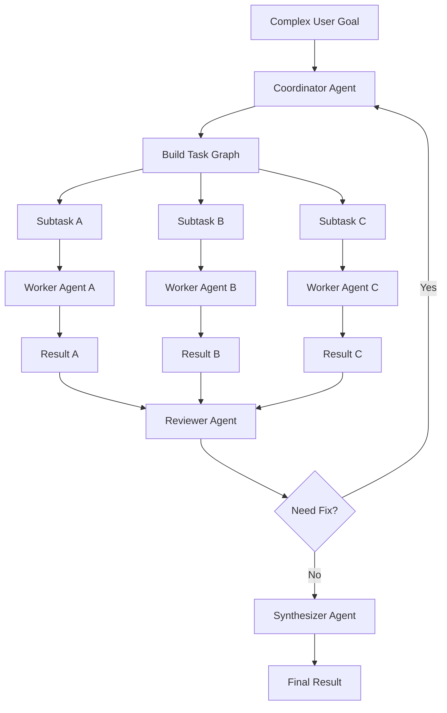

# Multi-Agent 设计

## 基本原则

Multi-agent 不应该被设计成多个聊天机器人自由讨论。

更可靠的方式是：

```text
Coordinator -> Task Graph -> Worker Agents -> Reviewer -> Synthesizer
```

也就是说，multi-agent 的核心是任务图执行系统。

Multi-agent 是 Loop Engineering 在复杂任务上的扩展：不是让多个 Agent 随机对话，而是由 Coordinator 把复杂目标拆成 TaskGraph，再为每个 TaskNode 启动边界清晰的 AgentRun loop。每个 loop 都必须遵守上下文、工具、权限、状态、事件和停止条件。

## 何时启用 Multi-Agent

默认使用 single-agent。

当任务满足以下条件时才启用 multi-agent：

- 任务步骤多，且存在明显子任务。
- 需要并行处理。
- 需要不同专业角色。
- 需要独立审查。
- 单个上下文窗口难以容纳全部信息。
- 任务结果影响较大，需要 reviewer。

## Agent 角色

### Coordinator Agent

负责：

- 理解复杂目标。
- 拆解 task graph。
- 分配子任务。
- 整合 worker 结果。
- 判断是否需要返工。

### Worker Agent

负责执行具体子任务。

每个 worker 必须有明确输入、输出、上下文范围、工具权限、MCP 可用范围和停止条件。

### Reviewer Agent

负责检查结果：

- 是否满足目标。
- 是否有风险。
- 是否缺少验证。
- 是否需要返工。

Reviewer 默认只读，避免审查者直接修改结果。

### Synthesizer Agent

负责把多个子结果合并成最终输出。

## Multi-Agent 流程



## Task Graph

TaskGraph 结构：

```text
TaskGraph
  id
  goal
  nodes
  edges
  execution_strategy
  status

TaskNode
  id
  goal
  assigned_agent
  input_context
  allowed_tools
  allowed_mcp_servers
  expected_output_schema
  dependencies
  status
  result
```

## Agent 间通信

Agent 之间不直接无限对话。

推荐通信方式：

```text
Worker result -> structured output -> Coordinator / Reviewer
```

每个 Agent 输出应结构化：

```text
summary
evidence
actions_taken
artifacts
risks
open_questions
next_recommendation
```

## 停止条件

每个 AgentRun 必须有停止条件：

- 达到目标。
- 输出达到 schema。
- 依赖信息缺失。
- 权限被拒绝。
- 超过最大步骤数。
- 超过 token / cost 预算。
- Coordinator 终止。
