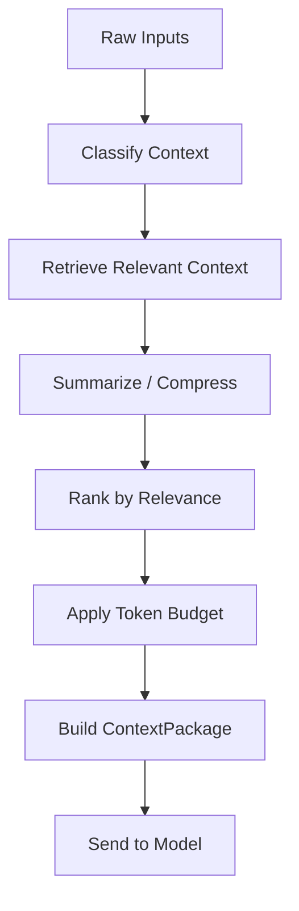

# 上下文与记忆设计

## 基本原则

Agent 不应该把所有信息都塞进 prompt。它应该在每次模型调用前动态构造最小必要上下文。

## 当前实现（Context v2）

当前 Python Worker 已在 `AgentRunner -> ModelProvider` 之间引入无状态
`ContextManager`。每次模型调用都由它生成供应商无关的 `ContextPackage`，Provider
只负责把包内消息序列化并调用模型协议。

输入预算为：

```text
input_budget = context_window - max_output_tokens - safety_margin
```

Context v2 使用可替换的保守 UTF-8 token 估算器；当前保留优先级依次为系统规则与
已安装 Skill、
当前目标、最新工具观测、其余当前 Run 工具观测、用户已确认的长期记忆、同一会话历史轮次。历史只按完整
`user/assistant` 轮次保留，工具调用只按完整 `assistant/tool` 原子对保留，且始终选择
连续的最新后缀。必需上下文无法装入时使用 `CONTEXT_BUDGET_EXCEEDED` 明确失败，不做
静默字符串截断。

Skill 指令与本轮选择的参考文件属于必需上下文，不能像历史或记忆一样静默裁剪；装不下时明确
失败。Skill 上下文随 AgentState checkpoint 保存，避免恢复后因本地包变化改变同一 Run 语义。
`model.context.prepared` 只发布 token 估算、预算、历史/观测/记忆的保留与裁剪数量、
策略版本、Skill 标识/版本/fingerprint 和整体 fingerprint，不发布 prompt 或正文。自动摘要和
向量检索仍属于后续阶段。

## 当前实现（Memory v1）

Memory v1 只保存用户显式确认的跨会话长期记忆，作用域为：

- `global`：跨所有 Workspace 成立的稳定偏好、用户事实和规则。
- `workspace`：仅对指定 active Workspace 生效的项目事实、偏好和规则。

不提供 `conversation` 或 `task/run` 长期作用域。会话消息由 Conversation History 管理，
任务目标、步骤、工具结果、checkpoint 和 Artifact 由 Runtime/Storage 管理；重复写入 Memory
会产生双重真相和过期内容。值得跨会话复用的会话结论，应由用户明确提升为 global 或
workspace Memory。

每个 Task 开始时，Worker 通过 Memory Application Service 和 Repository 查询
`global active + 当前 task.workspace_id 对应的 workspace active`，最多读取 20 条，
按 importance、workspace 具体度与更新时间排序。ContextManager 再按实际模型 token 预算
选择，记忆被包装为“已确认背景数据”，不得覆盖 system、安全或权限规则。

### 已批准响应偏好的类型化投影

长期记忆进入 Context 并不等于它已经成为可执行 Harness 约束。`Context v19 / Memory v2`
为这一边界增加唯一 owner：只有 active Memory 中精确的
`category=preference + key=response.language` 可以被解析为 `zh|en` 枚举；任意其他 key、类别、
模糊文本或同一有效 scope 内互相冲突的值都不得提升。Workspace 偏好优先于 global 偏好，
但原始 Memory 正文仍只作为 user-role 背景数据存在，system 只接收 Runtime 生成的固定字段、策略版本
和规则，不接收原始文本。

当前用户明确提出“请用英文回答 / please answer in English”等指令时，可以只覆盖本轮有效语言；
输入本身使用英文或中文不构成覆盖，位于任务中间的引用示例也不得被误判为指令。代码、JSON、路径、
引用、技术名词和专有名词允许保留原文。`ResponseLanguagePreferenceValidator` 在自然语言最终回答发送
任何 `model.delta` 前检查有效语言；不匹配时发布安全的 `FINAL_ANSWER_VALIDATION_FAILED`，复用一次
finish-only 答案重写预算，禁止再次调用工具。第二次仍不匹配则失败关闭。完成事件只记录
`default/effective language`、scope、是否当轮覆盖和策略版本，不保存 Memory 正文。

Memory 使用统一 `scope_type + workspace_id` 数据模型和检索接口，不按作用域拆表。未来增加
agent/profile 等新作用域时，应扩展枚举、owner 校验与检索策略，不重写 API、UI 和
ContextManager。LLM 自动提取未来必须写入独立 MemoryCandidate，不得直接创建 active Memory。

上下文管理的目标是：

- 让模型知道当前要做什么。
- 提供足够但不过量的信息。
- 保留任务状态。
- 使用相关历史和记忆。
- 控制 token 成本。

## 上下文类型

```text
Session Context:
  当前对话内容和摘要。

Task Context:
  当前任务目标、状态、步骤和中间结果。

Project Context:
  当前工作区、文件结构、项目说明和相关资料。

Memory Context:
  用户偏好、长期事实、历史任务摘要。

Environment Context:
  本地电脑状态、可用工具、权限范围。

Execution Context:
  工具调用结果、错误、观察信息。
```

## Context Pipeline



## ContextPackage

每次模型调用前构造一个 ContextPackage：

```text
ContextPackage
  system_instructions
  agent_role
  user_goal
  current_task_state
  recent_messages
  relevant_memory
  relevant_project_context
  tool_results
  available_tools
  permission_scope
  output_schema
```

### 会话历史完整性

模型使用的 `recent_messages` 与 UI 展示历史不是同一读取视图：PostgreSQL 和 UI
保留失败、取消、拒绝与未完成任务的原始记录，模型上下文只接受同一 `task_id`
下完整的 `user → assistant` 轮次。孤立 user/assistant、缺少 `task_id` 的消息以及
当前 Task 均不得进入历史上下文；轮数和字符预算必须按整轮截断，避免旧的失败
指令在后续任务中被误认为仍待执行。

## 记忆分类

长期记忆应分层：

```text
User Preference:
  用户偏好，例如语言、风格、工作时间。

User Fact:
  稳定事实，例如常用目录、设备信息。

Project Memory:
  某个项目的背景、架构、决策。

Rule:
  用户明确指定的长期规则。
```

## 记忆写入流程

```text
Conversation / Task Result
-> Memory Candidate Extraction
-> Importance Scoring
-> Sensitivity Check
-> User Confirmation if needed
-> Save Structured Memory
-> Optional Embedding
```

## Evidence precedence v1

ContextManager 使用 `context-v21-memory-v2-skill-v1-intent-v7-loop-v1-evidence-v3` 投影 Runtime 拥有的证据优先级，不让 Prompt、历史消息
或模型自行决定“哪条来源是真相”。当前顺序为：Runtime contract → 当前 Run Workspace 原文 → 当前 Run
RAG context → 已确认 Memory → conversation history。该顺序只决定回答证据 owner；安全、权限和工具边界
始终高于所有数据来源。

- 当前 Run 最新成功的 `workspace.read_file/read_files` 可接管早先 RAG 的回答 owner；显式提交 RAG citation
  时仍必须通过当前 Run Chunk 身份校验。
- RAG ToolResult 的 `evidence_assessment` 和 `document_coverage` 在有界 Prompt 投影中保留；充分性失败只能
  明确降级，不能被压缩阶段丢失。
- 历史 assistant 文本始终是旧对话数据。在同一有界完整历史内，Runtime 从新到旧查找最近一个拥有
  durable completed ToolCall provenance 的 Run，并只把该来源链作为 sidecar 连接 Knowledge；中间纯摘要
  轮不会切断来源链，但 sidecar 不自动成为本 Run 的事实证据，也不得越过历史裁剪边界追溯旧来源。
- 上下文裁剪仍优先保留系统规则、当前目标、最新 ToolResult 和源码证据账本；Memory 与完整历史轮次按
  预算降级。所有投影进入 Context fingerprint，恢复后同输入得到可审计的确定性上下文。

## Memory v2：候选与用户确认

模型不能直接写入正式 Memory。自动提取必须先产生独立 `MemoryCandidate`：

```text
completed Task/Run
-> durable MemoryExtractionJob
-> MemoryExtractor candidate specs
-> structure / sensitivity / scope / dedup validation
-> pending MemoryCandidate
-> user edit + approve / reject
-> approved MemoryCandidate + active Memory in one transaction
```

候选状态只允许单向转换：

```text
pending -> approved
        -> rejected
        -> expired
```

`approved/rejected/expired` 均为终态。Candidate 本身永不进入 ContextManager；只有批准事务
创建或关联的正式 `Memory(status=active)` 才能在后续任务中被读取。批准时必须重新校验
version、过期时间、Workspace、正式 Memory 唯一键和内容冲突。

正式 Memory 与 Candidate 复用 `global/workspace` 和
`preference/user_fact/project_fact/rule`，不引入第二套类型语义。Candidate 使用
`suggested_key` 承接正式 Memory 的业务 key，并以系统计算的 `deduplication_key` 保证同一
Run/提取策略的幂等性。同 key 不同内容属于冲突，不能由模型自动覆盖。

在敏感 Memory 加密存储完成前，疑似敏感 Candidate 必须在持久化正文前 fail closed；只允许
记录安全错误码或计数。异步提取属于独立 MemoryExtractionJob，不向已经终结的源 AgentRun
追加 RuntimeEvent。Memory 领域变化通过 AuditLog 和独立领域通知观察。

当前已完成 Candidate/ExtractionJob 契约、PostgreSQL migration、Repository、候选编辑与原子
批准/拒绝 API、Web 待确认区，以及成功任务后的异步提取执行链路。`agent.run.completed`
在任务终态、最终 Message 的同一 PostgreSQL 事务中幂等创建 ExtractionJob；Worker 内独立
后台循环使用 `FOR UPDATE SKIP LOCKED` 领取，超时的 running 作业可以恢复，模型或提取失败
不会阻塞、回滚或改写源 Task/Run。

自动定期任务不创建 MemoryExtractionJob。其指令来自已持久化的计划，产物由知识库或 Artifact
承担长期保存职责，并不代表用户新声明的偏好、事实或规则；若仍进入 MemoryExtractor，会让每次
周期运行反复制造低价值候选。交互式任务继续使用上述候选确认闭环。

第一版 `DeepSeekMemoryExtractor` 使用独立 JSON 输出契约，不复用 AgentAction parser，也不能
决定来源 ID 或 workspace_id。模型结果最多 8 条，低于 confidence 0.75 或 importance 40 的
内容直接抑制；其余仍需通过本地类型、范围、Workspace、去重和敏感规则。空数组是合法成功
结果。可恢复失败最多重试 3 次并指数退避；状态与安全错误码写入 ExtractionJob/AuditLog，
不把 prompt、原始响应或候选正文写入日志。

提取策略 `memory-extraction-v2` 进一步要求每条候选携带 `evidence_source + evidence_quote`。
`preference/user_fact/rule` 只能由用户目标中的明确长期陈述支持，禁止从助手最终回复、用户问题、
已有记忆的复述或助手扩写中反推；只有由任务结果直接证实的 `project_fact` 才能引用最终回复。
Application Service 会校验证据片段确实逐字存在于允许来源、候选数字没有超出证据、业务 key
没有与当前 active Memory 重复。已保存记忆以只读参考输入 Extractor，用于抑制重复提取，模型
仍不能修改或覆盖正式 Memory。

Memory v2 收口后，候选到期不再依赖用户尝试批准。独立维护循环会自动把到期 pending 候选
转换为 expired 并写审计；维护循环不依赖 DeepSeek 或自动提取开关。Migration
`009_memory_candidate_maintenance` 增加 pending `deduplication_key` partial unique index，
保证不同 Task/Run 并发提取时全系统最多保留一个完全相同的待确认候选；同 Run 的原幂等约束
继续保留。候选编辑为与正式 Memory 相同内容时会清除冲突标记，批准后只关联现有 Memory，
不会创建第二份正式真相。

## 结构化记忆与向量记忆

结构化记忆适合可靠事实：

```json
{
  "type": "user_preference",
  "key": "language",
  "value": "zh-CN",
  "source": "user_confirmed"
}
```

向量记忆适合模糊检索：

```text
历史任务摘要
项目背景文档
会议记录
长文本资料
```

Memory v1 已实现结构化记忆；任务摘要继续属于 Task/Conversation 持久化，不复制进 Memory。
向量检索后置。

## 记忆管理 UI

用户必须能够：

- 查看 Agent 记住了什么。
- 编辑记忆。
- 删除记忆。
- 禁用某条记忆。
- 搜索记忆。
- 标记敏感信息。

当前 Web 已实现查看、新增、编辑、启用/停用和永久删除。搜索与敏感信息加密存储留待后续；
在加密存储完成前，UI 不提供 sensitive Memory 写入入口。
