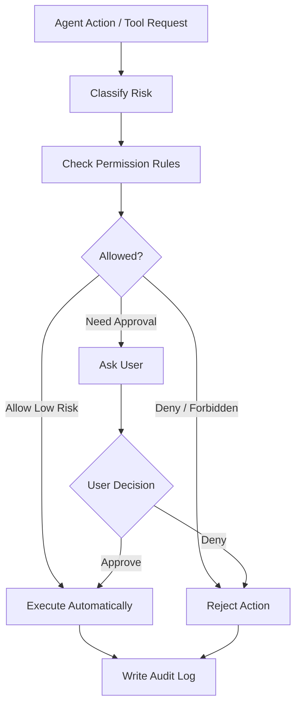

# 权限与安全设计

## 安全目标

个人电脑上的 Agent 必须可控。系统需要防止 Agent 在没有用户理解和授权的情况下执行高风险操作。

权限系统的目标不是取消 Agent 自主性。Agent 可以自主规划、选择工具并发起动作，但所有动作都必须被分类、校验、授权、执行和审计。低风险动作可以自动执行；中高风险动作需要用户确认；禁止动作必须拒绝。

安全目标：

- 明确 Agent 能做什么。
- 高风险操作前请求确认。
- 所有本地操作可审计。
- 权限可撤销。
- 不让 UI 层直接执行危险操作。
- 不把长期敏感信息随意注入上下文。

## 第三方通用 Skill 信任边界

通用 Skill 是可执行的 Agent 指令供应链内容，即使包内只有 Markdown，也可能诱导模型越权读取、
外传数据、扩大任务目标、写入长期记忆或调用高风险工具。因此“格式合法”“纯 Markdown”“发布者
签名有效”都不等于行为安全；签名只能证明来源和完整性，不能替代内容、能力与运行时审查。

必须保持以下不变量：

- 下载不等于安装，安装不等于启用，启用不等于授权。下载内容不能直接进入 Worker 扫描的受信任
  `skills/` 目录。
- 第三方 Skill、reference、asset、script 和包内宿主配置默认均不可信。Jarvis 只信任独立、受控的
  host adapter registry；Skill 自己不能声明或提升权限。
- Skill 指令不能覆盖 system safety、ToolGateway、PermissionManager、Workspace、Storage、AuditLog、
  Context/Memory 注入或定期任务策略。工具映射不等于授权，实际调用仍逐次经过标准权限链路。
- 只读工具也可能暴露隐私。未经审查的 Skill 不能因为工具被标为 L0 就自动获得文件、邮件、知识库、
  浏览器会话或其他敏感数据读取能力。
- 未经信任审查的脚本不得交给现有 SkillScriptExecutor 执行。当前 Python audit hook 是受信任脚本的
  纵深约束，不是恶意代码沙箱。
- Skill 更新、adapter 变化、依赖变化或 fingerprint 变化必须重新计算兼容性与权限摘要；不默认自动
  继承旧版本信任。

计划中的信任等级：

```text
quarantined
  已下载但不进入模型上下文，不注册 Tool，不执行脚本。

restricted
  仅允许用户显式调用；无 Tool、脚本、后台任务、Memory 写入或自动持久化。

reviewed
  已审核具体能力映射；Tool 调用继续按风险等级确认和审计。

trusted
  Jarvis 内置或经过完整供应链审查；可参与受控隐式激活，但高风险动作仍不可永久批准。
```

未来安装安全网关必须在隔离暂存区完成路径穿越、符号链接、文件数量/大小、压缩炸弹、异常二进制、
脚本、依赖、能力请求、名称冲突和指令风险检查，再生成面向用户的权限摘要。未通过的包进入
`invalid/quarantined/needs_adapter/needs_dependencies` 等非激活状态，不得因一个可选第三方 Skill
损坏而拖垮 Worker。内置必需 Skill 或受信任 adapter 损坏仍应 fail closed。

本节是后续安全约束，当前阶段不实现第三方 Skill 下载、隔离安装、市场、签名校验或恶意脚本沙箱；
现有 `skills/` 仍是仓库内受信任安装边界，不接受任意下载包直接落盘启用。

## 权限分级

```text
Level 0: Read-only
  只读操作，例如读取允许目录下的文件。

Level 1: Low-risk Action
  低风险操作，例如创建本地任务记录。

Level 2: Scoped Write
  范围内写入，例如写入当前工作区。

Level 3: User Approval Required
  需要确认，例如执行 Shell、修改文件、发送信息。

Level 4: Always Confirm / Restricted
  高风险操作，例如删除文件、购买、转账、发送邮件。

Level 5: Forbidden
  默认禁止的操作。
```

## 权限决策流程



## 确认粒度

用户确认可以有不同范围：

```text
Allow once
Allow for this task
Always allow for this tool and path
Always allow for this workspace
Deny
```

高风险操作不允许永久自动批准。

当前执行规则：L0 仅允许显式只读白名单自动执行，伪装成 L0 的未知工具拒绝；L1
自动执行但必须可观察；L2-L4 必须生成持久化 PermissionRequest；L5 直接拒绝。
界面只展示该请求 `allowed_decisions` 声明的按钮，L4/L5 不接受永久授权决定。

P3 Web 权限接管继续遵守以下显示侧安全规则：

- active Run 的 pending 请求必须在主操作区持续可见，不能被长 Timeline、Inspector 或窄窗口挤出；
  这只是 UI 接管入口，不改变 PermissionRequest 和 PostgreSQL 的权威状态。
- 参数只消费后端有界脱敏 `arguments_summary`，前端额外对疑似敏感 key fail closed；不得通过
  “查看详情”恢复 content、token、secret、password、authorization、checkpoint 或原始异常。
- 按钮严格取自 `allowed_decisions`。即使后端错误声明，L4 也不得显示持久授权，L5 不得显示批准；
  未知风险、scope 或 decision 以保守文案展示，不自动扩大授权。
- resolve acknowledgement 只表示决定已持久化接受，不表示 Worker 已恢复、工具已执行或 Run 已
  成功；后续结果必须由 durable RuntimeEvent 驱动。
- 拒绝、过期、冲突和网络错误保留在对应请求/反馈卡片。拒绝反馈必须说明操作不会执行但决定仍会
  审计；已完成反馈必须有界，避免在浏览器内形成无界权限历史。

### 持久化确认链路

```text
AgentRunner assess
-> permission.required + PostgreSQL checkpoint
-> Run waiting_permission（Worker 释放）
-> 用户 allow_once / deny
-> PostgreSQL decision + Outbox command
-> 空闲 Worker 校验并 claim resume
-> ToolGateway execute(verified approval)
-> permission.resolved + ToolCall + AuditLog + RuntimeEvent
```

- checkpoint 是 Runtime 内部数据，不属于 PermissionRequestDTO，不得进入日志、SSE 或前端。
- checkpoint 必须通过集中 builder/validator；空闲 Worker 在 claim resume 和工具 effect 前，逐项核对
  request/task/run/step/tool-call/tool-name 与 PostgreSQL PermissionRequest。同版本结构损坏或身份不一致
  必须以安全错误收口并消费毒 command，不能执行工具或泄漏 checkpoint 内容。
- RuntimeEvent、PermissionCard 和 AuditLog 只使用有界脱敏 `arguments_summary`；完整 ToolRequest 参数只在内部恢复点和执行边界使用。
- 刷新页面通过 `GET /api/runs/{run_id}/permissions` 恢复该 Run 的 pending 请求。
- 重复点击、过期请求、终态 Run 和错误 request/run 组合必须拒绝或幂等收口。
- PermissionRequest 必须携带由后端冻结的非空 `expires_at`；默认 15 分钟，配置边界为 30 秒到 24 小时。
  过期 owner 是 PostgreSQL + Control Plane reconciliation，浏览器倒计时只负责即时禁用按钮。定时扫描
  采用有界批次和 `SKIP LOCKED`，决定接口仍须行锁复核，避免扫描间隔内的迟到批准竞态。
- 到期不是用户 deny：请求、ToolCall、开放 Step、等待 Run/Task、RuntimeEvent、Outbox 与 AuditLog 必须
  原子收口为 `PERMISSION_REQUEST_EXPIRED`；不创建 PermissionGrant，不下发 permission decision command，
  不进入 ToolGateway。批准先于截止时间落库后，即使 command 稍晚送达仍按已批准事实处理；仅 pending
  请求参与到期扫描。
- 权限 command 重投不得重复执行工具。allow resume lease 过期代表 effect 结果未知，必须不可恢复失败；
  只有 ToolCall 终态和安全 `call_model` checkpoint 已持久化后，后续推理中断才允许恢复。任何失败终态
  都必须同步关闭开放 Step/ToolCall，不能留下“Run failed、工具仍 running”的投影。
- 等待权限期间允许取消；取消会使 pending 请求 expired 并写 AuditLog。
- Redis 只传递 command；请求状态和恢复点以 PostgreSQL 为真源。
- 已过期 PermissionRequest 对应的迟到 command 在身份一致时幂等 ack，不恢复或执行；request/task/run
  任一不一致时不 ack，交由有界 reclaim/DLQ 留证。Run 已终态后的 cancel command 同理，不重复终态。
- `ToolCall.permission_status=expired` 只表示请求未获批准便失效；仅允许从 pending 投影，不得把过期
  伪装成用户 deny，也不得覆盖 approved。PermissionRequest 与 ToolCall 的过期投影必须同事务完成。
- `workspace.create_file` 是 L2 Scoped Write：每次只接受 `allow_once / deny`，完整 `content` 仅存在于内部 ToolRequest/checkpoint；RuntimeEvent、Outbox、AuditLog、PermissionCard 和 Web DTO 只保存 `size_bytes + sha256` 脱敏摘要。
- 用户明确把 `target_absent` 设为创建前置条件并要求“不覆盖”时，Runtime 可以先用 L0 精确路径工具确认
  目标。可信结果证明目标已存在后，Loop 必须在权限请求前短路，并由 Host 明确报告未创建/未覆盖；这不是
  L2 自动批准，也不能形成 PermissionGrant。路径不精确、搜索无结果、结果来自模型正文或 ToolResult 失败
  （`create_file` 自身的 `PATH_ALREADY_EXISTS` 除外）时，仍不得跳过正常 L2 权限与 ToolGateway 执行。
- RAG Web PDF 上传同样是 L2 Scoped Write，使用两阶段边界：先持久化 waiting Task/Run 与
  `rag.upload_pdf` PermissionRequest，再由用户 `allow_once/deny`。批准只绑定一次请求中的
  Workspace、净化文件名、字节数和 SHA-256；实际上传不匹配即 fail closed。拒绝时不得创建 Artifact、
  RagDocument 或 ingestion job，并以取消终态和 AuditLog 留证。
- 内容哈希是已持久化上传的业务身份，文件名只是本次客户端展示别名。首次写入仍必须精确匹配获批文件名、
  大小和 SHA-256；只有 Permission 已 consumed、确定性 Artifact 已存在，且 Workspace、Artifact ID、大小、
  SHA-256 全部一致时，才允许同一内容以不同本地文件名重试已有入库 lineage。该恢复路径不得创建第二个
  Artifact、扩大授权范围，或在 denied/pending 状态下预读 Artifact。consumed 权限对应的 Artifact 如果
  已缺失，必须按完整性错误关闭，禁止使用旧权限重建。
- allow resume 在调用任何获批 ToolGateway effect 前，必须先同步提交 durable
  `permission.resolved + tool_in_flight`；RAG 上传则必须先验证 durable approved request，副作用完成后
  才标记 consumed。网络确认或前端弹窗状态都不能代替服务端权限真源。
- RAG 上传批准后、入库 Job 创建前的暂存来源不是“已完成”状态。RagIngestionService 只在 Task/Run 仍为
  `waiting_for_user/waiting_permission` 且确定性 PermissionRequest 精确匹配 L2、`allow_once`、Workspace、
  Artifact、文件名、大小和 SHA-256 时接受该来源；不能只凭 Artifact metadata 或 UI 的“已批准”标记
  放行。enqueue 成功后才消费权限并完成 Task/Run；enqueue 失败保留批准用于同文件幂等重试，文件摘要
  变化必须重新授权。
- `workspace.create_directory` 是 L2 Scoped Write：仅创建一个不存在的目录，不递归创建父目录；每次仅接受 `allow_once / deny`。
- `workspace.move_path` 是 L3 User Approval Required：仅在同一 workspace 内移动普通文件、目录或符号链接，目标必须不存在；执行器使用 no-replace 原子 rename，平台没有该原语时 fail closed，不退回到可能覆盖的“先检查、再 rename”。
- `workspace.delete_path` 是 L4 Always Confirm：每次仅接受 `allow_once / deny`，只能删除普通文件、符号链接或空目录；拒绝 workspace 根目录和递归删除。删除符号链接本身而不跟随 target。
- `rag.delete_document` 是 L4 Always Confirm：每次仅接受 `allow_once / deny`。批准后删除 RAG 派生数据库记录、向量和派生二进制，但保留原始 Artifact；运行中作业必须先取消。拒绝、批准及文件清理补偿均审计，禁止永久授权。
- P5-4 RAG 质量问题状态更新属于质量中心内的 L2 治理 metadata 写入：用户点击本身是显式授权，不创建
  ToolGateway PermissionRequest，但必须使用 expected version 防并发覆盖并写 AuditLog。接口不得修改
  query、证据、label、cohort、baseline、门禁阈值或检索运行参数，`verified` 只能由后续门禁自动产生。
- 用户 `deny` 时，ToolCall 使用 `status=failed + permission_status=denied + PERMISSION_DENIED`，Run 进入 failed；`denied` 不是 ToolCall `status` 枚举值。用户已经批准但 executor 失败时，必须保留 `permission_status=approved` 和真实工具错误码，不得改写成用户拒绝。
- DLQ 受控重试固定为 L3，只允许 `allow_once / deny`，不得生成 PermissionGrant 或永久批准。检查资格是只读操作；创建确认请求后，拒绝写 `run.retry.permission_decision` AuditLog，批准在同一 PostgreSQL 事务中消费 PermissionRequest、创建新 Run、更新 Task active_run、写 RuntimeEvent/Outbox/AuditLog。批准前必须再次核对权威状态，防止检查与决定之间的竞态。
- DLQ 重试不执行原始 payload，不恢复旧 Run，也不删除诊断副本；RunJob 的 user_goal/workspace_path 只能从 PostgreSQL Task 和仍有效的 Workspace 恢复。
- 缺失终态事件修复固定为 L3，只允许 `allow_once / deny`，不得生成 PermissionGrant。它只接受
  `run_id`，服务端重新构造安全 `agent.run.failed` payload；批准前必须再次核对 failed 状态、
  failed_at、安全 error、连续 sequence 和无冲突终态。批准原子写 Event/Outbox/Permission/Audit，
  拒绝也审计；不得修改 Run/Task/已有事件，也不得扩展成通用 SQL 或批量修复入口。

## Tool Gateway 安全边界

Agent 不直接调用本地系统或 MCP server。

统一路径：

```text
Agent -> ToolGateway -> PermissionManager -> Local System Bridge / MCP Server -> Result
```

ToolGateway 负责：

- 校验工具名。
- 校验参数 schema。
- 检查权限。
- 执行工具。
- 捕获错误。
- 写入 audit log。
- 返回结构化结果。

### 工作区信任边界

- PostgreSQL Workspace Registry 是已注册工作区的业务真源；`JARVIS_WORKSPACE_ROOT` / `JARVIS_ALLOWED_WORKSPACE_PATHS` 仅作为启动 seed，并以 `source=configured` 注册。
- 系统目录选择器是用户主动配置能力，不是 Agent Tool。Agent、prompt、ToolGateway 和模型都不能调用 picker、注册、撤销、切换或扩大 Workspace。
- Python Application 在注册时解析 realpath、拒绝根目录/Home/过宽父目录/系统树/敏感目录，并要求路径存在且为目录；Task 创建时再次应用完整策略并校验 realpath 未被替换。
- Task 优先绑定 active `workspace_id`，并保存校验后的 `workspace_path` 快照。Task 校验和 revoke 对同一 Workspace 行加锁，避免并发撤销竞态。
- `source=configured` 不允许通过 Web revoke；`source=user_picker` 必须二次确认后才可 revoke。历史 Task 保留快照，不因后续 revoke 丢失审计上下文。
- Gateway 只允许配置白名单中的 Web Origin；未知 Origin 在进入 Workspace handler 前返回 `403 ORIGIN_NOT_ALLOWED`，不得只依赖浏览器隐藏跨域响应。
- AgentRunner 再从已校验的 `Task.workspace_path` 注入 `workspace_root`，覆盖模型输出中的同名参数；ToolGateway 的文件执行器仍需再次校验相对路径和符号链接边界。
- 这形成“注册校验 + Task 绑定/快照 + Agent 参数覆盖 + 工具执行校验”四层防护，任何一层都不能被前端选择器替代。
- `workspace.search_files` 是 L0 metadata-only 工具：只搜索名称/相对路径，不读取正文；使用固定 workspace/search root FD 与 `O_DIRECTORY | O_NOFOLLOW` 逐级打开目录，symlink 本身可作为结果但永不递归进入。初始目录失败必须以 tool failure 收口，只有后代目录错误允许跳过。
- `workspace.search_text` 是 L0 正文检索工具：仅扫描允许的 UTF-8 文本类型，返回相对路径、行号和有界单行预览；不跟随 symlink，拒绝隐藏/排除路径，并限制查询长度、单文件大小、总读取字节、扫描文件数、递归深度和返回结果数。`source_only=true` 时额外排除 docs/tests/examples/scripts 和测试文件名，减少代码取证中的非生产命中。匹配行若包含 API key、auth/access/refresh token、密码、JWT、云密钥或私钥形态，`ObservationPhase` 必须在 RuntimeEvent、Observation、checkpoint 和模型上下文前递归脱敏；原始 executor 结果不得成为持久化真源。
- `workspace.read_file` 与 `workspace.read_files` 都是 L0 正文证据工具。单文件读取可使用受限 `start_line/max_lines` 获取搜索命中附近片段；批量读取最多接收 6 个已定位条目，每项仍独立经过同一 workspace boundary、symlink、普通文件、256 KiB 和严格 UTF-8 校验，单项失败不得取消其他安全读取。批量工具不能接受绝对路径或把搜索预览提升为正文证据。
- `workspace.get_file_info` 是 L0 metadata-only 工具：只返回单个相对路径的名称、类型、普通文件大小和修改时间；父目录以 dir-fd + `O_NOFOLLOW` 逐级打开，最终 symlink 只报告自身类型，不跟随或暴露 target，不返回绝对路径、权限位、owner/group 或正文。
- 所有 Workspace 写工具都从可信 root dir-fd 起、以 `O_NOFOLLOW` 逐级打开父目录，拒绝绝对路径、`..`、workspace 根目录操作和父级 symlink；路径验证不能替代 ToolGateway 与用户确认。
- `workspace.create_file` 的不覆盖保证同时参与 Loop 完成契约：只有用户显式声明“若目标存在则告知且不
  覆盖”并且 L0 ToolResult 精确证明同一规范化相对路径已存在时，Host 才能把 create effect 判定为前置条件
  短路。此时没有写 effect，因此不创建 L2 PermissionRequest、ToolCall deliverable 或 Artifact；若实际进入
  `workspace.create_file`，仍必须先 `allow_once`，且 `PATH_ALREADY_EXISTS` 继续由 ToolGateway 作为真实结果
  返回，不能被模型改写为创建成功。
- L0 名称搜索仍受 10000 条扫描、20 层深度和 100 条结果上限约束；L0 正文搜索受 10000 条目录项、2000 个候选文件、单文件 1 MiB、总读取 16 MiB、20 层深度和 50 条结果上限约束。两者都完整写入 ToolCall、RuntimeEvent 和 AuditLog；L0 自动放行不等于绕过 ToolGateway。

## 审计日志

每次工具调用都需要记录：

```text
tool_name
arguments
risk_level
permission_decision
approved_by_user
started_at
finished_at
result_summary
error
agent_run_id
task_id
```

### 定期知识库写入授权

- 创建定期任务是用户对该计划的持久化、最小范围授权。普通报告只允许
  `knowledge.create_document`；`source_report` 额外允许第一方 native L1
  `literature.search_arxiv`，不得由请求正文或模型扩展工具名单。
- 可信 `scheduled_task_id/authorized_tools/source_policy` 仅由服务端从 PostgreSQL 计划写入
  RunJob，模型参数不能设置。来源工具还会逐项校验 provider、query、max_results 与计划完全一致。
- PermissionManager 只对风险 L2、工具名精确匹配的知识库写入自动放行；任何 Workspace 写入、MCP
  调用或未来新工具仍进入常规确认。
- 普通任务调用该工具继续要求 `allow_once`。无论普通授权还是定期授权，ToolCall、RuntimeEvent、
  KnowledgeDocument 来源和 AuditLog 都必须保留 Task/Run 关联。
- 内置 arXiv 元数据 MCP 仍按 MCP 默认 L3 单次确认；它与定期任务的 native L1 适配器共用同一
  第一方 arXiv provider，但通用 MCP 身份不会获得持久授权。PDF 下载使用 native L2
  `literature.download_arxiv_pdf` 单次确认，未加入定期任务授权。
- `rag.ingest_artifact` 是独立 L2 单次确认。批准 PDF 下载不等于批准向量化；该 Tool 只接受 Artifact
  UUID，Workspace 从持久化 Task 回查，并再次校验 Artifact/Task/ToolCall/PDF 哈希血缘。

### 本地文档解析与外部 OCR 授权

- PyMuPDF、PaddleOCR-VL Pipeline 和 localhost MLX-VLM 都是本地处理，只能读取由 ingestion
  编排器传入的受控 Artifact bytes/页面渲染，不接受模型生成的任意文件路径。MLX server URL
  必须是无凭据的 localhost HTTP 地址，不产生文档外发。
- 百度智能云 OCR 是可选 fallback，会把被判定为扫描页或原生文字损坏页的页面图像发送给第三方；
  接入 ToolGateway 时固定
  为 L3 `allow_once / deny`，不得自动继承下载、知识库写入或定期任务授权，也不得永久批准。
- 只发送明确标记为需要 OCR 的页面裁剪；API key、secret、access token、供应商响应正文和原始
  网络异常不得进入 RuntimeEvent、AuditLog 或 Renderer 错误。OCR 结果必须保留 provider、版本、
  置信度和页面坐标，以便用户追溯派生内容。

审计查询页面是只读解释层，不是新的执行入口。它只能显示安全投影：关联 ID、事件类型、
风险/权限、操作与结果摘要、错误码和脱敏详情摘要。任何 `details` / `error` 中的 key、
token、password、Authorization、cookie、prompt、content、异常堆栈或长输出不得原样返回浏览器。

审计导出同样只能消费这份安全投影，默认 JSONL、可选 CSV，并同时受行数和字节数硬上限约束。
Python 以稳定 cursor 分页读取，Gateway 只做有界流式转发；两层都不得缓存全表。CSV 单元格必须防止
公式注入，下载响应不得缓存。导出完成或中断都要追加 AuditLog，但只记录筛选摘要、计数、SHA-256、
预算和稳定结果码，禁止记录导出正文、原始 cursor 或异常文本。

审计保留先执行只读预演：普通记录默认 90 天，L3/权限类记录延长至 365 天；L4/L5、审计保留自身、
数据删除/清理/撤销和恢复/修复/还原类事件永久保护。预演受扫描数与候选数双重上限约束，只返回
分类计数，不返回候选 ID 或正文。实际清理固定为 `audit.apply_retention_policy` L4 Always Confirm，
每批只接受 `allow_once / deny`，禁止长期授权和自动调度。创建确认时冻结候选数量与 SHA-256；
批准后在同一数据库事务内取得全局执行锁、重新按原时间点扫描和分类，快照变化即 fail closed，
只有完全一致时才有界删除并写永久审计。拒绝也写永久审计。

## 敏感信息策略

敏感信息包括：

- API key。
- 密码。
- token。
- 私密联系人。
- 邮件内容。
- 财务信息。
- 身份信息。

策略：

- 敏感配置加密或使用系统 keychain。
- 默认不注入长期上下文。
- 需要时按任务范围临时使用。
- 记忆写入前进行敏感检查。
- Runtime 使用高置信度凭据策略识别 API key、auth/Bearer/访问令牌、密码、JWT、云访问密钥和私钥。
  当结构化 Intent 要求持久化，或 Host 从“凭据 + 保存/记住/以后使用”的组合确认持久化请求时，任何
  模型工具动作都被确定性收敛为拒绝：不得创建 Memory、Knowledge 或 Workspace 文件，不得把完整凭据
  写入最终 Artifact/回复，并引导用户改用系统 keychain 或环境变量。安全拒绝优先于 unknown Intent 的
  一般澄清；该策略属于 Runtime guard，不依赖模型是否正确分类或主动拒绝。
