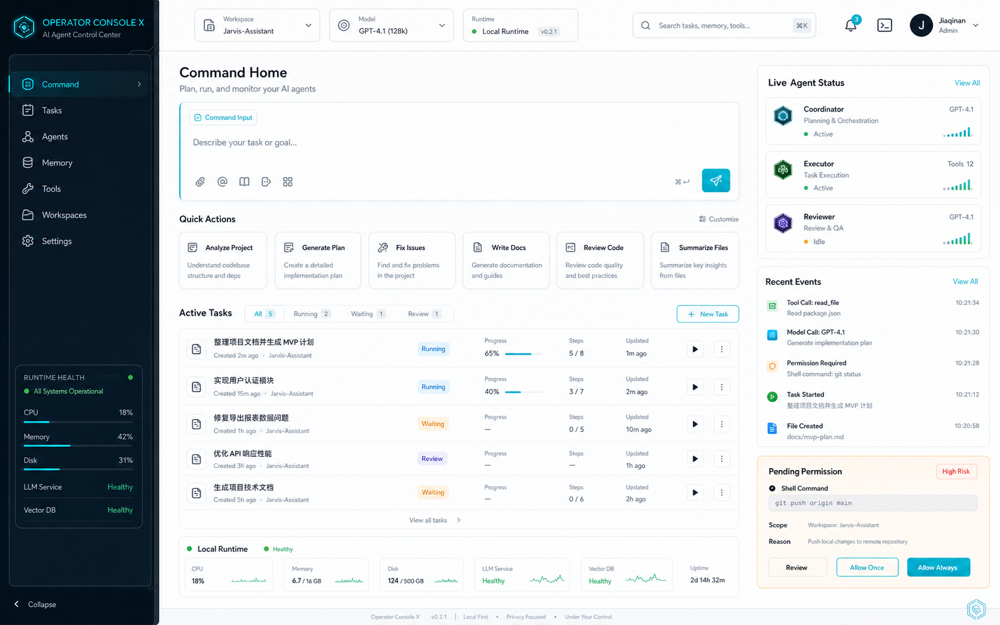
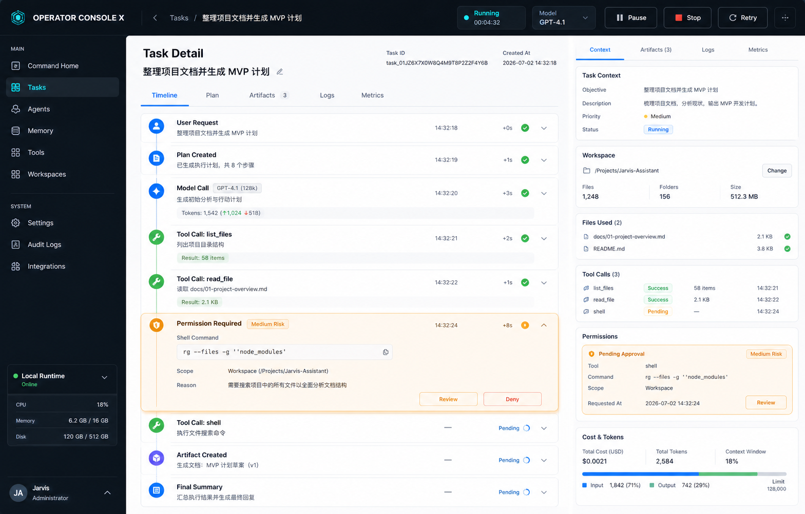
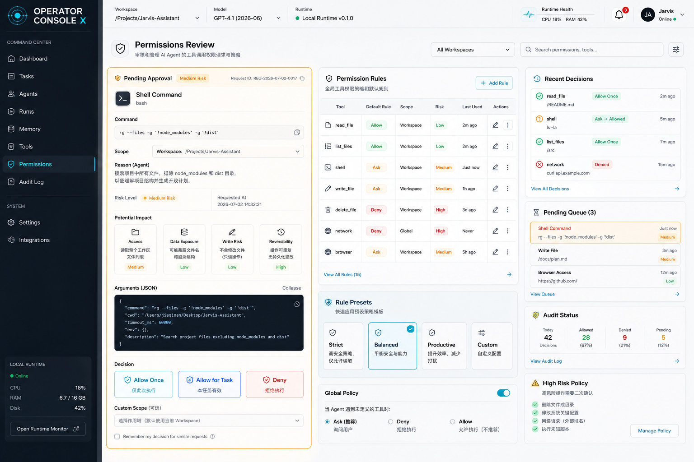
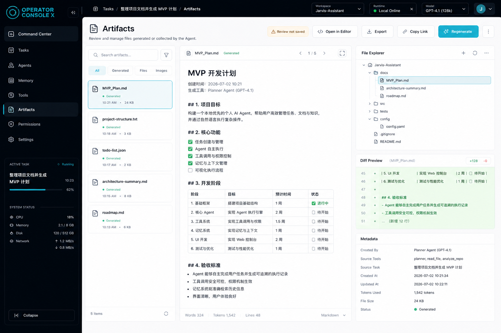
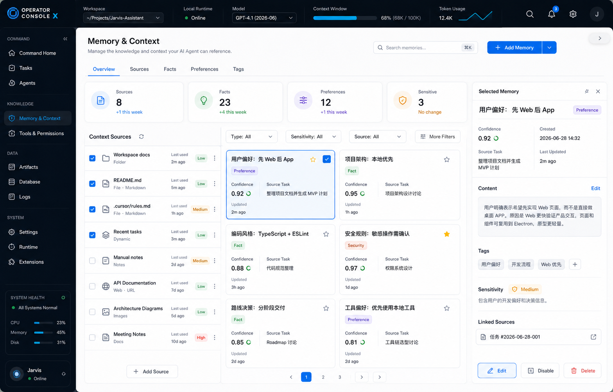
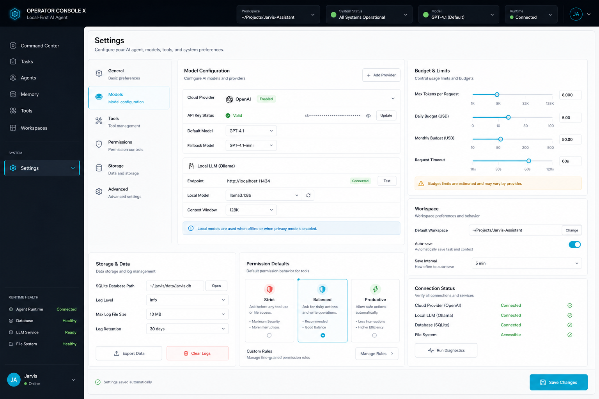
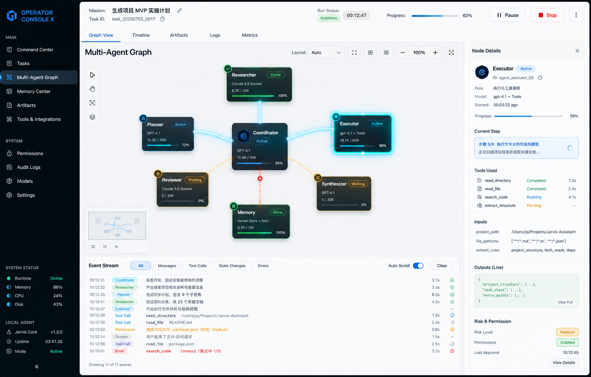
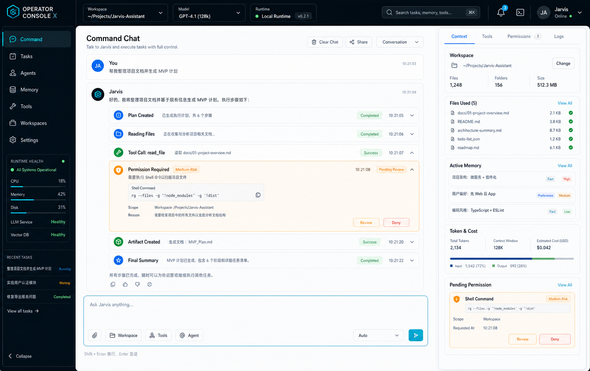
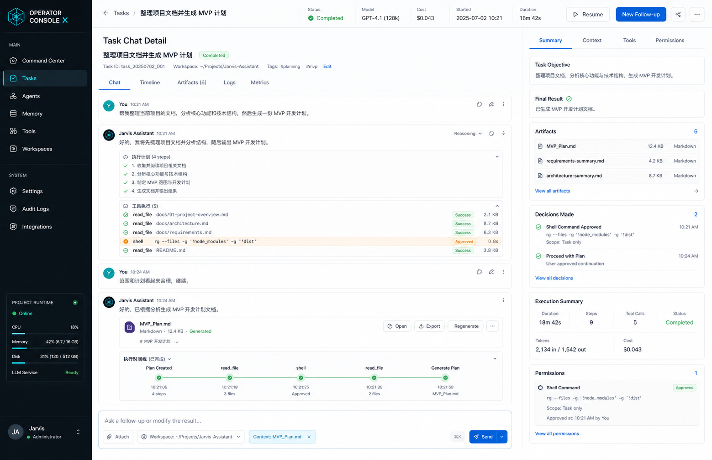

# 前端与 Web 页面设计

## 设计定位

第一阶段先实现 Web 控制台，而不是直接实现 macOS App 壳。Web 前端采用 Vue 3 + TypeScript + Vite，用于快速验证产品交互、页面结构和 Agent 执行可视化；后续再把稳定的 Vue 页面迁移或封装到桌面端 Renderer。

这个 Web App 的第一屏应该是一个个人 Agent 控制台，而不是普通聊天产品或营销首页。

用户打开 App 时，需要立刻看到三件事：

- 我现在可以让 Agent 做什么。
- Agent 正在做什么、做到哪一步。
- 哪些动作需要我确认、哪些结果已经完成。

因此 MVP 的前端重点是对话入口、任务创建、执行可观察、权限接管和历史恢复。

## 体验原则

### 工作台优先

主窗口默认进入 Command Chat / Command Center。它同时承担对话、输入、当前任务、运行流和结果承载，不做单独的欢迎页。

### 对话入口优先

Jarvis 类产品不能只有任务看板和执行日志。用户应该能持续和 Agent 对话，看到自然语言回复，并在对话中直接展开执行步骤、权限请求和产物结果。

对话线程是主入口，Timeline 是对话中的可观察层，Inspector 是右侧的审计和解释层。

### 过程透明

Agent 的计划、模型输出、工具调用、权限请求、失败重试都应该被整理成可扫读的时间线。用户不需要看原始日志，但必须能知道系统为什么做了某一步。

### 接管清晰

当任务进入 `waiting_for_user`，界面需要把用户决策放在最明确的位置。权限弹窗和右侧 Inspector 都要展示操作范围、风险等级、参数摘要和可选授权范围。

### 密度适中

这是一个高频工作工具，不适合大面积装饰式布局。视觉应该安静、清楚、耐看，信息密度接近开发工具、任务管理器和系统设置的结合。

### 本地感

界面语言应强调当前工作区、本地文件、运行历史和可撤销权限。用户要感觉这是运行在自己电脑上的助手，而不是远端网页服务。

## 信息架构

```text
Main Window
├── Left Sidebar
│   ├── New Task
│   ├── Inbox / Active
│   ├── Tasks
│   ├── Agents
│   ├── Memory
│   ├── Tools
│   └── Settings
│
├── Main Workspace
│   ├── Command Chat
│   ├── Conversation Thread
│   ├── Inline Run Timeline
│   ├── Command Composer
│   ├── Task Detail
│   ├── Artifact Preview
│   └── Empty / Error / Loading States
│
└── Right Inspector
    ├── Context
    ├── Tool Calls
    ├── Permissions
    ├── Cost
    └── Logs
```

## 主窗口布局

### 桌面尺寸

建议默认窗口尺寸：

```text
width: 1200-1440
height: 780-960
```

布局比例：

```text
Sidebar: 240px
Main Workspace: flex
Right Inspector: 320px
```

当窗口宽度不足时：

- 右侧 Inspector 折叠为顶部按钮或抽屉。
- Sidebar 保留图标和当前任务入口。
- Command Composer 始终固定在主区域底部。

### 多轮对话（2026-07-15，2026-07-15 修复）

同一会话支持持续追问。Conversation 是对话容器，每次追问创建新 Task 但复用 `conversation_id`。

- **Sidebar** 显示 "最近会话" 列表，按 `updated_at` 倒序排列。点击会话可恢复历史消息并继续追问。
- **ConversationThread** 以持久化 API（`GET /api/conversations/{id}`）为消息真源，实时 Run 内容仅为尚未持久化回复的临时展示。
- **消息刷新触发时机**：
  - 会话切换（`activeConversationId` 变化）
  - 新 Task 创建后（`historyVersion` 递增）
  - 当前 Run 进入终态（completed / failed / cancelled）
- **竞态保护**：以 `conversationGeneration` 标识当前会话代数，并为 `refresh`、`loadOlder` 分别维护独立 request token。响应必须同时匹配 conversation id、generation 和本操作的最新 token 才能写入；切换会话或 `refresh(null)` 会使旧刷新与旧分页全部失效。
- **有界分页**：首次只读取最近一页；`next_cursor` 是唯一分页真源，点击“加载更早消息”后将更早消息按 ID 去重并前置合并。刷新期间禁止分页请求。
- **错误与重试**：会话刷新、加载更早消息和 Sidebar 会话列表分别保留结构化 `AppError`/安全错误状态，失败不会伪装成“没有更多消息”，UI 提供重试入口。
- **Sidebar 初始化**：Settings、Conversation、Task、Worker 状态通过 `Promise.allSettled` 独立初始化，任一请求失败不阻止其他状态和 Worker 轮询。
- **消息 key**：使用稳定消息 ID（`m.id`）作为 `v-for` key；临时消息使用 `live-{runId}` 前缀。
- **内容渲染边界**：用户消息始终按纯文本展示；Assistant 最终回复按安全 CommonMark Markdown
  展示。统一 `MessageContentRenderer` 禁用原始 HTML、限制链接协议，并为完整 JSON 回答提供独立、
  可滚动的 JSON 代码视图。数学公式由同一渲染器使用 KaTeX 展示，同时支持 `$...$` / `$$...$$` 与
  `\(...\)` / `\[...\]`；KaTeX 保持 `trust=false`，无效公式降级显示原始内容，宽公式允许局部横向滚动。
  ToolResult JSON 继续属于 Timeline/Inspector，不作为聊天正文直接展开。
- Runtime 生成的 RAG 引用是同站内部链接，必须在当前 App 中导航到 `/knowledge/rag`，不得强制新窗口；
  query 中的 `document_id/chunk_id` 只用于定位可信来源。RAG 文档页加载后滚动并高亮对应文档，同时明确
  展示证据分块 ID。外部 `http/https/mailto` 链接继续使用新窗口与 `noopener noreferrer`；不安全协议仍
  由统一 Markdown renderer 拒绝。
- **防御性兼容**：Worker 是内部 AgentAction JSON 与用户回复的主要隔离边界；前端只为历史异常数据
  解开一层形如 `{"action_type":"finish","final_message":"..."}` 的包装，不能通过正则删除普通
  JSON、代码块或用户要求的结构化内容。
- **Timeline 去重**：`model.delta` 只展示生成字符计数，`agent.run.completed` 只展示验证/持久化状态；
  两者不重复输出 Markdown 或 JSON 正文，最终内容由 Conversation Thread 的消息渲染器唯一展示。
- **去重**：以 `task_id + run_id` 匹配判断实时回复是否已持久化，不用内容相等判断。
- **activeConversationId** 可以持久化到 `localStorage`，但浏览器缓存不是业务真源。页面启动时必须先用
  会话详情 API 验证缓存 ID，只有服务端确认存在后才能恢复选择；明确 `NOT_FOUND` 时清除缓存并保持
  New Task 状态。若已验证的会话在发送前被另一运行环境清理，创建任务只允许针对明确 not-found 自动
  清除选择并无 `conversation_id` 重试一次，不能把其他错误伪装成新会话成功。
- **运行历史恢复**：恢复或点击 Conversation 时，`taskStore` 从后端 `TaskDTO` 列表选择该会话 `updated_at` 最新的 Task/Run，并重新订阅该 run。Gateway SSE 从 PostgreSQL 重放 RuntimeEvent，因此 completed/failed/cancelled 状态和 Timeline 在刷新后仍可见；前端不得根据消息缺失自行猜测失败。
- **New Task** 清空当前 conversation 选择，下次发送消息创建全新会话。
- 模型失败时不展示伪造的成功回复；前端从 RuntimeEvent 推导状态，不猜测任务结果。
- 对话区将已收到的 `model.delta` 放入纯展示缓冲，以自适应逐字动画和光标平滑呈现；动画不生成
  RuntimeEvent、不改变 Run 状态，`agent.run.completed.payload.output` / Message 仍是最终真源。
  用户主动上滚后停止自动跟随，回到底部后恢复；系统“减少动态效果”偏好下直接展示已收到文本。
- 打字动画只属于当前页面通过新任务或安全重试创建的 Run。刷新、服务重启恢复、点击历史会话时，
  PostgreSQL Message 和 SSE 历史重放必须立即显示完整正文，不得重新播放；该展示来源只保存在前端
  会话内，不能写入后端 Run 状态或 DTO。

### 移动或窄窗口

虽然第一阶段是 Web App，但 Vue 布局仍应支持窄窗口：

- `1024px` 以下 Sidebar 与 Inspector 都使用覆盖式 drawer，不参与主内容宽度计算；两者互斥打开，
  点击遮罩、关闭按钮或选择导航项后关闭。宽屏的折叠偏好与窄屏 drawer 开合是两套 UI 状态。
- Header 在窄屏隐藏次要文字，只保留 Run 状态、Workspace 选择和必要系统图标；按钮文案必须反映
  当前布局下的真实 panel 状态。
- Timeline 继续内嵌对话；Inspector 用原有 tabs 在 drawer 内切换。Composer、Permission 主决定、
  Run 恢复和任务提交重试始终保留在主区底部，并允许操作按钮换行。
- 消息容器、页面主区和卡片必须设置可收缩边界。普通长文本、路径、引用、链接和错误允许
  `overflow-wrap`；代码块和宽表格只在自身内部横向滚动；图片不得超过消息宽度；Artifact 长标题
  截断但可通过 title 查看完整值，正文预览有固定最大高度。
- 最低产品验收宽度为 `480px`；同时覆盖 `760px` 窄桌面与 `1440px` 宽屏。三档都不得出现页面级
  横向滚动，且不能只凭 DOM 测试替代真实渲染检查。

## 首屏 Command Chat

首屏不是空聊天页，也不是纯 Dashboard，而是 Chat + Agent Execution Hybrid。用户在这里对话、下达任务、看到 Agent 的阶段性解释，并在对话流中接管权限请求。

```text
┌─────────────────────────────────────────────────────────────────────┐
│ Sidebar │ Header: Workspace / Model / Run State                     │
│         ├───────────────────────────────────────┬───────────────────┤
│ Command │ Conversation Thread                    │ Inspector         │
│ Tasks   │ - User message                         │ Context           │
│ Agents  │ - Assistant response                   │ Tool Calls        │
│ Memory  │ - Inline plan block                    │ Permissions       │
│ Tools   │ - Inline tool call block               │ Cost              │
│ Settings│ - Inline permission card               │ Logs              │
│         │ - Final result / artifact card         │                   │
│         │ Composer: ask / attach / send          │                   │
└───────────────────────────────────────┴─────────────────────────────┘
```

### Header

Header 展示：

- 当前工作区下拉选择器。选项只来自 `workspaceStore` 消费的 PostgreSQL Workspace Registry；运行期间禁用，存在 active Workspace 时不允许切换到隐式“未选择”状态。
- Header 可由用户主动打开系统目录选择器添加 Workspace；同名 Workspace 使用路径信息区分。picker 取消不是错误。
- 当前在线 worker 心跳上报的真实模型，例如 `deepseek-v4-flash`；未连接或未配置时必须明确显示对应状态。
- 当前任务状态。
- active Run 的 12 个契约状态必须由统一 presentation owner 映射为中文标签与说明；Header、Command
  Center 不得各自维护不完整映射，也不得把未知分支直接显示为原始枚举。
- 连接状态由 Worker 查询与 active Run EventSource 生命周期共同决定。没有权威信号时显示“正在检查”，
  瞬时断线显示“事件重连中”，禁止固定展示绿色“已连接”。
- Pause / Resume / Stop 控制。

Header 不放大量导航，避免和 Sidebar 重复。

### Sidebar

Sidebar 是全局导航和任务入口。

核心条目：

- `New Task`
- `Active`
- `Tasks`
- `Agents`
- `Memory`
- `Tools`
- `Settings`
- `Runtime`（运行健康、DLQ 诊断与受控处置）

当前 Web MVP 已实现 `New Task`、`Tasks`、`Memory`、`Knowledge`、`Schedules`、`Audit`、`Runtime` 和 `Settings`。
Knowledge 是知识中心的单一全局入口，内部使用局部导航拆为四个子路由：`/knowledge` 总览、
`/knowledge/documents` 知识文档、`/knowledge/rag` RAG 文档库和 `/knowledge/quality` RAG 质量中心。
全局 Sidebar 不展开这些二级入口，避免导航继续膨胀；窄窗口下局部导航允许横向滚动。

总览页只展示知识文档、RAG 文档和质量中心的状态摘要、最近知识/RAG 活动与快捷入口，不承载完整
表单、文档运维或审核队列。知识文档页负责连接独立 `Jarvis` Vault、展示已登记文档并通过弹窗显式
创建报告、笔记和来源说明；RAG 文档库随顶部当前 Workspace 切换，展示文档状态、chunk 数、
Embedding 标识、最近作业阶段/尝试次数与安全错误码。RAG 质量中心再用“用户反馈 / 评测与飞轮 /
发布门禁 / 问题台账”四个局部 Tab 区分候选诊断、质量真相审核、发布结果观察和跨门禁治理记录，不能把
审核操作混入普通文档浏览。

运行中的卡片还展示后端返回的当前执行器和真实计数：PyMuPDF/PaddleOCR-VL 页进度、chunk 数或
Embedding 完成数；同时展示 OCR、复杂图片和复杂表格各自触发的视觉页数，不能把所有视觉增强笼统
描述为 OCR。不得用固定时长或前端轮询次数伪造百分比。
非 disabled 文档提供“重新执行”按钮，点击前明确确认会重新解析、分块和向量化。按钮调用受控重排队
接口，不得重新上传文件、伪造 Job 状态或在前端重置进度。
当存在 indexing 文档时，页面可以轮询作业状态，但必须保留已加载的文档卡片，仅显示轻量“更新中”状态；
不得把周期性数据刷新表现为整个 RAG 区重新加载。
页面不读取已有个人 Vault，不提供任意路径向量化入口，也不允许客户端指定知识库写入路径。RAG 区的
加载、空态、失败重试与 Workspace 切换必须由独立 Frontend State 管理，旧 Workspace 响应不得覆盖
当前选择。

选择 PDF 后，Frontend State 必须先在浏览器计算 SHA-256 并创建 L2 上传请求，不得立即发送文件。
页面使用真实 Permission Dialog 展示 `rag.upload_pdf`、L2、当前 Workspace、文件名、大小和完整摘要；
只有 `allow_once` 成功后才携带 `permission_request_id` 上传同一 File 对象。`deny` 必须清除内存中的
待上传文件，并明确提示未创建 Artifact、RAG 文档或作业；不得用 `window.confirm` 或前端布尔值冒充
服务端授权。

P3 RAG 运维规则：

- 文档卡第一层展示可信 Artifact 来源、权威状态、文档版本、索引策略、Chunk/向量计数和最近 Job；
  Parser、Chunker、Embedding 标识、索引目标与内部关联 ID 放入可展开详情。旧 Job 未记录向量进度时
  必须明确标注，不能用 Chunk 数推断完成向量数。
- 所有 mutation 使用 DTO 当前 `version` 作为 `expected_version`。服务端返回版本冲突时刷新当前
  Workspace 列表并保留安全错误码，禁止前端递增版本或覆盖服务端新状态。
- 批量运维最多选择 20 个文档。执行前展示动作影响、适用数量与将跳过数量；执行后逐项显示成功、
  失败、跳过及安全错误码。部分失败不能被合并成整体成功，也不能回滚已由服务端完成的其他项。
- 批量启用、停用、重新执行和取消复用现有单文档 API，并按选择顺序有界执行。批量删除必须逐文档
  创建既有 L4 PermissionRequest，每项只允许单次批准或拒绝；不得新增前端直删、批量永久授权或
  绕过原始 Artifact 保留策略的入口。
- 480px 下批量工具栏允许换行，文档详情与安全错误有界断行，主要状态和单项操作仍可见。

P4 用户反馈与审核规则：

- 已持久化的 Assistant 消息可提交“有帮助 / 没帮助 / 依据不足”；只有正文包含具体 `chunk:{uuid}`
  引用时才展示“引用有误”，并要求选择具体 chunk。实时打字中的临时消息不显示反馈入口。
- 组件只提交 `message_id/kind/citation_chunk_id?`，不读取或提交 trace、query、pipeline 状态。
- RAG 质量中心的用户反馈区按当前 Workspace 和状态有界加载 50 条；列表只显示 query hash、
  trace/run 关联、pipeline 版本、结果计数、截断状态和引用 chunk id。
- “诊断”详情展示 Candidate/Reranker/Context 阶段位置。`privacy_status=approved` 前只显示 ID、hash 与
  阶段元数据；获批后才显示 query 和最长 320 字符的 Chunk 摘要。审核者选择失败类型，并可选择正例/
  难负例生成 `user_feedback/draft`；已有人工或终态标签时只允许保存分类。
- “忽略”只更新反馈候选状态；页面不得宣称 draft 已形成金标或进入发布 cohort。
- RAG 质量中心的“评测与飞轮”是独立的质量真相审核区，按 Workspace 和隐私状态读取最多 100 条
  trace。pending 详情只显示 hash、阶段计数和版本；隐私获批后才显示 query 与最长 320 字符证据摘要。
- 点击任一 trace 的“审核”必须立即打开视口内的审核弹窗，不能把详情追加到完整队列底部。弹窗正文
  独立滚动，宽屏和窄窗口都必须保留关闭、隐私决定、证据标注与标签操作入口。
- 审核动作按 `privacy -> human_review label -> promotion candidate` 顺序显式执行。确认标签至少选择一个
  正例；positive 与 hard-negative 互斥。`promoted` 是不可在页面继续编辑的终态。
- 页面必须说明“生成回归候选”不等于进入正式回归集；版本化 cohort 只能通过 release commit 更新，
  页面不得提供自动批准、自动晋升、直接改写 manifest 或运行发布脚本的入口。
- “发布门禁”只读取最近 20 次脱敏运行摘要，突出最新状态、revision、cohort、baseline、样本数、聚合
  指标和失败检查；允许刷新，不提供执行门禁、编辑策略/基线、更新 cohort 或晋升样本的 mutation。
- 门禁历史不得展示本地报告路径、原始 query/answer、Chunk 正文、Embedding 向量或模型凭据；运行脚本
  写入结果失败时发布门禁必须失败关闭，避免页面显示的质量真相与实际发布动作脱节。
- P5-2 的趋势方向、退化提醒和失败簇优先级必须来自后端结构化 `insights`，前端不得自行比较运行或
  猜测业务状态。趋势只比较相同 gate/cohort；不足两次时显示等待下一次可比运行，不绘制假折线。
- 失败簇展示最新失败率、失败样本数、阈值、历史出现次数与优先级。通过阈值但仍存在的失败保持“中”
  优先级；相较上次上升为“高”，门禁检查失败为“阻断”。页面不提供自动修复或策略 mutation。
- “问题台账”独立于最新失败簇存在，必须保留已验证或已忽略问题的可见性；顶部统计不随筛选缩小，列表
  可按状态、责任模块和失败类型筛选。每项展示 query hash、出现次数、首次/最近/验证 revision、处理说明、
  乐观版本和更新时间，并可回到同一 trace 审核台。页面不得以本地状态伪造问题终态。

Schedules 页面创建 daily/weekly 计划、显示下一次执行与最近 Run，并支持暂停、恢复和手动触发；页面必须
明确说明计划授权范围只包括写入 Jarvis 知识库，不能暗示任意工具或系统操作已获授权。
尚无对应页面或路由的 `Agents`、`Tools` 必须显示为禁用/暂未开放，不能以可点击但无响应的
入口误导用户。`New Task` 必须清空当前 task、run 和 conversation 选择，创建下一条任务时
不得复用旧 conversation。

Memory 页面只消费 Gateway DTO，支持 global/workspace 作用域、四类结构化记忆、新增、编辑、
启用/停用和永久删除。删除必须二次确认。页面必须明确说明 v1 只保存用户显式确认的内容，
且记忆不能覆盖安全与权限规则。Right Inspector 的 Context 区域展示长期记忆保留/裁剪数量，
不展示正文。

`Runtime` 路由展示 Gateway 提供的只读 Runtime Health DTO：整体状态、Worker 汇总、三条 Redis 消费链路的 lag/pending/consumer/最老 pending，以及三个 DLQ 的数量。页面下方提供单链路 DLQ 脱敏诊断表，可按错误码、Task ID、Run ID 筛选并用游标分页；只消费 Gateway 返回的白名单 DTO。页面不得直接访问 Redis，不展示消息 payload，也不提供原消息重放或删除动作。

页面同时展示独立的“PostgreSQL 业务真源对账”区域：默认核对最近 50 个 Run 的 Task 状态、
RuntimeEvent 序号与终态、Step 引用、最终 Artifact 引用和外置文件完整性。该区域必须明确标注
“只读、不自动修复”，只展示 Gateway 返回的安全错误码、摘要和关联 ID；不得显示 Artifact
路径、正文、用户目标或工具参数。对账降级不得由前端推断或反写 Task/Run 状态。

仅 `TERMINAL_EVENT_MISSING` 可出现“检查修复”。对话框先重新核对 PostgreSQL；满足严格
failed Run 条件后才允许创建 L3 单次确认。批准只补写 `agent.run.failed` 并写 Outbox/AuditLog，
拒绝也审计；UI 不提供批量修复、永久批准或其他异常的通用执行入口。

每条记录可打开“检查处置”对话框。对话框先只读核对 PostgreSQL 权威 Task/Run、错误和 Workspace 状态；只有 Run Queue 的 `RUN_QUEUE_RETRY_EXHAUSTED` 可继续。用户表达处置意图后创建持久化 L3 `PermissionRequest`，仅允许 `allow_once / deny`：拒绝也写 AuditLog；批准后基于 PostgreSQL 数据创建新 Run，展示新 Run ID，并保留原 DLQ 记录。Worker Command、RuntimeEvent、malformed、关联 ID 缺失或权威状态变化必须显示不可处置原因。

Sidebar 底部显示本地运行状态：

- Runtime connected / disconnected
- Storage ready
- Model configured / missing

### Main Workspace

主区域根据当前选择切换视图。MVP 优先支持：

- Command Chat
- Task Chat Detail
- Task Dashboard
- Artifact Preview
- Audit Log browser（只读筛选、详情与关联 Task/Run ID）
- Permissions Review
- Settings

后续增加：

- Memory Viewer
- Tools Registry
- Multi-Agent Graph

### Right Inspector

Inspector 是解释和审计区域，不抢主任务流。

Tabs：

- `Context`: 本次任务使用的工作区、历史/工具观测/长期记忆统计，以及 Runtime 实际激活的
  Skill 名称、版本和 fingerprint。只消费 `model.context.prepared` 的公开字段，不展示 Skill
  指令或参考正文，也不重复对话中已经展示的任务标题和用户目标。
- `Tools`: 按 `tool_call.id` 聚合的工具调用卡片，展示工具名、provider、风险等级、状态、参数摘要、结果摘要、耗时、结构化错误和有界内容预览。
- `Permissions`: 当前授权、待确认请求、权限范围；同一 request id 只展示最新状态。
- `技术`: 内部事件、错误和关联 ID 的诊断层。第一层仍展示中文摘要，原始 event type、event id、
  step id 必须展开单条记录后才出现。

## 核心页面

### 1. Command Chat

用途：

- 创建新任务。
- 继续和 Agent 对话。
- 查看当前任务执行。
- 接收最终结果。
- 在对话流中批准或拒绝权限请求。

关键组件：

- `ConversationThread`
- `ChatMessage`
- `InlineRunBlock`
- `InlinePermissionCard`
- `CommandComposer`
- `AttachmentBar`
- `ArtifactCard`
- `RightInspector`

Conversation Thread 支持：

- 用户消息。
- Agent 自然语言回复。
- Agent 阶段性解释。
- 可折叠执行步骤。
- 权限请求卡片。
- Artifact 结果卡片。

Composer 支持：

- 输入草稿由 UI Store 持有。发送只触发创建请求，只有 Task 创建成功并建立 Run 订阅后才清空；
  网络或服务错误必须保留原文，并提供原地重新提交。
- 多行文本输入。
- 文件拖入。
- 工作区选择。
- 模型策略选择。
- Submit / Stop。

当前 MVP 的工作区选择位于 Header，作用于下一次 Task。`taskStore.createTask()` 将选中的 Registry ID 写入 `CreateTaskInput.workspace_id`；刷新或恢复历史任务时，Context 展示该 Task 持久化的 `workspace_path` 快照。Web 不提供任意路径文本输入，新增目录必须由用户主动调用系统 picker。

Tools Inspector 只消费持久化 `RuntimeEvent`：同一 `tool_call.id` 的 started/finished/failed 合并为一张卡，因此刷新后通过 SSE 历史重放仍可恢复同样的工具详情。完整文件内容不得直接展开；当前只展示 Runtime 提供的最多 500 字符 `content_summary.preview`。

### 2. Task Dashboard

用途：

- 浏览历史任务。
- 快速恢复未完成任务。
- 查看失败和等待确认的任务。

任务列表字段：

```text
title
status
workspace
last_step_summary
updated_at
cost
risk_badge
```

筛选：

- All
- Running
- Waiting
- Failed
- Completed
- Cancelled

排序：

- recently updated
- created time
- cost
- risk level

### 3. Task Chat Detail

用途：

- 展示单个任务的完整对话、上下文、时间线、结果和审计信息。
- 支持 pause / resume / retry failed step。
- 当前 Command View 对 active Run 展示暂停、恢复和取消：暂停按钮只在 `running` 展示，
  恢复按钮只在 `agent.run.paused` 后展示；“等待安全暂停/等待恢复”是请求反馈，不代替
  RuntimeEvent 权威状态。paused SSE 保持连接，resume 后继续复用同一 Timeline。
- 权限决定后的状态继续只消费后端返回的 RuntimeEvent。Control Plane 持久化接受决定后，Gateway
  通过 `ResolvePermissionOutput.events` 立即返回仅表示“授权等待结束”的
  `permission.resolved` acknowledgement；它不能表示工具或 Run 已完成。Worker 后续发布的 durable
  `permission.resolved` 可能具有不同 event.id，前端按 `request_id` 语义去重。Gateway SSE 同时使用
  Redis 实时投影和 PostgreSQL durable 历史补偿；实时投影短暂漏失时，页面应在有界时间内收到后续
  工具与终态事件，不要求刷新，也不由前端伪造“已恢复”状态。
- failed step retry 只在 active Run 已失败、terminal `agent.run.failed.payload.error.recoverable=true`，
  且最新 `model.call.failed` 同时带可信 `step_id` 与 `payload.recoverable=true` 时展示。不能复用更早的
  可恢复事件为后续不可恢复终态制造重试按钮。点击后 API 返回新的 replacement Run，
  `taskStore` 切换 `active_run_id` 并订阅新 Run；原失败 Timeline 保留为历史，不在前端伪造
  “原 Run 已恢复”。active Run 切换时清理旧 Run 的操作错误提示。工具失败或未知结果不显示重试入口。
- 支持基于该任务继续追问或修改结果。

页面结构：

```text
Task summary
Run state
Conversation
Inline Timeline
Artifacts
Inspector
Follow-up Composer
```

### 4. Agent Run Timeline

Timeline 是前端 MVP 最重要的组件。

事件类型：

```text
user_message
assistant_message
plan_created
model_call
tool_call_started
tool_call_finished
permission_required
permission_resolved
step_failed
step_retried
run_completed
run_failed
```

每个时间线节点默认展示摘要，支持展开查看结构化详情。工具参数和日志默认折叠，避免主区域变成原始日志流。

在 Command Chat 中，Timeline 不一定是独立整页组件，也可以作为 `InlineRunBlock` 嵌入对话流。独立 Timeline 主要用于 Task Detail 的深度查看。

P3 信息层级规则：

- Conversation 负责用户目标、Agent 自然语言结果和完整交付物；Timeline 负责执行过程；Inspector
  负责参数、上下文、权限、错误和技术追溯。同一正文、目标或最终回复不能在三处等权复制。
- Timeline 使用统一 RuntimeEvent presentation owner。`model.delta`、`model.context.prepared`、
  `log.appended`、Task 元事件和 `final_response` Artifact 不进入过程列表。
- 同一次 model/tool/MCP 调用已有 terminal 事件时隐藏 started；已 resolved/expired 的 Permission
  隐藏对应 required。失败 ToolCall 和失败 Run仍可分别保留，因为两者表达能力结果与运行结果。
- 头部展示“关键节点”及工具、权限、失败计数，不展示 raw event count。历史 Run 默认折叠；当前
  新建 Run 执行时展开，终态后自动折叠，把结果阅读优先级还给 Conversation。
- 工具、权限和失败节点提供 Inspector 下钻；原始状态枚举、事件类型和内部 ID 只能出现在明确的
  技术诊断层。

### 5. Permission Dialog

触发时机：

- 工具调用风险等级需要确认。
- 请求超出当前工作区范围。
- Shell、文件写入、删除、发送、系统设置等操作。

弹窗内容：

```text
Tool name
Risk level
Requested action
Scope
Arguments summary
Why needed
Possible impact
Decision buttons
```

按钮：

- `Allow once`
- `Allow for this task`
- `Always allow for this workspace`
- `Deny`

高风险操作只显示：

- `Allow once`
- `Deny`

P3 权限接管展示规则：

- 当前 active Run 的 pending 请求固定停靠在 Command Center 底部“当前权限接管”区域，保证长
  Timeline 和窄窗口下的主决定仍可见；Timeline 保留 required/resolved/expired 过程证据，Inspector
  只承载风险和 scope 摘要。
- 工具名、风险、动作、scope facts、原因、可能影响、参数安全摘要和决定文案由统一
  Permission presentation owner 映射。普通 UI 不展示 `allow_once/deny` 等原始枚举。
- 决定按钮只能来自后端 `allowed_decisions`。前端继续 fail closed：L4 移除持久授权，L5 移除所有
  批准决定；不能因未知决定类型生成宽松按钮。
- 参数摘要最多展示有界字段和值长度；正文、token、secret、password、authorization 等敏感内容
  不得展开。文件正文只展示大小和 SHA-256 等后端安全摘要。
- 提交中禁用所有决定；网络、冲突和过期错误显示在原请求卡片。resolve acknowledgement 只表达
  “决定已接受”，必须等待 durable Worker 事件后才能显示工具或 Run 成功。
- 决定完成后保留有界反馈：拒绝明确说明操作未执行且已审计；批准明确说明仍在等待工具结果，避免
  把“批准成功”误读为“动作成功”。

### 6. Settings

设置页用左侧分组导航，右侧表单。

分组：

- Models
- Workspace
- Permissions
- Storage
- Logs
- Advanced

Models（Phase 6 已实现）：

当前 Settings → Models 区域展示从 Control Plane + Worker heartbeat 聚合的安全投影：

- 真实 Provider、底层 API Protocol、Model Name、Base URL（脱敏，无 userinfo/query/fragment）。
  当前 DeepSeek 展示为 `DeepSeek`，不得以 `openai_compatible` 协议名冒充供应商身份。
- API Key 配置状态（仅 boolean 已配置/未配置，不返回 key 值或环境变量名）
- Timeout、Max Retries、Max Tokens、Thinking Mode
- Worker 在线状态与最近心跳时间、最后安全错误码
- "测试连接"按钮：Go Gateway → Python Control Plane 短事务 API
  - 5s 超时、不重试、固定最小 prompt
  - 成功展示 provider/model/latency_ms/测试时间
  - 失败展示安全错误码与消息（不含原始响应/headers）
  - 结论写入 AuditLog（只记录安全摘要）
  - 防重复提交，仅调用 typed API client
- 不做 API key 输入、保存、回显或编辑

后续扩展：

- Local model endpoint
- Fallback policy
- Token / cost limit

Permissions：

- Tool rules
- Workspace rules
- Revoked grants
- High-risk policy

Workspace：

- 展示 active Workspace 的名称、canonical path、source 和当前选中状态。
- `configured` Workspace 显示“配置管理”，不可通过 Web 撤销。
- `user_picker` Workspace 支持二次确认撤销；撤销当前项后选择下一个 active Workspace。
- 提供刷新和“添加工作区”操作；取消 picker 不显示错误。

Storage：

- Storage backend status
- Export task history
- Clear logs

## 组件设计

### 前端代码组织

前端页面不要写成重型单文件页面。页面层负责布局和组合，业务区域通过 feature components 实现，跨业务复用能力放到 shared components / composables / stores。

推荐组织方式：

```text
views/
  CommandView.vue              # 路由页面，只做布局和区域组装

features/
  command/
    components/
      CommandComposer.vue
      CommandThread.vue
      CommandMessage.vue
      RunStatusBar.vue
    composables/
      useCommandSession.ts

  timeline/
    components/
      RunTimeline.vue
      TimelineStep.vue
      ToolCallCard.vue
      ModelDeltaBlock.vue
      PermissionEventCard.vue

  permissions/
    components/
      PermissionDialog.vue
      PermissionScopeView.vue
      RiskLevelBadge.vue

  inspector/
    components/
      RightInspector.vue
      ToolCallInspector.vue
      ContextInspector.vue
      AuditLogPanel.vue

components/
  layout/
  feedback/
  ui/

stores/
api/
```

实现原则：

- `views` 只负责路由级布局、区域组合和少量页面级状态。
- `features/*/components` 承载具体业务 UI，例如 Timeline、Permission、Artifact、Inspector。
- `components/*` 只放跨业务通用组件，例如 AppShell、EmptyState、ErrorState、LoadingState、CodeBlock。
- `composables` 负责可复用交互逻辑，例如事件订阅、选择状态、权限流程。
- `stores` 负责跨页面状态，不能绕过 API contract 推导后端真相。
- API 调用、RuntimeEvent 订阅和 DTO 映射放在 `api` / `stores` / `composables`，不要散落在深层展示组件里。

### Status Badge

任务状态颜色建议：

```text
pending: neutral
running: blue
waiting_for_user: amber
blocked: orange
failed: red
completed: green
cancelled: gray
```

颜色只作为辅助，必须同时显示文字。

### Risk Badge

风险等级：

```text
L0 Read
L1 Low
L2 Write
L3 Confirm
L4 Restricted
L5 Forbidden
```

L3 以上需要在 Inspector 和 Dialog 中明显展示。

### Timeline Item

字段：

```text
id
type
status
title
summary
timestamp
duration_ms
metadata
expandable_details
```

视觉结构：

- 左侧图标表示类型。
- 标题行展示动作和状态。
- 第二行展示摘要。
- 右侧展示耗时、模型或工具名。
- 展开区展示 JSON、日志或结果摘要。

### Artifact Preview

MVP 支持文本 artifact：

- markdown answer
- command output summary
- file summary

当前 Command View 只将 `artifact.created.payload.artifact` 中
`purpose=deliverable` 的记录按 id 去重为可展开交付物卡；`purpose=final_response`
继续由对话正文和 Timeline 表达，不再被误标为用户交付物。内容来自后端 DTO/RuntimeEvent，
刷新后由 PostgreSQL SSE 历史重放恢复，不从助手消息自行推导。历史 v1 事件只在 Artifact
消费边界根据旧 final-output metadata 做兼容升级。
超出内联阈值的文本事件只包含 size/mime/hash 与内部相对引用；ArtifactCard 首次展开时通过
typed API client 请求正文。浏览器只获得经 Control Plane 校验后的内容，不获得本地路径；
同一卡片只请求一次，失败显示结构化 AppError。

`kind=file` 且 `metadata.storage=workspace` 的交付物卡只展示受控相对路径、大小与 MIME；
它不调用文本 Artifact Preview API，也不接收绝对 workspace 路径。用户可由工具 Timeline、
权限记录和关联 `tool_call_id` 追溯文件来源。

后续支持：

- diff preview
- file preview
- browser screenshot
- generated document

## 视觉风格

### 技术基线

当前前端技术基线：

```text
Vue 3 + TypeScript + Vite
Naive UI
Pinia
TanStack Query for Vue or VueUse + typed API client
UnoCSS or Tailwind CSS
Iconify or lucide-vue-next
```

Naive UI 是首选组件库。页面实现应优先使用 Naive UI 的布局、表单、Dialog、Drawer、Tabs、DataTable、Timeline、Badge、Notification、Tooltip 等组件；仅在产品气质或布局密度需要时用 UnoCSS / Tailwind 做补充样式。

组件库取舍：

- `Naive UI`：首选。适合 Agent Console、暗色主题、权限弹窗、Timeline、设置页和高密度工具界面。
- `Element Plus`：稳妥备选。生态成熟、表单和表格稳定，但视觉更偏传统中后台，需要额外做产品气质定制。
- `Arco Design Vue`：现代中后台备选。适合更 SaaS / 控制台风格的界面。
- `Ant Design Vue`：能力强，但企业后台感更重，不作为当前首选。

### 基础风格

关键词：

```text
quiet
local
inspectable
precise
desktop-native
```

避免：

- 营销型大 hero。
- 过多装饰卡片。
- 大面积渐变背景。
- 一屏只有一个聊天框。

### 色彩

建议使用中性底色加少量状态色：

```text
background: #F7F8FA
surface: #FFFFFF
border: #DDE1E7
text: #111827
muted: #6B7280
accent: #2563EB
success: #16A34A
warning: #D97706
danger: #DC2626
```

深色模式后置，但 CSS token 需要预留。

### 字体和间距

建议：

```text
font: system-ui / -apple-system
base font size: 14px
small text: 12px
line height: 1.45
spacing unit: 4px
panel padding: 16px
toolbar height: 44px
```

## Operator Console X 设计套件

当前推荐的前端方向是 `Operator Console X`：

```text
方案 C 的可用骨架
+ 方案 A 的运行时间线和权限高亮
+ 方案 B 的 Multi-Agent 图谱作为后续高级页
```

核心判断：

- MVP 首屏采用 `Command Chat View`，让对话窗口成为主入口。
- `Command Home` 可以作为 Overview / Dashboard 变体，不作为唯一首页。
- `Task Detail Timeline` 和 `Task Chat Detail` 共同定义任务详情体验：一个偏执行观察，一个偏对话恢复。
- `Permissions Review` 是高风险操作的集中接管页。
- `Multi-Agent Graph` 暂列为高级页，不进入第一版核心闭环。

### 01 Command Home

用途：任务概览、快捷入口、运行状态和待处理事项。



### 02 Task Detail Timeline

用途：深度查看单个任务的执行步骤、工具调用、权限节点和运行指标。



### 03 Permissions Review

用途：审核待确认权限、管理工具规则、查看近期授权决策。



### 04 File / Artifact Preview

用途：查看 Agent 生成的文档、文件、diff、metadata 和导出操作。



### 05 Memory & Context

用途：管理上下文来源、项目事实、用户偏好、敏感记忆和标签。



### 06 Settings / Model Config

用途：配置模型、API key、本地模型、预算限制、存储和默认权限策略。



### 07 Multi-Agent Graph Advanced

用途：后续高级页，用于展示 Coordinator、Researcher、Executor、Reviewer、Synthesizer 等多 Agent 任务图。



### 08 Command Chat View

用途：MVP 推荐首屏。用户在这里和 Agent 持续对话，执行步骤、权限请求和结果产物都嵌入对话流。



### 09 Task Chat Detail

用途：恢复一个历史任务的完整对话、执行过程、权限决策和结果产物，并支持继续追问。



## MVP 页面优先级

### P0

- Main shell layout
- Command Chat View
- Task Chat Detail
- Inline Run Timeline
- Task Dashboard
- Permissions Review / Permission Dialog
- Settings / Models

### P1

- Right Inspector
- Tool Calls tab
- Task Detail Timeline resume / retry
- Workspace picker
- File attachment bar
- Artifact Preview

P6-5 延续既有 Timeline / Inspector 分工：`model.call.*` 与 `tool.call.*` 继续由统一
RuntimeEvent presentation owner 映射；重试、暂停与恢复只消费后端事件中明确发布的
`retry_from_checkpoint` 和 `resume_node`。普通 Timeline 展示“理解任务 / 模型推理 / 动作校验 /
工具执行”等产品语义，Context Inspector 展示最近一次恢复控制状态；未知节点统一降级为“安全检查点”，
原始 node 名仍只允许出现在技术诊断层，前端不得据此推导新的 Run 状态。

当前 Artifact Preview 已支持最终文本 Artifact 与 `workspace.create_file` 产生的 UTF-8 文件
交付物。文件卡默认只展示受控相对路径、大小和 MIME；用户展开后才经 typed API client
读取正文。Renderer 不接触绝对路径、本地文件 API 或 ToolGateway，读取失败只展示后端
结构化安全错误。

### P2

- Memory viewer
- Tools registry
- Multi-agent graph
- Cost analytics

## 前端状态模型

Web 前端可以先用 Pinia 管理本地 UI 状态，用 typed API client 管理请求入口，用 Runtime event stream 更新运行状态。后续桌面端封装时可通过 IPC adapter 复用同一事件语义。

核心 store：

```text
taskStore
  tasks
  activeTaskId
  activeRunId
  filters

runStore
  eventsByRunId
  runStatus
  streamingText
  lastProjectedSequence

permissionStore
  pendingRequests
  resolvedRequests

settingsStore
  modelConfig
  workspaceConfig
  permissionRules

uiStore
  sidebarCollapsed
  inspectorVisible
  compactLayout
  sidebarDrawerOpen
  inspectorDrawerOpen
  inspectorTab
  composerDraft
```

`runStore` 使用 RuntimeEvent reducer 投影 UI 状态。事件按 `event.id` 去重；带
`sequence` 的 PostgreSQL durable 事件只允许严格向前投影，但不得用 durable sequence
丢弃没有 sequence 的实时事件。`completed / failed / cancelled` 是客户端终态栅栏：迟到事件仍可
保留在 Timeline 作为诊断证据，但不得回退 Run 状态、重开流式正文或重新创建权限请求。

## Runtime 事件与 UI 映射

```text
task.created -> add task, open task detail
agent.run.started -> set run status running
agent.step.started -> append timeline item
model.delta -> 按 event.id 去重后追加有界 delta 到实时 assistant 回复；不依赖 accumulated
tool.call.started -> append tool item
tool.call.finished -> mark tool item complete
permission.required -> open dialog and inspector permissions tab
permission.resolved -> close dialog, update timeline
permission.expired -> remove dialog/card, keep expired timeline evidence
agent.run.completed -> show result, set task completed
agent.run.failed -> show error state, set task failed
```

`permissionStore` 按 request id upsert 去重，并始终按 active run 过滤展示；恢复或切换 Run
时调用 `GET /api/runs/{run_id}/permissions` 与后端 pending 真源对账。提交决定期间禁用
重复点击，冲突、过期和网络错误显示在对应 PermissionCard，不能用全局数组把其他 Run
的权限请求展示到当前对话。已完成反馈按固定上限保留，不能成为无界前端队列。

## 空状态

### 首次启动

展示：

- 当前模型是否已配置。
- 当前工作区是否已选择。
- 一个简洁的新任务输入框。
- 近期任务为空提示。

不要展示长篇说明文案。

### 无模型配置

Composer 可以输入，但提交时引导进入 Settings / Models。

### Runtime 未连接

顶部状态显示 disconnected，并提供 Retry。

## 设计验收标准

MVP UI 完成后应满足：

- 用户能在首屏创建任务。
- 用户能看到任务从创建到完成的实时步骤。
- 用户能理解每次工具调用的大致目的和结果。
- 用户能在高风险操作前看到清楚的权限确认。
- 用户能从任务列表恢复一个历史任务。
- 用户能配置模型和工作区。
- 页面在 1200px 宽度下无需横向滚动。
- 右侧 Inspector 折叠后，主任务流仍可完整使用。

Assistant Markdown 只自动识别带 `http://`、`https://` 或 `mailto:` 等显式协议的外部链接；
`worker.py`、`policy.md`、`cs.AI` 等文件名或点分标识不得被 fuzzy linkify。可信内部 citation 使用 Runtime
生成的站内相对链接，并保持同标签页定位。
