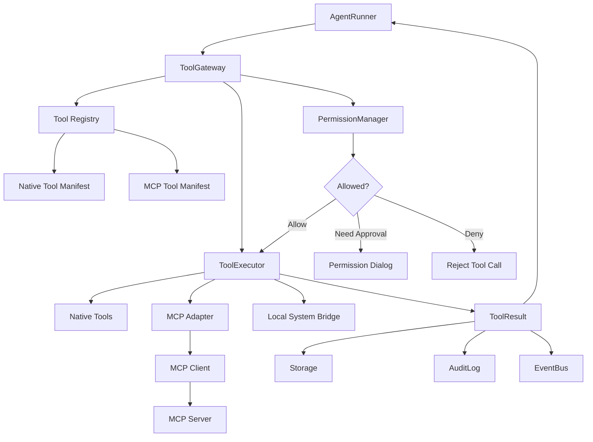

# MCP 与 Tool Gateway 设计

## 文档目的

本文档定义 MCP、Native Tool、Local System Bridge 与 Tool Gateway 的关系。当前 ToolGateway 的真实 owner 位于 Python Agent Worker Pool；Go Gateway / Runtime Orchestrator 负责调度和事件扇出，Redis Runtime Bus 负责通信，二者都不直接执行 MCP 或本地工具。

它的核心目标是：MCP 是 Agent Harness 的工具能力来源之一，但不能绕过 ToolGateway、PermissionManager、Storage、EventBus 和 AuditLog。

当前实现使用官方 Python MCP SDK v1 的 stdio transport。HTTP/SSE、运行时热重载和外部
server 安装仍未实现，不能把设计中的未来 transport 当作当前能力。

## 核心判断

Agent 可以自主选择工具并发起动作，但不能直接调用 MCP server 或本地系统能力。

统一路径：

```text
AgentRunner
-> ToolGateway
-> PermissionManager
-> ToolExecutor
-> Native Tool / MCP Client / Local System Bridge
-> ToolResult
-> Storage + AuditLog + EventBus
-> AgentRunner observe
```

MCP 的定位：

```text
MCP Server = 外部能力提供者
MCP Client / Adapter = 协议适配层
ToolGateway = 内部工具注册、权限、执行和审计入口
AgentRunner = 自主选择和发起工具调用的一方
```

## 架构图



## ToolGateway 职责

ToolGateway 负责：

- 注册 native tools。
- 从 MCP servers discover tools。
- 将 MCP tool manifest 适配成内部 tool manifest。
- 校验 tool name 是否存在且启用。
- 校验 arguments 是否符合 schema。
- 计算或读取默认 risk level。
- 请求 PermissionManager 判断。
- 执行 native tool 或 MCP tool。
- 捕获错误并转成统一 AppError。
- 保存 ToolCall、AuditLog 和 runtime event。
- 返回结构化 ToolResult 给 AgentRunner。

ToolGateway 不负责：

- 决定 Agent 下一步要做什么。
- 构造模型 prompt。
- 绕过权限直接执行本地动作。
- 把 MCP 原始响应直接暴露给 UI。

### 获批工具的 effect 前生命周期边界

ToolGateway 在 `PermissionApproval` 已验证、executor 已解析但尚未调用 capability adapter 的位置拥有
唯一 `ToolEffectBoundary.before_effect` 生命周期端口。它属于 Runtime Harness，不属于 Agent Loop：模型、
ToolRequest arguments、Skill 和 MCP server 都不能启用或释放该端口。

生产默认不装配 boundary。隔离 REC-07 故障测试只有在
`JARVIS_TEST_FAULT_INJECTION_ENABLED=true` 且配置绝对
`JARVIS_TEST_TOOL_EFFECT_BARRIER_ROOT` 时才装配 `FileToolEffectBarrier`。屏障原子写入
`<sha256>.reached.json`，其中只有 Task/Run/Step/Tool/Permission 身份、风险等级和 release 文件名；不保存
参数、reason、正文或路径目标。测试驱动看到 reached 后可以强杀 Worker，验证 PostgreSQL 已保存的
`tool_in_flight` 会按 effect unknown 失败关闭且不会重放。若屏障超时或自身异常，ToolGateway 在 executor
前返回不可恢复的结构化错误，不允许故障测试设施失效后继续产生业务副作用。

## Tool Manifest

所有工具，无论来自 native、system 还是 MCP，都要适配成统一 manifest。

```ts
type ToolManifest = {
  name: string;
  provider: "native" | "mcp" | "system";
  description: string;
  input_schema: JsonSchema;
  output_schema?: JsonSchema;
  risk_level_default: RiskLevel;
  permission_scope: ToolPermissionScope;
  enabled: boolean;
  mcp_server_id?: string;
  metadata?: Record<string, unknown>;
};
```

内置 `native/system` capability 可以使用以下保留 metadata：

- `metadata.capability`: 内部 capability id 与 version。
- `metadata.agent_prompt`: 模型行为指南和安全调用示例，由 PromptBuilder 读取。
- `metadata.loop`: Runtime Loop 使用的非模型控制语义。证据工具声明 `operation`、`evidence_domain` 和显式
  `substitutable_evidence_domains`；未声明的跨域来源默认不可互相替代。具体工具名只在 manifest 数据绑定层
  出现，`LoopController` 不按案例或 provider 名硬编码策略。

`agent_prompt` 只允许来自代码内显式装配的受信任 `native/system` manifest。MCP discovery
即使返回同名 metadata，也不得将其注入 system prompt；MCP 描述必须经过 adapter 的长度、
字符与安全归一化后才可进入模型可见工具描述。

当前 RAG 在线检索通过内置 native L0 `rag.search` 暴露。该 Tool 只是
`RagRetrievalService` 的薄适配器，不拥有向量查询、重排或上下文预算算法。它的模型可写参数只有
`query/top_k/document_ids`；Workspace 必须由 Runtime 可信 `task_id` 回查，禁止接受模型提供的
`workspace_id`。`PermissionManager` 只对白名单中的这个只读工具自动放行，调用仍进入标准
ToolCall、Timeline 与审计链路。

selected multi-document scope 下，`document_ids` 仍由 Runtime 覆盖，Tool adapter 将有效 `top_k`
提升到至少等于文档数且不超过 20。最终检索结果附带
`document_coverage(requested_count/covered_count/complete/uncovered_document_ids)`；它只描述实际
进入模型上下文的指定文档覆盖。`complete=false` 时模型不得声称已经全面比较或总结全部指定资料。
ToolResult 还必须提供 Runtime 拥有的 `evidence_assessment`：schema 固定为
`rag-evidence-assessment-v1`，包含 `sufficient/reason_code/evidence_count/covered_document_count/
requested_document_count`，并以 `policy_version=rag-evidence-sufficiency-v2` 增加
`strict_anchor_count/covered_strict_anchor_count/lexical_gate_applied/lexical_term_count/
covered_lexical_term_count` 有界计数。不得把原始 anchor、query 或正文复制进诊断。
`NO_EVIDENCE`、`REQUESTED_DOCUMENT_COVERAGE_INCOMPLETE`、`QUERY_CONSTRAINT_UNCOVERED` 与
`QUERY_EVIDENCE_LEXICAL_MISMATCH` 都是成功检索的安全降级结果，而不是伪装成工具故障；PromptBuilder
必须保留该投影。RagCitationValidator 只消费最新一次成功检索且策略版本完全匹配的 assessment；不得回退
读取更早 observation，缺失或跨版本 checkpoint 必须 fail closed。Dense/Cross-Encoder 分数不能单独把不含
问题约束的片段提升为充分证据。

`rag.search` 返回值包含公开的版本化 Pipeline 标识、有界 `RagContextPackage` 和
`evaluation_trace_id`。PromptBuilder 只投影回答
所需的 Chunk/Element 证据；Agent finish 只能提交候选 `chunk_id`，最终文档名、页码、Artifact ID 与
引用列表由 `RagCitationValidator` 从当前 Run 的可信 ToolResult 恢复。Reranker、Query Rewrite 或
混合 Retriever 不得进入 Tool adapter；它们属于 `agent/rag/retrieval` 的可替换阶段。Candidate 与
Reranker 的完整无正文排序快照只进入独立 `rag_evaluation_traces` 业务真源，不得进入模型 observation。
生产 QueryRewriter 为 `bounded-query-plan-v1`：保留原始 query，并只从明确复合分句生成最多三条附加
查询；不使用模型生成事实、不扩大文档范围，完整 queries 进入脱敏 Pipeline trace。

受控 PDF 入库通过内置 native L2 `rag.ingest_artifact` 暴露。模型只提供 `artifact_id`；Tool executor
必须使用可信 `task_id` 调用 `RagIngestionCommandService` 回查 Workspace 并校验来源血缘，然后只创建
PostgreSQL 作业。真实预处理、分块、Embedding 与 pgvector 写入仍由独立 RAG Worker 执行。PDF 下载与
RAG 入库是两次独立权限决策，不能合并授权。

真实完成状态通过内置 native L0 `rag.await_ingestion` 暴露。模型只提供前述 ToolResult 返回的
`job_id`；executor 使用可信 `task_id` 限制 Workspace，并只读轮询 PostgreSQL 中的 ingestion job 与
document。只有 `job=completed` 且 `document=ready` 才返回 `ready=true`、真实 chunk/vector 数；它不
创建、重试或推进作业。用户只要求后台提交时无需调用，明确要求可检索或向量化完成后再告知时由 LLM
在普通 Agent loop 中选择调用。

命名规则：

```text
workspace.list_files
workspace.get_file_info
workspace.read_file
workspace.read_files
workspace.create_file
workspace.search_files
workspace.search_text
workspace.create_directory
workspace.move_path
workspace.delete_path
knowledge.create_document
literature.download_arxiv_pdf
system.notify
skill.<skill_id>.<script_name>
mcp.<server_id>.<tool_name>
```

示例：

```text
mcp.github.search_issues
mcp.filesystem.read_text_file
mcp.browser.open_page
```

## Tool Request

AgentRunner 发起工具调用时使用内部请求格式。

```ts
type ToolRequest = {
  task_id: string;
  run_id: string;
  step_id: string;
  tool_name: string;
  arguments: Record<string, unknown>;
  reason?: string;
  requested_by: "agent" | "user" | "system";
  authorization_scope?: Record<string, unknown>; // 仅 Runtime 可注入的可信授权上下文
  execution_context?: Record<string, unknown>; // Runtime 私有 effect context，不进入模型参数
};
```

`knowledge.create_document` 是 native L2 工具，只能在已注册的独立 Jarvis Vault 创建不覆盖的
Markdown 并更新索引。普通任务必须 `allow_once`；定期任务仅在服务端 RunJob 精确携带对应
schedule ID 且授权名单包含该工具时自动放行。该例外不能推广到其他 L2 工具。
当前 Knowledge capability version 为 `1.2.0`。模型必须提交纯语义标题，不得把 Run ID、Git revision、
随机后缀或生成阶段放进标题；报告周期和分析范围可以作为语义限定。Application Service 根据
`report/note/source` 生成 `Reports/Notes/Sources` 下不带 UUID 后缀的文件名，同名时以
`KNOWLEDGE_DOCUMENT_EXISTS` 拒绝覆盖。正文在该边界规范化为 Obsidian MathJax dollar 定界符，代码块、
行内代码和不完整定界符不转换；索引按报告、笔记、来源分区重建。Tool Executor、模型和 Renderer 均不
拥有路径、公式方言或索引结构决策。

权威文献能力使用两段式边界：MCP server 返回有界、结构化的来源元数据与可读内容；
`literature.download_arxiv_pdf` 是 native L2 工具，只接受 arXiv ID，并由 Runtime 提供确定性
Artifact id。它固定使用 arXiv HTTPS，校验最终 host、大小、MIME、PDF 文件头和 SHA-256 后
写入 Artifact Store。外部 MCP 返回的路径或“已下载”描述不能直接创建 Artifact。

无人值守计划不持久授权通用 MCP。`source_report` 使用 native L1
`literature.search_arxiv`，与内置 MCP adapter 共用同一个第一方 arXiv provider；执行器会校验
RunJob 中服务端签发的 query/max_results，并根据已写入知识文档的 source URLs 过滤重复来源。
provider 与 PromptBuilder 同时保留通用 `RetrievedSourceDTO` 字段：`source_id/source_type/title/
canonical_url/content_scope/content_text/content_locators/content_sha256`，以及 provider 确认的
`download.available/reference/mime_type/url`；provider 自有字段可以并存。是否可下载以该结构化字段
为准，模型不能根据 URL 或内容猜测。PromptBuilder 只向下一轮模型投影生成报告与选择工具所需的
有界公开字段；当随后调用
`knowledge.create_document` 时，Runtime 会从本 Run 的可信成功检索 observation 重新生成并覆盖
`source_urls`。来源归属与下次去重不依赖模型是否正确复制 URL。

交互式知识整理若在同一 Run 内先后成功执行来源检索、原文下载与 `rag.ingest_artifact`，Runtime 还会
在调用 `knowledge.create_document` 前生成并覆盖 `provenance_links[]`，按可信 ToolResult 连接 public
source、Artifact UUID/SHA-256、RAG document/job ID 和当前 ingestion status。文件适配器只将这些
关系追加到 Markdown；模型输入、下载内部路径或未确认的未来 ready 状态都不能成为关系事实来源。

单独执行 `rag.search -> knowledge.create_document` 时，Runtime 使用与 Prompt 相同的 observation
窗口，只消费成功 native ToolResult 中模型实际可见的 nested context Chunk；合法 UUID 被连接为
`artifact_id/rag_document_id/rag_search_tool_call_id/rag_chunk_id`，去重后总量不超过 50。
该关系表示“本次知识生成可见的检索证据”，不等同于正文逐句引用；Runtime 不从正文猜引用，也不为
检索关系伪造 source URL、ingestion job 或 status。

Skill 不能声明平台证据工具或替代 RAG 证据真相。Runtime 的最终回答证据守卫只接受平台原生、真实、
成功的 ToolResult；当前 RAG 证据入口是 `rag.search`。Skill 方法论不会改变 ToolGateway、权限、审计
或证据要求。

## Tool Result

```ts
type ToolResult = {
  ok: boolean;
  kind: "text" | "json" | "file" | "artifact" | "empty";
  summary: string;
  data?: unknown;
  artifact_ids?: string[];
  deliverables?: Array<{
    kind: "file";
    title: string;
    path: string;
    size_bytes: number;
    mime_type: string;
    content_hash: string;
  }>;
  error?: AppError;
  metadata?: Record<string, unknown>;
};
```

返回原则：

- `summary` 必须简短，可直接进入 Timeline。
- executor 原始 `summary/data/deliverables/error` 只在当前执行栈内短暂存在；`ObservationPhase` 在它们进入
  Agent observation、RuntimeEvent、checkpoint、Outbox 或 Web DTO 前递归移除高置信度凭据。路径、计数、
  状态、Artifact ID 和错误码等非敏感结构必须保持不变。
- 大文件或长输出应保存为 artifact，避免直接塞进下一轮 context。
- MCP 原始结果需要适配成 ToolResult。
- deliverables 只能由成功执行的 Capability Adapter 生成；模型参数、reason 和 summary
  不能作为 Artifact 事实来源。Runtime 必须再次校验描述与 `data` 一致，再确定性创建
  Artifact 并回填 `artifact_ids`。
- `error.recoverable=true` 表示该失败可作为 observation 交回 LLM，并不表示 Runtime 可以盲目重放
  已产生副作用的工具。每一次重试仍必须由新的 Agent 决策产生，并再次经过 ToolGateway 与权限边界；
  `max_iterations` 是最终上限。
- 无副作用的外部 provider adapter 可以在单次 ToolGateway 调用内部执行确定性、有界暂态重试；超时、传输
  错误、429 与 5xx 必须分别归一化为稳定 AppError code，并公开安全的 attempts/status/retry-after 诊断。
  内部重试耗尽后不得由 Agent Loop 原样重放，也不得用未声明为等价域的其他证据工具冒充原来源。
- Workspace 文件/目录不存在时，可在该失败 ToolResult 的 `data` 返回最多 5 个真实已有的同类型相对路径
  候选。候选诊断复用有界、安全的名称搜索，只是 parent capability 内部的只读诊断，不形成隐式读取、
  自动目标替换或第二套权限入口；后续选择和读取仍必须生成新的标准 ToolRequest。

## MCP Server 配置

MCP server 配置进入 Tools 页面和 Storage Layer。

```ts
type McpServerConfig = {
  id: string;
  slug: string;
  name: string;
  transport: "stdio";
  command: string;
  args: string[];
  env_keys: string[];
  enabled: boolean;
};
```

安全原则：

- `env_keys` 只保存 key 名，不保存敏感值。
- API key、token、password 使用系统 keychain 或加密存储。
- Web UI 或后续桌面 Renderer 不直接读取完整 MCP server secret。
- 禁用的 server 不参与 tool discovery。
- `command` 必须是已存在、非符号链接、可执行的绝对文件路径；Jarvis 不自动下载或安装 server。
- server stderr 被丢弃，不能绕过结构化日志；调用超时和结果大小有界。
- 配置、启停或手动发现后需重启 Worker 才能更新当前 Agent 的 ToolRegistry；热重载后置。

手动发现的控制路径：

```text
Web Tools 页面
-> Go Gateway 发布 mcp.discovery.refresh
-> Redis worker-command stream
-> 空闲 Python Worker
-> MCP Client discovery
-> PostgreSQL mcp_servers / mcp_tools + AuditLog
-> ACK command
```

Go 只拥有管理命令的 HTTP/Redis transport 契约，不引入 MCP SDK、不读取 server 配置，也不
执行 discovery。Python Control Plane 只负责短事务配置 CRUD 与查询；MCP 生命周期归 Worker。

## MCP 生命周期

### 启动发现

```text
App start
-> Runtime init
-> Load enabled mcp_servers
-> Connect / health check
-> Discover tools
-> Normalize to ToolManifest
-> Store mcp_tools
-> Register in ToolGateway
```

当前 PromptBuilder 与 ToolRegistry 在 Worker 启动时形成同一静态快照。手动发现只更新
Storage 中的发现结果，必须重启 Worker 后原子装配；动态 registry 与 prompt 热重载不能只
更新其中一侧，留待后续独立设计。

### 调用流程

```text
AgentRunner chooses mcp.<server>.<tool>
-> ToolGateway validates tool manifest
-> Validate arguments by input_schema
-> Classify risk
-> PermissionManager check
-> Optional user confirmation
-> MCP Adapter calls server tool
-> Normalize result
-> Save ToolCall and AuditLog
-> Emit mcp.call.finished
-> Return ToolResult to AgentRunner
```

### 失败流程

```text
MCP timeout / protocol error / server unavailable
-> Convert to AppError category "mcp"
-> Save ToolCall failed
-> Emit mcp.call.failed
-> AgentRunner observes failure
-> Agent may retry, choose fallback tool, ask user, or mark blocked
```

## 权限策略

MCP tool 不天然可信。每个 MCP tool 都必须有 risk level。

默认策略：

```text
Read-only MCP tool: L0 / L1
Workspace-scoped write: L2
External write or send: L3 / L4
Destructive or financial action: L4
Unknown tool risk: L3 by default
Forbidden operation: L5
```

权限判断输入：

```ts
type PermissionCheckInput = {
  task_id: string;
  run_id: string;
  step_id?: string;
  tool_name: string;
  provider: "native" | "mcp" | "system";
  mcp_server_id?: string;
  risk_level: RiskLevel;
  arguments_summary: Record<string, unknown>;
  scope: PermissionScopeDTO;
  reason?: string;
};
```

当前 ToolGateway 将调用拆成两个受控阶段：`assess(ToolRequest)` 负责 manifest、enabled、
最小 JSON Schema 和 PermissionManager 校验；`execute()` 只执行无需确认的请求，或携带
Runtime 已核验 `PermissionApproval(request_id, allow_once)` 的请求。AgentRunner 不得凭
模型输出自行构造“已批准”状态，MCP/native/system executor 也不得绕过这一入口。

MCP 调用必须支持的授权范围：

```text
Allow once
Allow for this task
Always allow for this MCP server and tool
Always allow for this workspace
Deny
```

高风险 MCP tool 不能永久自动批准。

## Context 注入策略

模型需要知道可用工具，但不应该看到无关或高风险工具的完整细节。

ContextManager 注入工具时：

- 只注入当前任务允许使用的 tool manifest 摘要。
- 隐藏敏感配置。
- 隐藏由 Runtime 管理的参数，例如 `knowledge.create_document.provenance_links`。
- 对高风险工具标记 risk level 和需要确认。
- 对禁用工具不注入。
- 对 MCP server 只注入工具名、描述、参数 schema 和风险提示。

工具出现在模型上下文中不代表已经授权；真实调用仍必须经过 ToolGateway、PermissionManager、
ToolCall、AuditLog 和 RuntimeEvent。L2-L4 风险等级不会因为 Skill 指令而降低。

通用 Skill 包可以携带确定性脚本，但是否注册由独立的 Jarvis adapter 决定，声明不等于绕过工具
边界。`jarvis-skill-adapter-v1` 默认
`execution_enabled=false`；显式启用且通过 SkillLoader 校验的脚本，由通用
SkillScriptExecutor 映射为 `skill.<skill-id>.<script-name>` 的 L1 system ToolManifest，并沿
`AgentRunner -> ToolGateway -> PermissionManager -> SkillScriptExecutor` 执行。禁止 AgentRunner、
SkillLayer 或 ContextManager 直接启动 Shell/子进程。

Skill script v1 固定约束：仅 Python、固定 argv、JSON object 输入输出、禁网、最小环境、脚本
SHA-256、1–30 秒超时、输入/输出大小上限、非零退出/非法 JSON fail closed；脚本不能写 Vault、
Workspace 或数据库，也不能调用 MCP 或派生子进程。其 Python audit hook 是对受信任已安装脚本的
纵深约束，不是恶意代码的 OS 沙箱；Skill 安装仍是代码信任边界。任何副作用必须由后续独立工具
再次经过 ToolGateway 和对应权限等级。

示例：

```text
Available tools:
- workspace.read_file: 读取 workspace 内有效 UTF-8 文本文件，受路径边界/max_bytes/max_chars 限制；不存在时返回最多 5 个有界已有文件候选但不自动读取。risk L0.
- workspace.read_files: 一次读取最多 6 个已定位文件/行范围；条目可为精确相对路径字符串、`path:start:end` 范围简写或带范围对象，逐项执行相同安全校验并允许部分成功，失败项保留有界路径候选。risk L0.
- workspace.list_files: 列出 workspace 指定路径下顶层文件/目录（不递归，最多 100 条）；不存在时返回最多 5 个有界已有目录候选。risk L0.
- workspace.get_file_info: 获取 workspace 内单个相对路径的有限元信息，不读取正文、不跟随 symlink。risk L0.
- workspace.create_file: 在 workspace 内创建新的 UTF-8 文本文件，不覆盖、不自动创建父目录。risk L2, requires approval.
- workspace.search_files: 递归搜索 workspace 内的文件名、目录名和相对路径，不读取正文。risk L0.
- workspace.search_text: 在 workspace 的受支持 UTF-8 文本正文中执行有界 substring 搜索，返回相对路径、行号和短预览。risk L0.
- workspace.create_directory: 创建 workspace 内不存在的新目录，不覆盖、不递归创建父目录。risk L2, requires approval.
- workspace.move_path: 在 workspace 内原子移动路径，目标必须不存在且不跨设备复制。risk L3, requires approval.
- workspace.delete_path: 删除普通文件、符号链接或空目录，不递归删除。risk L4, always requires approval.
- mcp.github.search_issues: search GitHub issues. risk L1.
- mcp.github.create_issue: create GitHub issue. risk L3, requires approval.
```

## UI 展示

UI 需要在以下位置展示 MCP 信息：

- Tools 页面：MCP server 列表、连接状态、discover 到的 tools。
- Settings / MCP：新增、编辑、启用、禁用 MCP server。
- Timeline：MCP call started / finished / failed。
- Inspector / Tools：MCP server、tool name、参数摘要、结果摘要。
- Permission Dialog：MCP server、tool、risk level、scope、possible impact。

## 自动化契约测试场景

MCP 自动化测试可通过直接注入 fake adapter 覆盖：

```text
mcp_discovery_success
mcp_discovery_failed
mcp_call_success
mcp_call_permission_required
mcp_call_failed
mcp_server_disconnected
```

这些场景只属于测试夹具，不通过 Web UI、共享产品契约或 Gateway Dev API 暴露。产品验收统一走真实 Task / Run 链路。

## MVP 边界

MVP 应包含：

- MCP server 配置模型。
- MCP tool discovery 的接口和自动化测试替身。
- ToolGateway 对 MCP tool 的统一注册。
- MCP tool 调用的权限检查路径。
- Timeline 和 Inspector 展示 MCP 调用。
- MCP 调用失败的错误结构。

MVP 可以暂缓：

- 复杂 MCP marketplace。
- 自动安装 MCP server。
- 多用户 MCP 权限。
- 远程 MCP server 凭证同步。
- 向量化 MCP resource 检索。

## 当前已实现 Native Tools（2026-07-17）

以下 native tools 已在 Python Agent Worker 中通过 ToolGateway + PermissionManager 实现：

| 工具名 | 状态 | risk | 说明 |
|--------|------|------|------|
| `workspace.list_files` | ✅ 已实现 | L0 | 列出 workspace 指定路径下顶层文件/目录（不递归，最多 100 条，排除 node_modules/.git 等噪声目录） |
| `workspace.get_file_info` | ✅ 已实现 | L0 | 查询单个文件、目录或 symlink 的相对路径、名称、类型和修改时间；仅普通文件返回 size_bytes；不读取正文、不跟随或暴露 symlink target |
| `workspace.read_file` | ✅ 已实现 | L0 | 安全读取 workspace 内单个 UTF-8 文本文件，受 workspace boundary、max_bytes（默认 64KB、最大 256KB）、max_chars（默认 20K、最大 100K）限制；可用 `start_line/max_lines` 读取搜索命中附近的有界行范围。非法 UTF-8 严格拒绝，不做 fallback decode |
| `workspace.read_files` | ✅ 已实现 | L0 | 一次读取 1–6 个已定位文件/片段；每项可为精确相对路径字符串、`path:start:end` 行范围简写，或含 `path` 和可选 `start_line/max_lines` 的对象，逐项复用单文件安全读取并按输入顺序返回。允许部分成功，逐项公开有界错误；每文件最多扫描 256 KiB、返回 12K 字符/400 行，整批最多返回 60K 字符 |
| `workspace.create_file` | ✅ 已实现 | L2 | 使用可信 workspace root 的 dir-fd 逐级遍历创建新 UTF-8 文件；拒绝绝对路径、`..`、父级/目标 symlink，不覆盖已有文件，不自动创建父目录，单文件最大 1 MiB；执行前必须 `allow_once`；成功 ToolResult 产生带来源 ToolCall 的 deliverable Artifact |
| `workspace.search_files` | ✅ 已实现 | L0 | 对文件名、目录名和相对路径做 case-insensitive literal substring 搜索；不读取正文，不支持 regex/glob；默认/最多返回 50/100 条，扫描最多 10000 项、递归最多 20 层，结果路径为相对 POSIX 路径 |
| `workspace.search_text` | ✅ 已实现 | L0 | 对允许的 UTF-8 文本正文做 case-insensitive literal substring 搜索；返回相对路径、行号、有界预览及扫描覆盖元数据，不支持 regex/glob、不跟随 symlink；最多扫描 10000 项/2000 文件/16 MiB，单文件最大 1 MiB、递归 20 层、返回 50 条；`scan_complete` 与 `result_window_truncated` 区分扫描未完成和仅返回窗口截断，后者没有分页游标；`source_only` 可排除 docs/tests/examples/scripts 和测试文件 |
| `workspace.create_directory` | ✅ 已实现 | L2 | 使用可信 root/parent dir-fd 创建一个新目录；拒绝根目录、绝对路径、`..` 和父级 symlink，不覆盖已有路径，不递归创建父目录；执行前必须 `allow_once` |
| `workspace.move_path` | ✅ 已实现 | L3 | 在可信 source/destination parent dir-fd 间用 no-replace 原子 rename 移动普通文件、目录或 symlink；目标已存在、跨设备、根目录、父级 symlink 或移动到自身子目录时拒绝；执行前必须 `allow_once` |
| `workspace.delete_path` | ✅ 已实现 | L4 | 通过可信 parent dir-fd 删除普通文件、symlink 或空目录；不跟随 symlink、不允许 workspace 根目录或递归删除，非空目录拒绝；每次必须 `allow_once` |
| `literature.download_arxiv_pdf` | ✅ 已实现 | L2 | 只接受规范 arXiv ID；下载到受控 Artifact Store，限制大小并校验 HTTPS 最终域名、PDF MIME/文件头和 SHA-256；普通任务必须 `allow_once`，不进入定期任务隐式授权 |
| `rag.ingest_artifact` | ✅ 已实现 | L2 | 从当前任务可信 Artifact 创建或复用异步 ingestion job；入队成功不等于可检索 |
| `rag.await_ingestion` | ✅ 已实现 | L0 | 只读等待当前 Workspace 的既有 job 到真实完成/失败终态；不修改作业，只有 document ready 才报告完成 |
| `rag.search` | ✅ 已实现 | L0 | 在当前 Workspace 的 ready 文档上执行有界检索与证据组装；Workspace 由可信 task_id 回查 |
| `knowledge.create_document` | ✅ 已实现 | L2 | 在独立 Jarvis Vault 中创建不覆盖的 Markdown 知识文档，并写入可信 provenance |

条件式创建仍只有一条 ToolGateway 路径。用户明确要求“若目标已存在则告知且不要覆盖”时，Runtime 可先用
L0 工具取得同一规范化相对路径的可信存在性证据；这会使 `target_absent` 前置条件短路，因此不创建 L2
PermissionRequest、写 ToolCall、deliverable 或 Artifact。没有精确证据时仍必须进入
`workspace.create_file -> PermissionManager -> executor`；执行器返回的 `PATH_ALREADY_EXISTS` 是真实
ToolResult，不能被模型改写成创建成功。

执行实现按 `agent/tools/workspace/` package 拆分：package facade 只稳定导出十个
executor，每个工具由同名模块拥有；`path_policy.py` 是跨工具 workspace 边界、路径规范化
和安全目录 FD 遍历的唯一 owner。同一领域的 `agent/tools/workspace/module.py` 统一拥有
十个 ToolManifest、Prompt metadata 与 executor binding，并由
`agent/tool_gateway/catalog.py` 预检后安装到现有 ToolRegistry。`agent/tool_gateway/`
不再存放任何 Workspace 或其他具体能力
实现，只拥有统一 gateway、registry、ToolRequest/ToolResult 等边界契约。该拆分不改变
权限等级或 ToolGateway 执行路径，也不引入第二套 ToolRegistry。

`agent/tools/` 只放具体工具、manifest/binding 和同领域安全策略；PermissionManager
位于 `agent/permissions/`，ToolCall 持久化位于 `runtime/tool_calls/`。当前 capability
装配是代码内显式清单，不是动态插件 loader。后续 MCP discovery 必须先
归一化为相同的 `ToolManifest + executor binding` 再进入唯一 ToolRegistry，不能直接从
AgentRunner、LangGraph node 或 capability module 调用外部能力。

十个工具均必须经过 `ToolGateway.execute → PermissionManager.check → executor` 统一路径。只读工具先执行 workspace 边界校验；`workspace.read_files` 只在自身已通过 Gateway 后组合调用同 capability 的单文件安全实现，不产生第二套注册、权限或审计入口。`workspace.search_files` 与 `workspace.search_text` 使用固定 search root FD，`workspace.get_file_info` 使用固定 workspace root FD，均通过 `O_DIRECTORY / O_NOFOLLOW` 逐级打开目录，避免 symlink 替换竞态。`workspace.create_file` 使用 `O_DIRECTORY / O_NOFOLLOW / O_EXCL` 和可信 parent dir fd 避免检查后替换，并在部分写入或 `fsync` 失败时关闭文件描述符和清理未完成文件；结构写工具复用同一 parent dir-fd 路径策略，`workspace.move_path` 不允许降级为会覆盖目标的普通 rename。

`workspace.create_file` 的成功 ToolResult 可以产生 `deliverable/tool` Artifact。之后用户在 Web
展开该 Artifact 属于已登记交付物的只读查询，不是 Agent 再次选择工具；它由 Artifact
Application Service 负责，并必须反查 Task 和原 ToolCall 的完整来源链、通过安全 dir-fd
重新读取、校验 size/hash。前端、Gateway 和 Artifact metadata 中的相对路径都不能单独成为
文件读取授权，也不能绕过该服务直接访问本地文件。

内置 `jarvis_worker.mcp_servers.literature` 提供 `search_arxiv` 来源检索工具，可由 Tools 页面
一键注册为 stdio server。它最多返回 10 条、限制 XML 和字段大小、单连接请求，并按 arXiv
官方要求在每次 legacy API 请求前保守等待 3 秒；结果包含标准 `RetrievedSourceDTO`、arXiv provider
字段和 attribution，其中 abstract 属于可总结内容而不是纯元数据；`download.available=true` 由
provider 根据 arXiv PDF 能力产生，同时给出受控 reference、MIME 与公开 URL。
provider 使用最多 3 次、单次 15 秒的确定性暂态预算：每次 legacy API 请求仍至少间隔 3 秒；timeout、
transport error 与 5xx 使用 3/6 秒退避，HTTP 429 使用有界 `Retry-After`（3～30 秒）。耗尽后分别返回
`ARXIV_SEARCH_TIMEOUT`、`ARXIV_SEARCH_UNAVAILABLE` 或 `ARXIV_RATE_LIMITED`；不可重试 4xx 返回
`ARXIV_SEARCH_REJECTED`，超限或非法 Atom 返回 `ARXIV_RESPONSE_INVALID`。错误只暴露 attempts、可选
status 和 retry-after，不透传响应正文、请求 URL 或异常堆栈。`literature.search_arxiv` 的证据域为
`external_literature.arxiv`，本地 `rag.search` 的证据域为 `workspace.indexed_documents`，二者没有声明
等价替代关系。
该 MCP 工具仍使用默认 L3 单次确认，不能因“内置”身份绕过 MCP 权限策略。
定期来源报告使用的是独立 native adapter，而不是对该 MCP 工具降低风险等级。

## 验收标准

MCP 接入完成后应满足：

- Agent 不能直接调用 MCP server。
- MCP tool 必须通过 ToolGateway 执行。
- MCP tool 调用必须产生 ToolCall 记录。
- 中高风险 MCP tool 必须触发 PermissionManager。
- 所有 MCP 成功和失败都必须有 runtime event。
- UI 可以展示 MCP server、tool name、参数摘要、结果摘要和错误。
- App 重启后可以恢复 MCP server 配置和 tool manifest。
